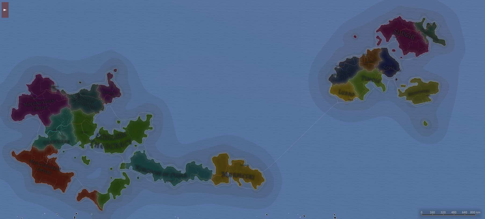
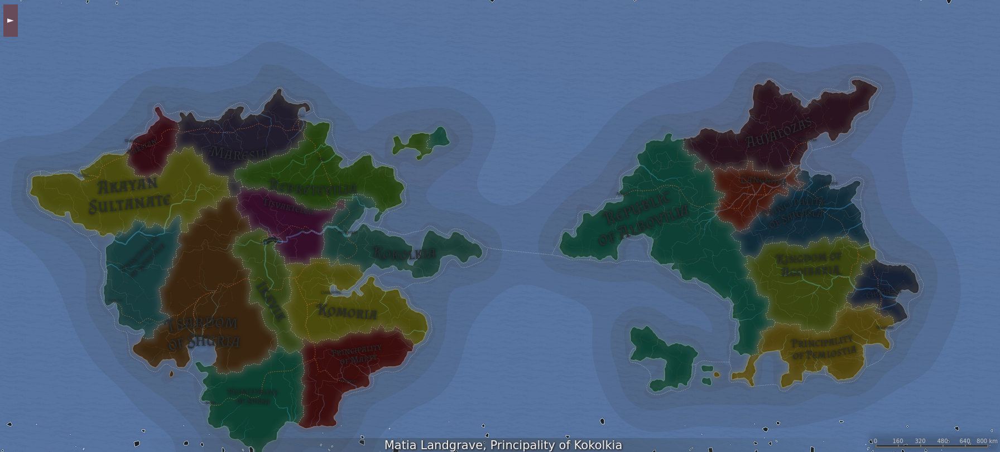

école
bourgeoisie
quartier
ghetto

Map du jeu:

# médiéval:
Gère la population à l'aide d'un melting pot et d'une paix social basée sur le pain et le loisir. Par là, pas de révolte.
Le conflit se ferra surtout culturellement.

Désert:
Faible précipitation. plus d'évaporation que de précipitaiton. formé dans les ombres pluviométriques des grandes ceintures de montagne (plateau de l'himalaya)

Steampunk:

Forêt (inexploré):

