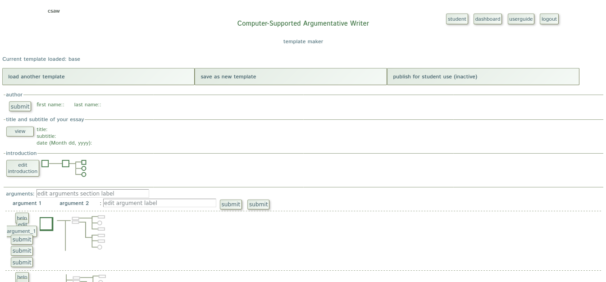
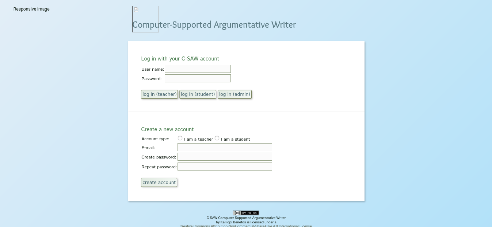
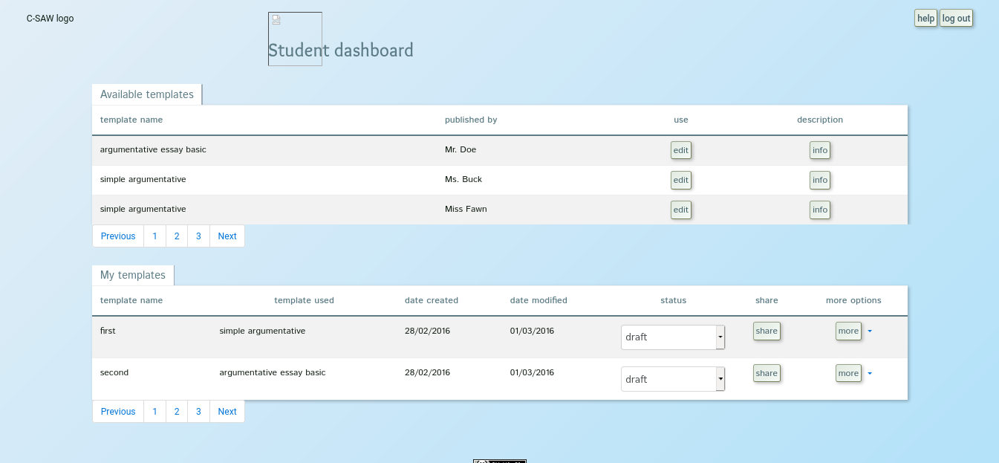
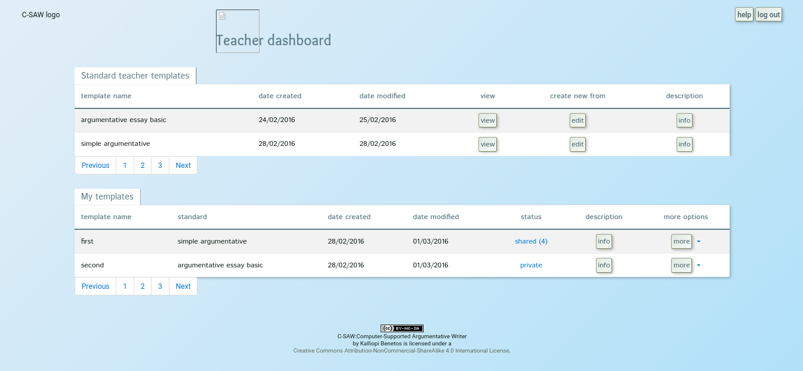
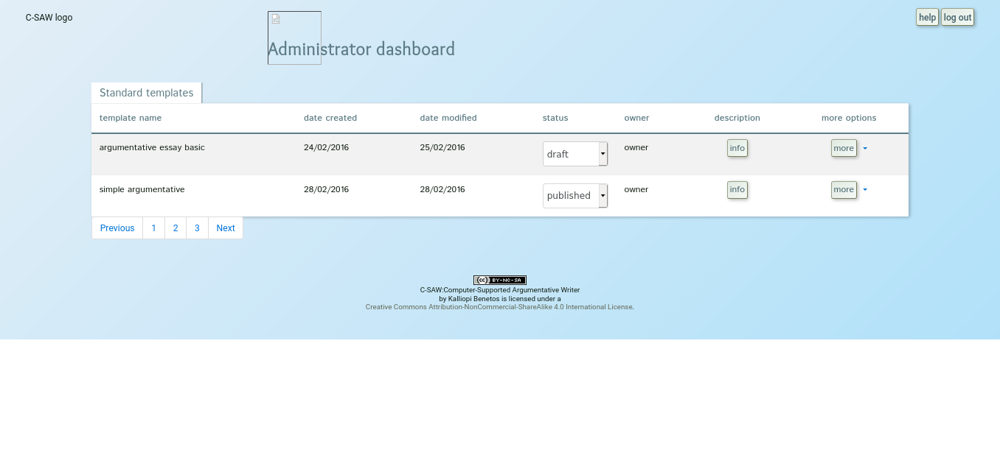

\newcommand{\rectangle}[3]{\node (#1) [boite, xshift= #2 cm, yshift= #3 cm] {#1};}
\newcommand{\fleche}[3]{\draw[thick,->] (#1) -- (#2) node[midway,sloped,below, rotate=0] {#3};}
\newcommand{\flechel}[5]{\draw[thick,->] (#1) to [out=#4, in=#5] node[midway, sloped, below, rotate=0] {#3} (#2);}

Rapport du projet de semestre
=============================

Hategegekimana Fabrice

## Introduction
À l'origine, le projet demandait de construire la partie serveur du projet pour permettre un système de login et d'interaction entre professeur et étudiant. Il fallait principalement construire une base de donnée pour le stockage des documents xml pour des raisons de sécurité.

## Analyse du problème
Après une première observation, on a pu relever les points importants du travail.  

Il fallait premièrement établir un système pour la création de compte et la connexion des utilisateurs.  

En deuxième partie, il nous fallait construire un système qui gère en arrière-plan les données personnelles des utilisateurs ainsi que leur session.  

En troisième lieu, il nous fallait aussi établir un système de partage entre ses différents utilisateurs et avoir accès au logiciel de traitement de leur document préalablement établit  

De plus, j'ai pu voir au nombre de documents que c'était un grand projet et qu'il était nécessaire d'écrire une documentation pour un développement ultérieur.

## Qualité de la solution
Ces problèmes ont pu être résolut avec l'établissement d'une base de donnée avec une construction au préalable de classes UML pour la considération des différentes entités et leur interactions entre elles.  
On a pu se mettre d'accord pour rédiger une documentation sur une plateforme spécifique (dokuwiki) permettant aux prochaines personnes qui se pencheront sur le projet d'avoir une vue générale (et parfois détaillée) du projet.

## Réponses aux attentes
Pour l'heure actuelle, une base de donnée fonctionnelle a été mise au point pour permettre un système d'enregistrement, de connexion et de gestion de donnés personnelles pour chaque utilisateurs. 

Le point sur le partage d'élément entre utilisateurs n'a cependant été réglé que partiellement.
Le partage de document est possible entre enseignants et étudiants, mais on a pas encore une interface permettant aux enseignants de visualiser les travaux rendus de leur élèves, on a pas encore de système permettant aux étudiants de partager des documents entre eux et visualiser les documents partagés par leurs camarades.

## Brève présentation du projet
À l'origine la plateforme csaw était une application indépendante capable d'ouvrir, de modifier et d'enregistrer les documents xml présents au sein du même répertoire. Ci-dessous se trouve un visuel de cette plateforme:

Il y avait aussi l'interface du login ainsi que les 3 interfaces des dashboard qui ont été préalablement réalisés, par ma cliente.    

1) Interface pour l'enregistrement et le login  

2) Dashboard pour l'étudiant  

3) Dashboard pour l'enseignant  

4) Dashboard pour l'administrateur/trice  

Il ne restait plus qu'à developper tout autour le code qui prend en charge les interaction faites avec ces plateformes.  
La plateforme d'enregistrement et de login doit pouvoir stocker les données entrées dans le register dans la base de donnée et verifier si les données rentrées dans le login sont bien présente dans la base de donnée (à ce moment une session est créée et l'utilisateur est dirigé vers son dashboard). 
Les dashboard ont des fonctions plutôt similaire, ils permettent de manipuler les dissertations. On peut voir la description les concernant (avec info), on peut gérer leur status (partagé ou non partagé), pour l'enseignant et l'étudiant, on peut dupliquer les documents du haut pour les mettre dans ses documents personnels en bas. Le bouton more donnes des options plus spécifiques comme la duplication, la suppression et l'édition du document (l'édition et la visualisation nous conduisent vers la plateforme csaw dédiée si c'est un document pour enseignant ou étudiant).
Pour générer cela, j'ai dû identifier les différentes entités (utilisateurs, documents, group, etc.) en utilisant des classes UML.

## Remarques et problèmes rencontrés
Des questions ont pu surgir dans l'élaboration théorique et pendant l'implémentation du code. Le principal problème est surtout arrivé pendant le partage des données entre utilisateurs car on avait pas encore réalisé la complexité de la tâche. À ce moment, l'interface utilisateur (préalablement conçu en html) ne disposait pas des outils de manipulation assez sophistiqués pour cette action.  

Nous avons aussi eu à faire face à certains élément de sécurité comme empêcher que des personnes se connectent librement en tant qu'enseignant, empêcher l'insertion malicieuse d'instruction sql dans les entrées utilisateur et savoir qui a accès à quelle information.  

Le développement a été ralenti par la période de confinement (car j'ai dû mettre mes études en pause pour servir à l'armée) et nos contacts ont dû se faire principalement par mail et par vidéo conférence. De plus ce projet est d'assez grande envergure au vu des nombreuses fonctionnalité qu'il offre. Nous avons pu malgré tout commencer quelque chose qui pourra être repris par la suite.  

## Conclusion
J'ai déjà eu à créer quelques applications informatiques avant l'université (pour smartphone ou sur pc), mais je n'ai jamais eu une approche théorique. Dans ce projet, j'ai pu me poser des question sur quel outils informatiques (théorique ou logiciel) utiliser, comment faire une abstraction du problème et en tirer les moyen à mettre en place pour y répondre, sans parler de la documentation pour gardé un visuel du projet.   

Les cours au sein de l'université mon permis de penser le problème avant d'écrire et m'ont rendu capable d'entreprendre des projets complexes tout en les gardant "maintenables". En plus ce projet donne aussi une chance aux étudiants qui n'en ont pas eu l'occasion de pouvoir mettre en pratique les cours appris.  
