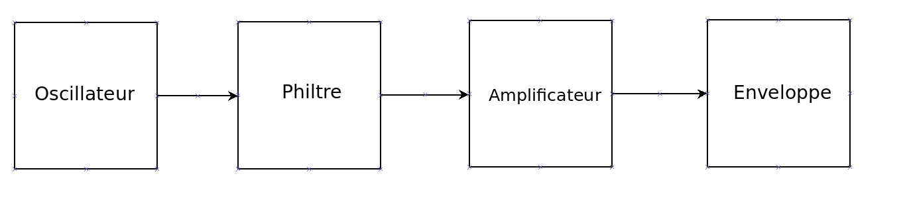
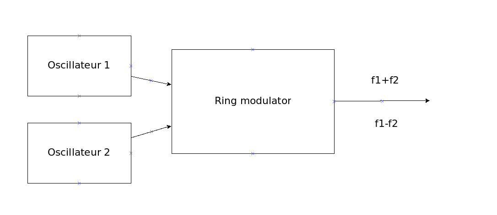
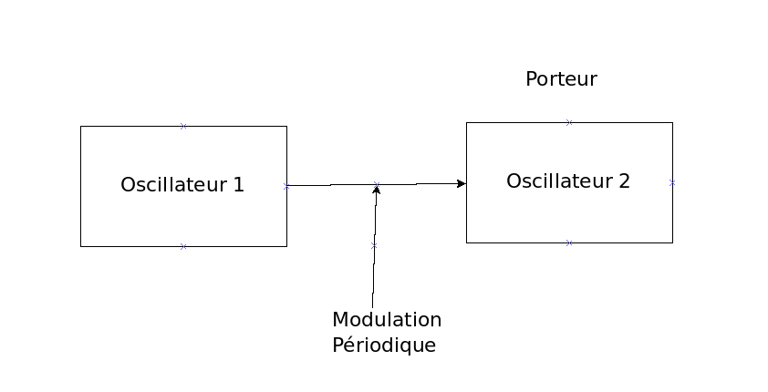
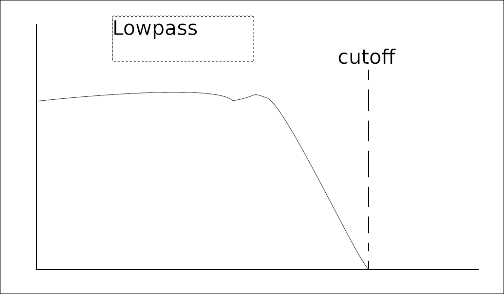
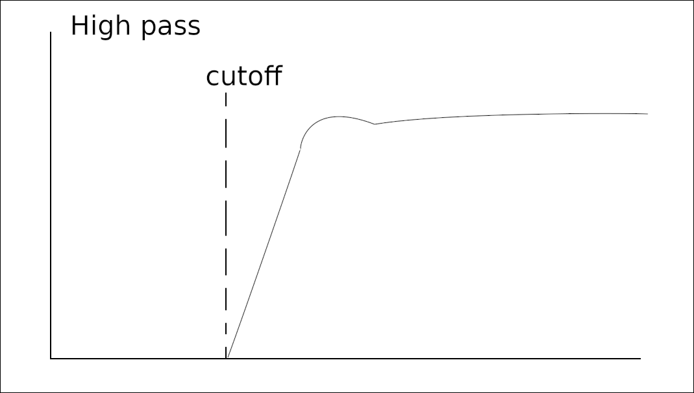
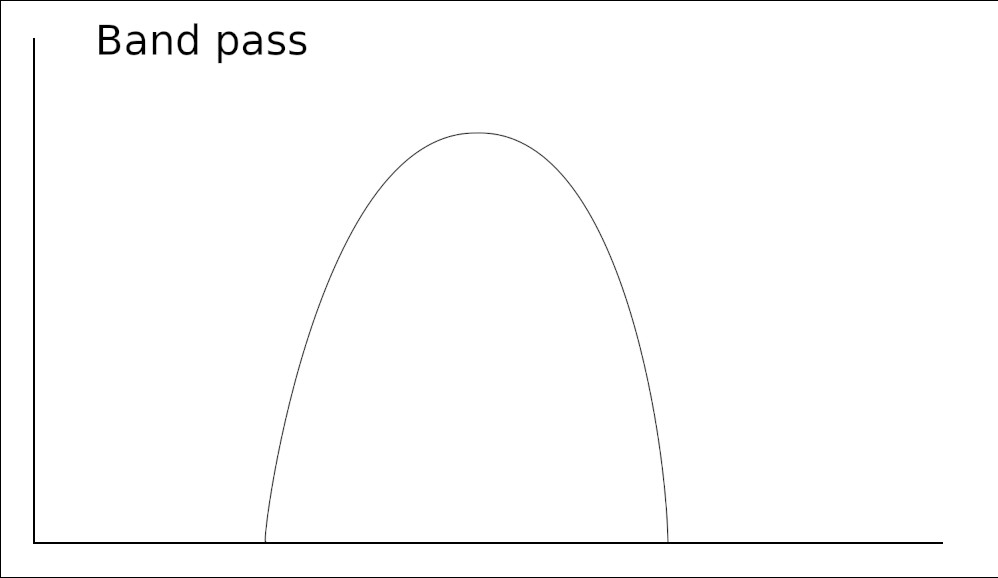
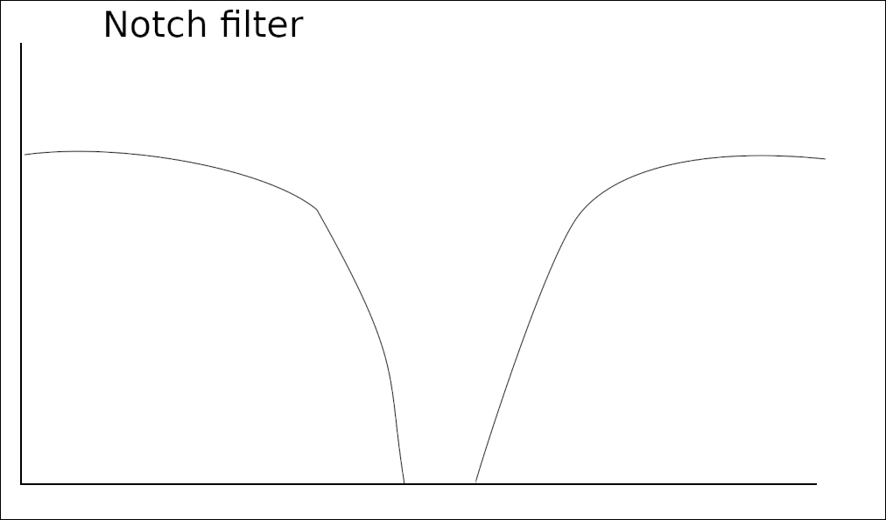
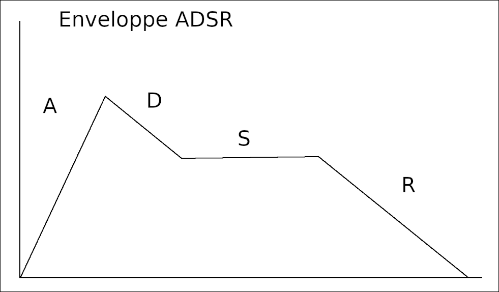
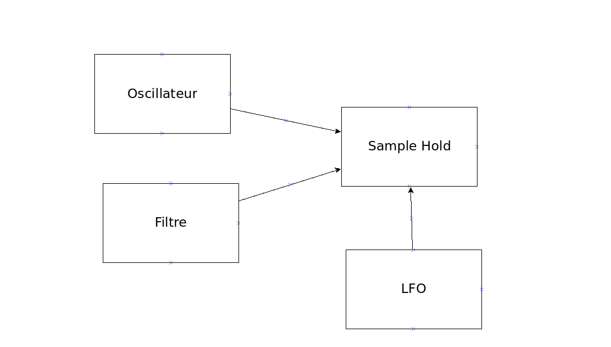

Synthétiseur modulaire:
========================

## Caractéristiques du son:
	Intensité: amplitude  (décibel) de faible à fort
	Hauteur:  nb cycle/sec	(Herz) de bas à aigüe 
	timbre:
		* fréquence fondamentale
		* harmoniques (multiple de la fréquence fondamentale)

## Outils pour la synthèse sonore:
oscilloscope:	
	Instrument de mesure du son.
				
---

## modulation en anneau:

## modulation de fréquence

## philtre:

**Lowpass**

**Highpass**

**Bandpass**

**Notche filter**

## Enveloppe ADSR

Se fait sur:
	* L'Amplitude
	* Le Filtre
	* Le Pitch

## LFO
Low frequency oscillator
A toujours une fréquence en dessous de 20 Hz. Permet de moduler la fréquence de changement (pour de l'automation)
On peut ainsi y brancher plusieurs effets intéressants.

## Sample and Hold
Est un module qui permet de prendre un son et d'y appliquer un LFO

## Portamento glide
Passage d'une note à une autre par "glissement"
glide= temps que va mettre le glissement d'une note à une autre.
