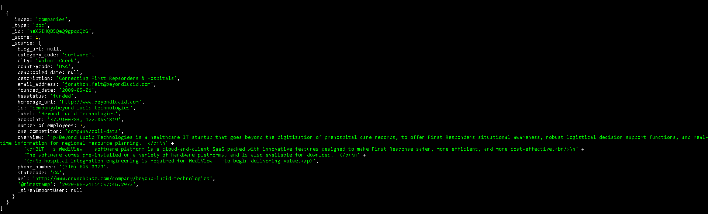
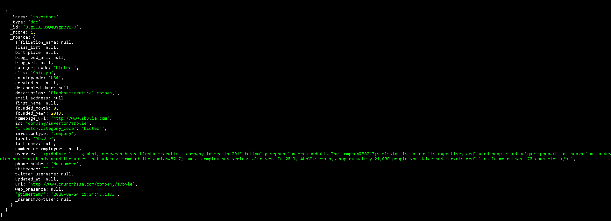
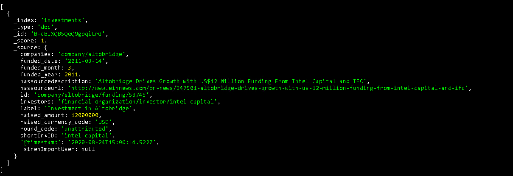
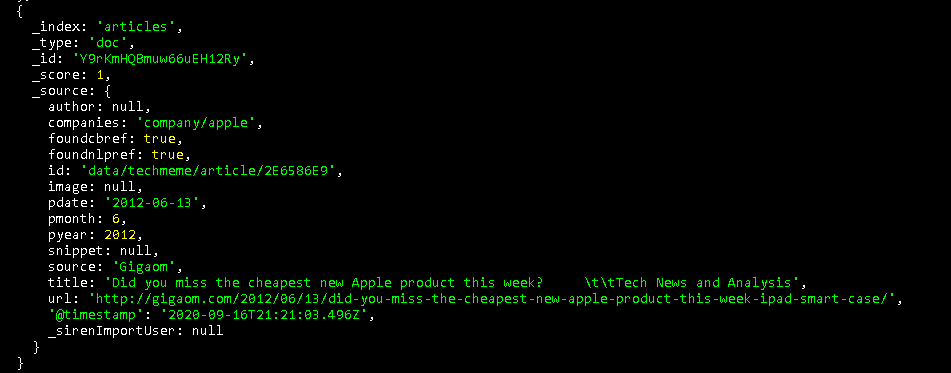
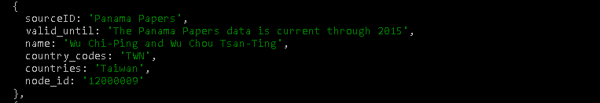

## companies

```
companies : { 
	label: label,
	Geopoint: geopoint
}
```

## investors


```
investors:{ 
	label: label,
	investortype: investortype
}
```

## investments


```
investments:{ 
	companies: companies,
	investors: investors,
	funded_date: funded_date,
	raised_amount: raised_amount,
	raised_currency_code: raised_currency_code
}
```

## articles

```
articles:{ 
	title: title,
	author: author,
	id: id,
	companies: list of 'company/[company_Name]',
	pdate: '2012-06-13',
	source: journal,
	title: title,
	url: url,
}
```

Officer Neo4j ICIJ


Code qui marche

```
GET siren/articles/_search
{ 
  "query": { 
      "join": { 
            "indices": [
	              "companies"
	    ],
	  "on": [
		  "companies",
		  "id"
	  ],
	  "request": { 
		    "query": { 
			"term": { 
			      "label": "Apple"
			  }
		    }
	    }
	}
}
}
```
GET siren/articles/_search
