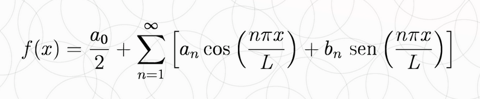
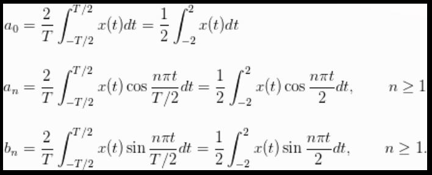

## Imagerie numérique

Série de fourier:
Transformer une fonction périodique en une série de fonctions trigonométriques

Discret fourier transform (DFT)
Digital Signal Processing (DSP)

delta function

delta(n) //discret (vaut 1 ssi n=0, vaut 0 sinon)
delta(t) //continue

On peut représenter toutes fonction discrète comme une somme de delta(n) multiplié par un poids w_i (c'est donc une superposition de fonctions delta)
u(n)= somme(delta(n-k))
delta(n)= u(n)-u(n-1)

delta(t) -[sommation]-> delta(n)
delta(n) -[soustraction avec n-(1-n)]-> delta(n)

# Complex numbers
C= R + I

magnitude = longeur du vecteur = |C| = sqrt(R^2 + I^2)
phase = angle du vecteur = teta = arctan(I/R)

# Polar coordinate
R= |C|cos(teta)
R= |C|sin(teta)

C= |C|e^(j*teta)
