# Imagerie numérique TP1  
## Exercice 1 DFT Exploration (4 points)

### (a) We consider the following discrete signal : f = [1,2,4,8]  
I computed by hand the DFT of f:

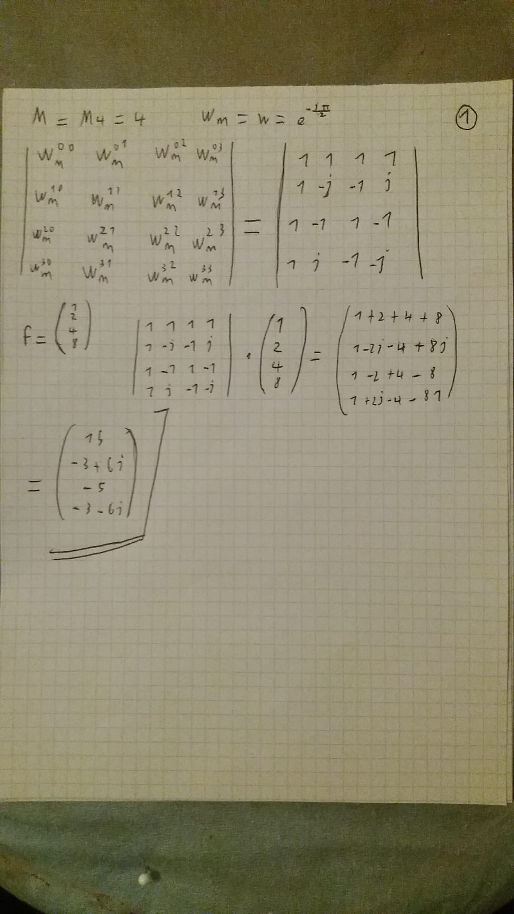{ width=60% }
  
In python (ex1.py function a()) I found [15.+0.j -3.+6.j -5.+0.j -3.-6.j], that is the same answer.  
We have a non zero imaginary part beacause the signal is not symmetric.  
For instance a function with the form [a,b,a,b] (a periodic one) we can get:  
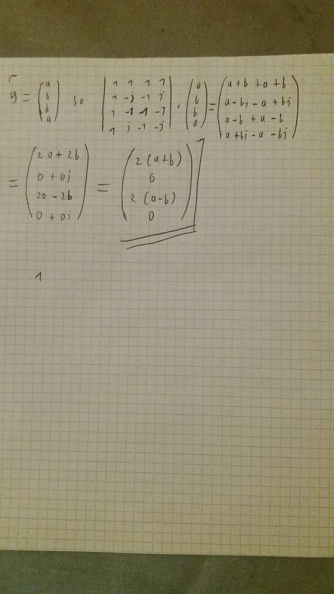{ width=70% }  

### (b) We now turn to a more involved example.  
I defined a variable  on the interval [-2,2] with 101 samples and a signal f= exp(-10*t^2)  
I did a plot with plt.plot(t,f).      
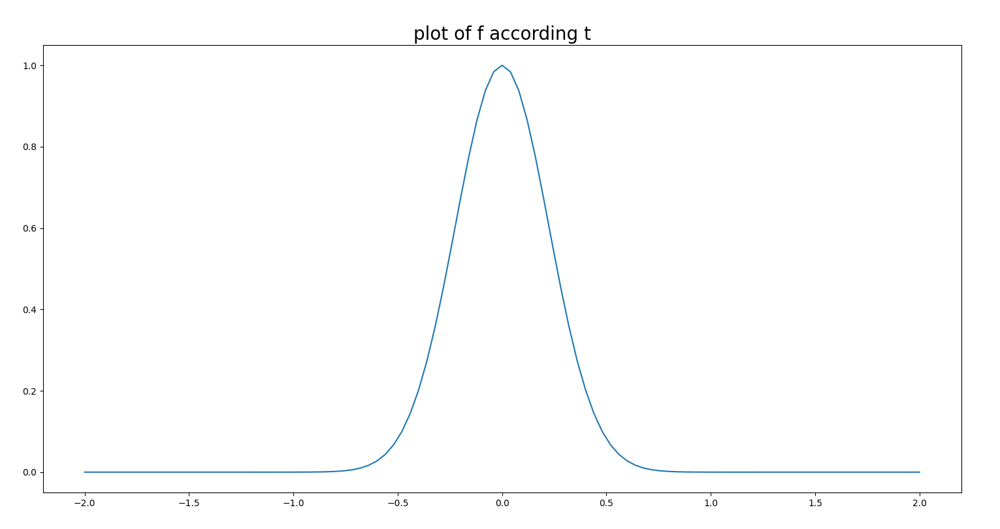{ width=70% }  
I also did a plot with plt.plot(f) (a shifted one).    
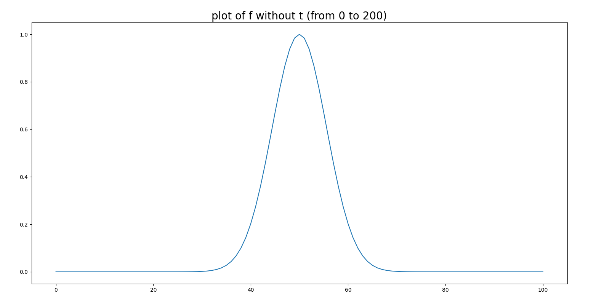{ width=70% }  

I defined a symmetric signal from f by rolling it: f_sym= np.roll(f,51) and ploted this new function.  
After that I computed F= np.fft.fft(f_sym) and ploted this new function.    
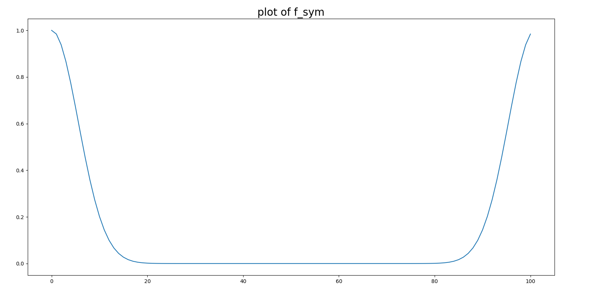{ width=80% }  
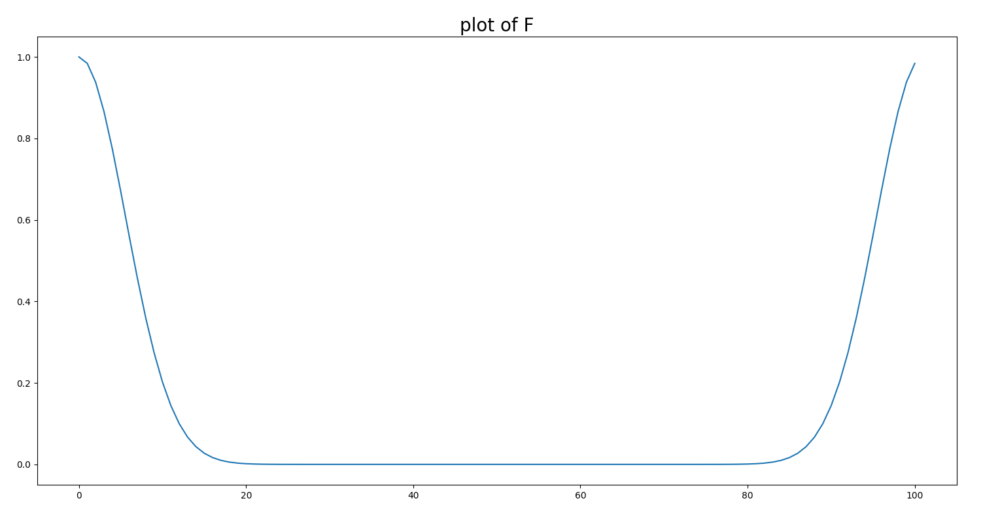{ width=80% }  

I computed D = np.fft.fft(f_sym) and represented it in four different plots.  
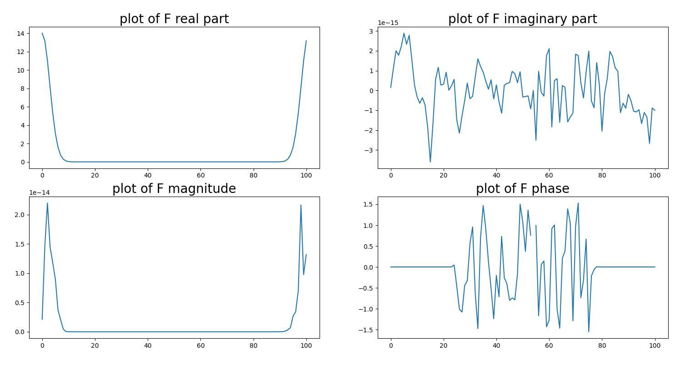{ width=80% }  

To have a better result, I modify F using F= np.fft.fftshift(F).  
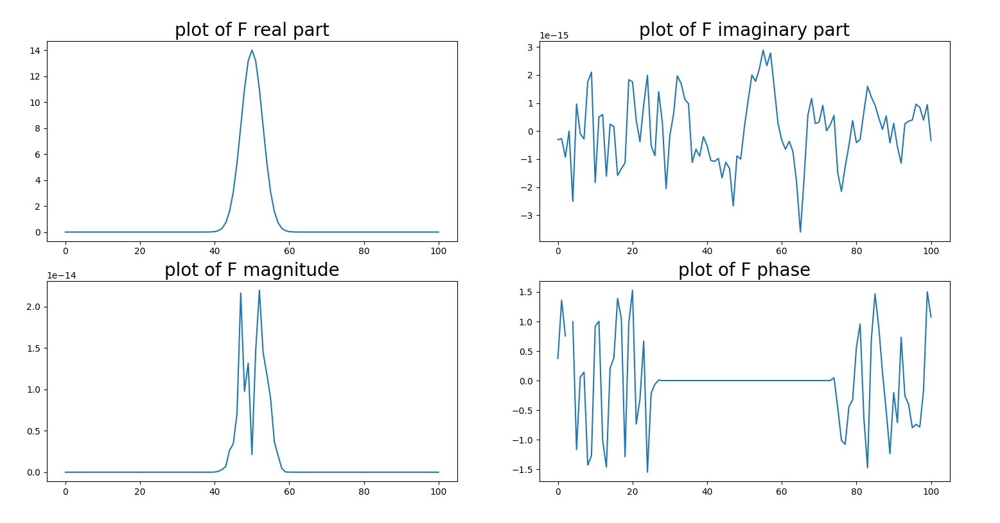{ width=80% }  

## Exercice 2. Circular convolution
We consider the two signals f=[1,2,3,4] and g=[1.-1].  

### (a)  
I computed by hand their standard convolution.  
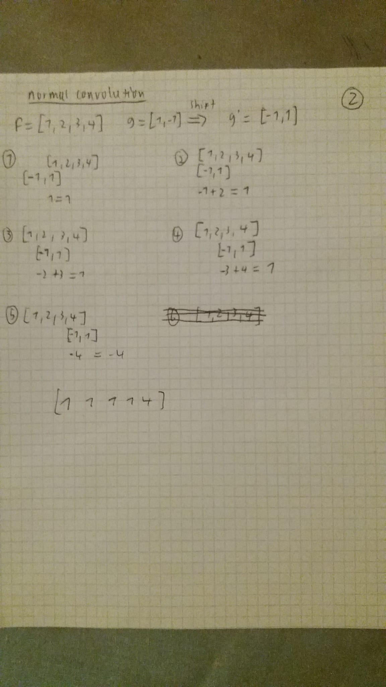{ width=70% }  

### (b)  
I computed by hand their circular convolution (no padding)  
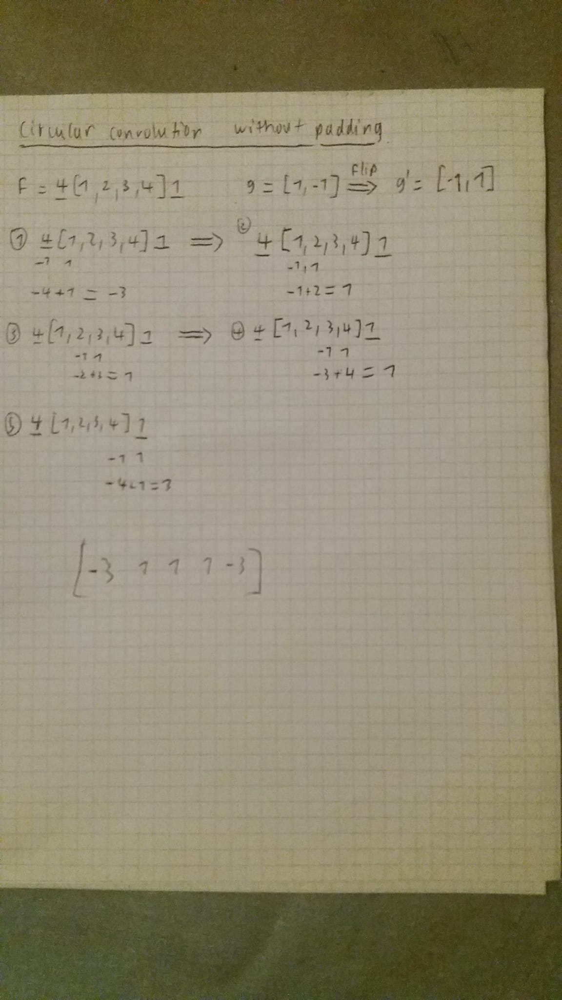{ width=70% }  

I computed by hand their circular convolution (zero padding)  
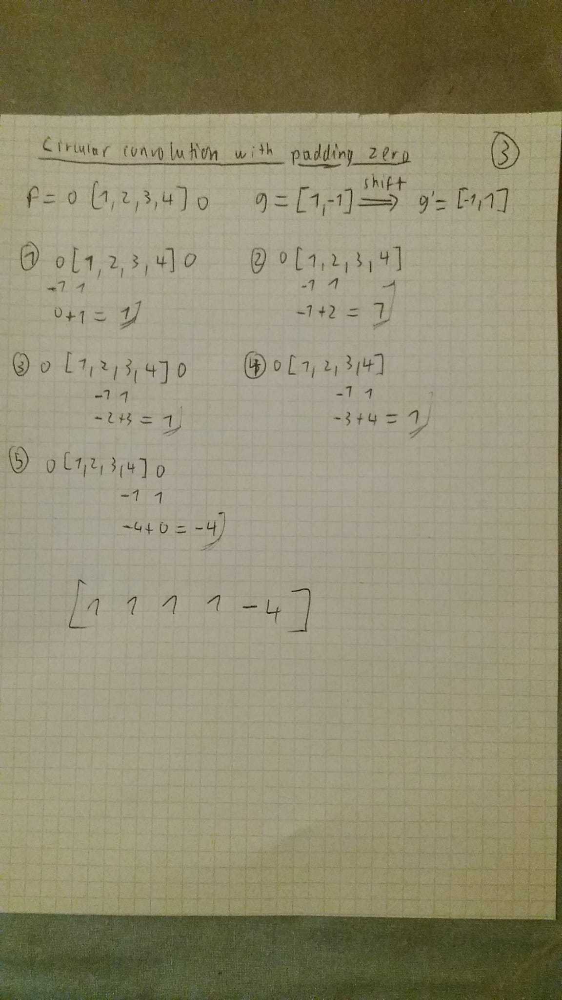{ width=70% }  
With zero padding, I found the same result as a normal convolution.  

With python I found respectively:  
[ 1  1  1  1 -4]  
[-3  1  1  1 -3]    
[ 1  1  1  1 -4]    

There are the expected values.  
