DSP and Complex Numbers

## Exercise 1. The Dirac comb (3 points)
*(a) In Python, implement a function sha(t, T)*
Remark: Use num = 201 in np.linspace(). Why is this value important ?
response: I don't know.

*(b) Explain why sampling a function at rate 1/T is equivalent to multiplying it with XT(t).*
\begin{center}
\rotatebox[origin=c]{270}{
\includegraphics[width=0.5\textwidth,height=\textheight]{images/1b.jpg}
}
\end{center}

*(c) Illustrate this fact by sampling f(t) = sin(t + pi/4) with T = 1, 2, 0.5.*

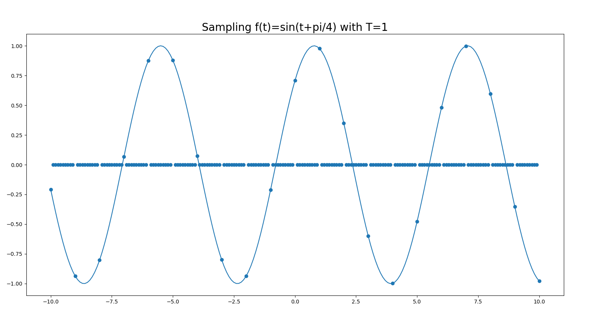
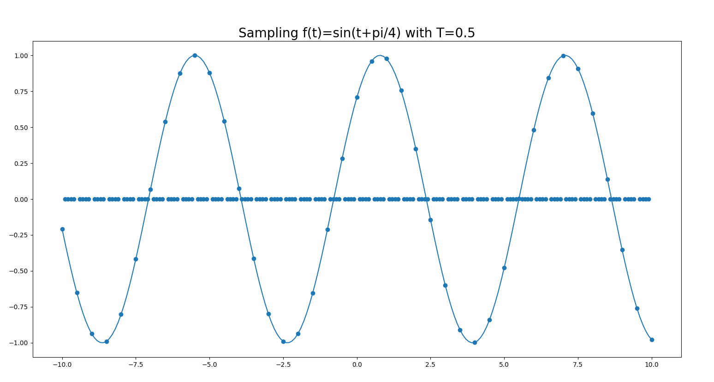
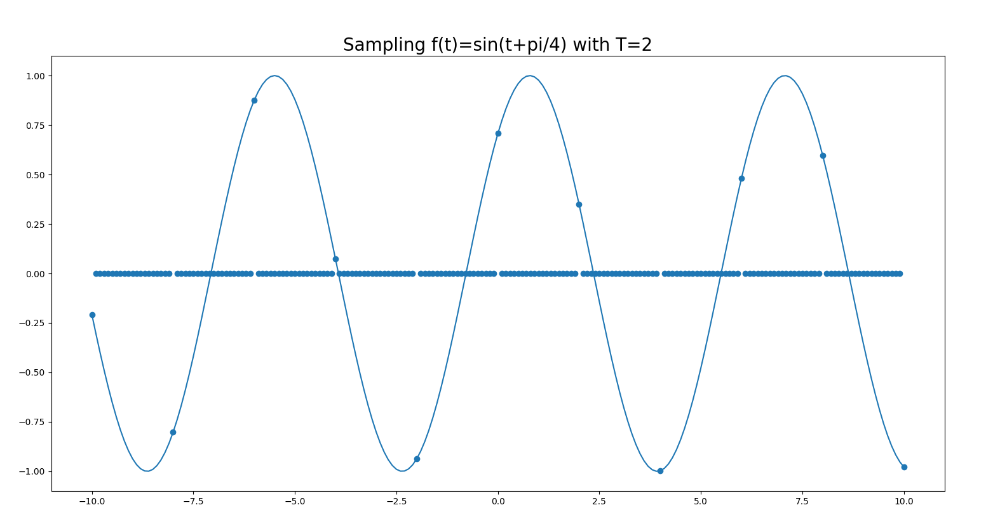

response: we can see that a fraction of 1/T point is sampled.
	 
*(d) Implement the two functions Even(S) and Odd (S), that compute the even and odd parts of a signal S.* 
Apply them to the signal f(t) and visualise Even(S), Odd(S) and Even(S)+Odd(S) on three different graphs.
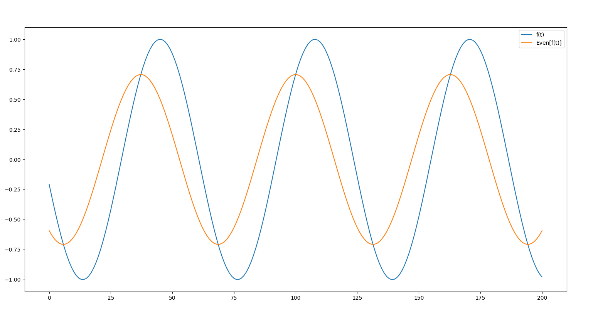
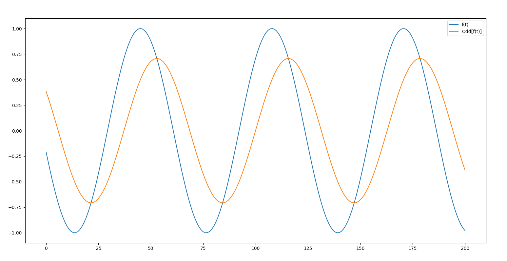
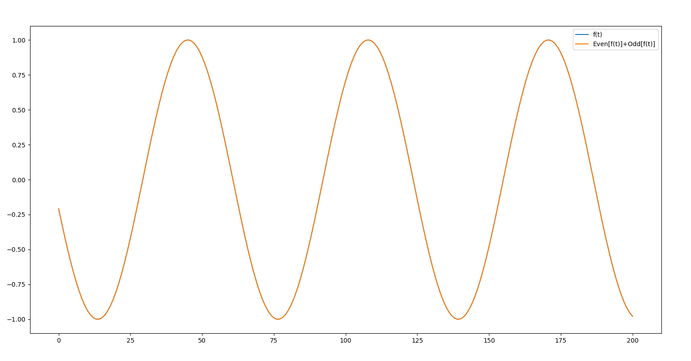

response: the Even and Odd function seem to be the same excepte that they have a different phase. The sum of the Even and Odd part give the same function f(t)
	 
*(e) Using trigonometric formulas, compute by hand the odd and even parts of f(t).* 
	- Compare your results with part (d).

\begin{center}
\rotatebox[origin=c]{270}{
\includegraphics[width=0.5\textwidth,height=\textheight]{images/1e.jpg}
}
\end{center}

If I sum up the Odd and Even function of f(t) I can find f(t).
Because:
$$ Even(f(x))+Odd(f(x))=(1/2)(f(x)+f(-x))+(1/2)(f(x)-f(-x)) $$
$$ Even(f(x))+Odd(f(x))=(1/2)((f(x)+f(-x))+(f(x)-f(-x))) $$
$$ Even(f(x))+Odd(f(x))=(1/2)(2f(x)) $$
$$ Even(f(x))+Odd(f(x))=f(x) $$

## Exercise 2. Complex function visualization (3 points)
In this exercise, you will visualize a complex polynomial function using complex numpy arrays.  Consider:

f(z)= z^3 - 1

*(a) Show that 1, ej2pi/3 and ej4pi/3 are the complex roots of f by computing by hand.*
\begin{center}
\rotatebox[origin=c]{270}{
\includegraphics[width=0.5\textwidth,height=\textheight]{images/2a1.jpg}
}
\end{center}

\begin{center}
\rotatebox[origin=c]{270}{
\includegraphics[width=0.5\textwidth,height=\textheight]{images/2a2.jpg}
}
\end{center}
	 
*(b) Create a numpy complex matrix z of size 100 x 100 whose entries range from [-2, 2] both in real and imaginary parts.*
*(c) Apply the function f to the matrix z, using pointwise operations, giving you a new complex matrix w of same size.*
*(d) Use the function np.abs() on w and visualize the result as an image, with its colorbar.*
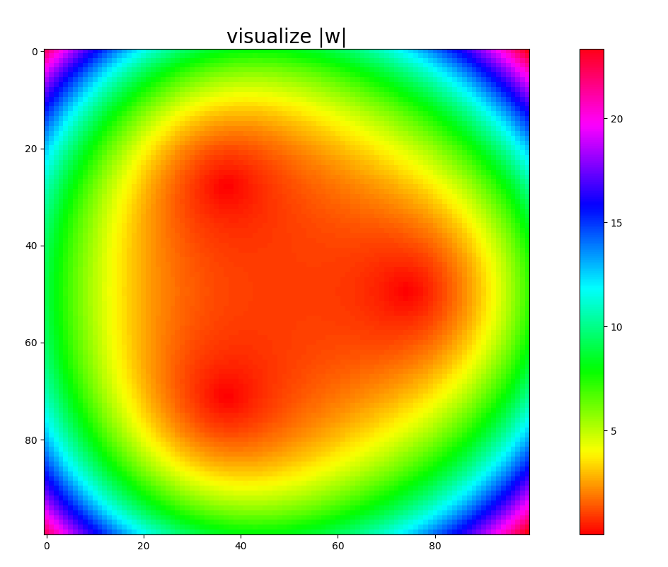

*(e) To further enhance the visualization, we will use a logarithmic scale.*
Instead of visualizing directly |w|, first apply the transformation m = log(1 + |w|) and do plt.imshow() on m. Comment the resulting image.
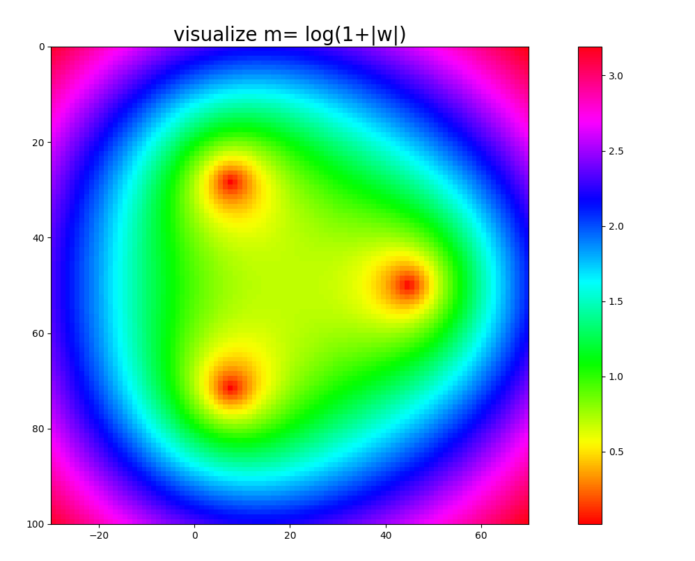
We can see more precisely the extrems of the graph.

*(f) Visualise now the real and imaginary parts of w on two different plots. When is f(z) a real number ?*
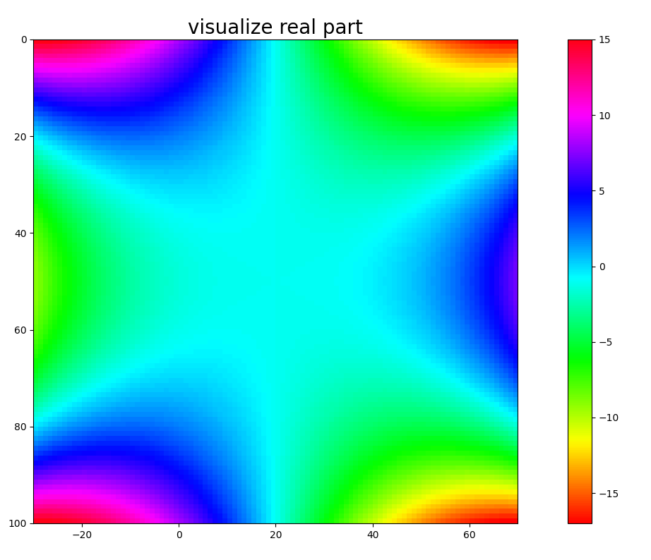
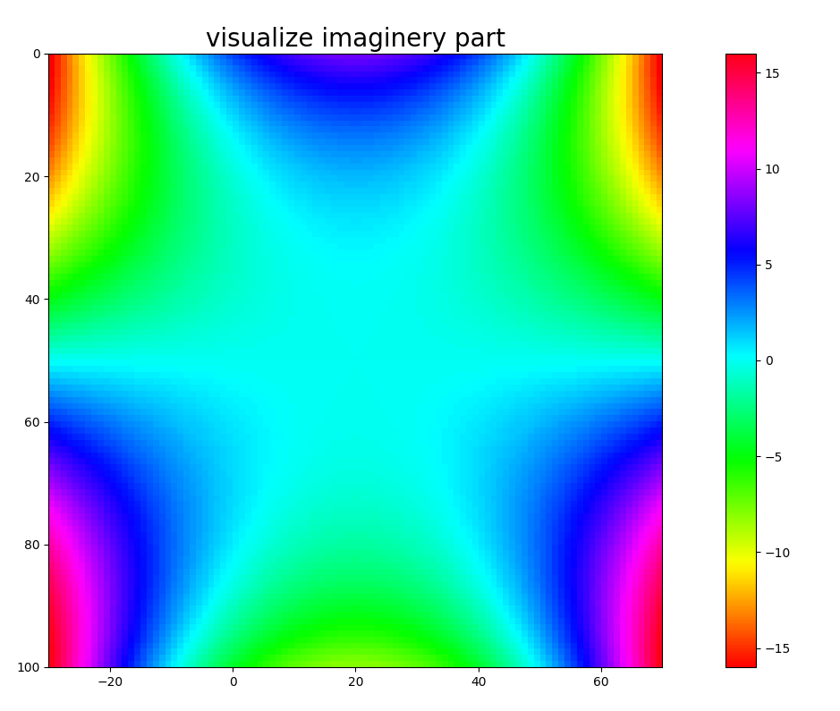

*(g) Prove point (f) by computing explicitely the developpement of f (a + jb) and finding a relation between a and b.*
\begin{center}
\rotatebox[origin=c]{270}{
\includegraphics[width=0.5\textwidth,height=\textheight]{images/2g.jpg}
}
\end{center}

*(h) Finally, visualise the phase of w using np.angle() and plot the colorbar as well. Give a new interpretation on when is f(z) a real number based on the value of the phase.*

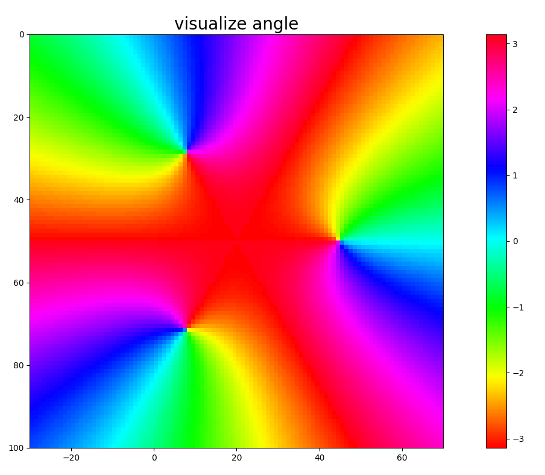
