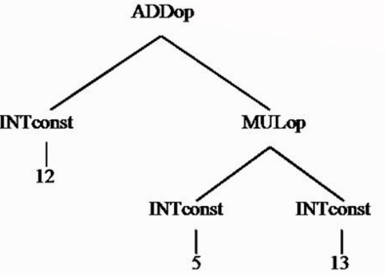
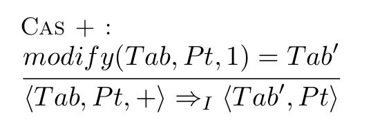
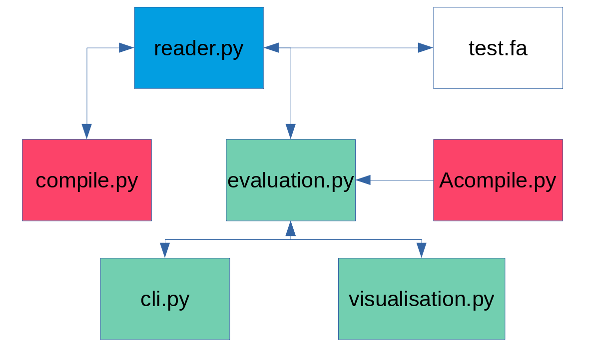
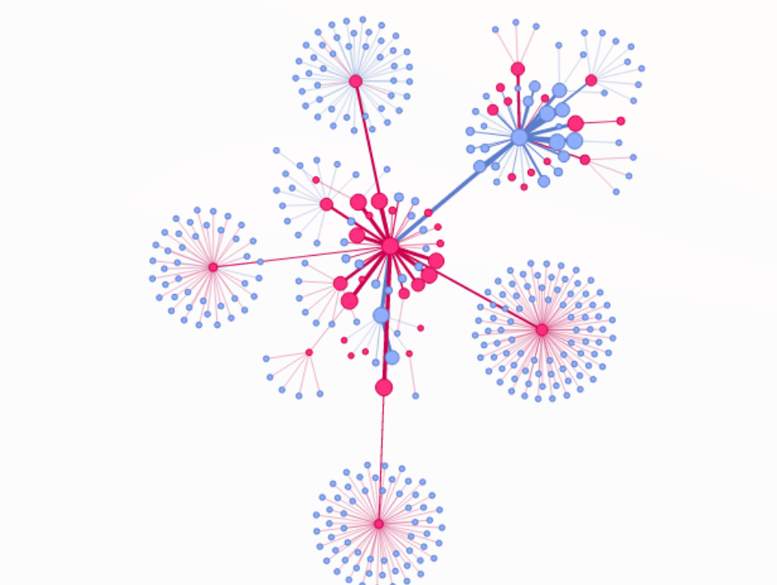

----

# Motivation: 

**Ce que nous voulons:**

	- Étude de langage
	- Sémantique opérationnelle
	 
**Créer un outil pour:**

	- Définir la sémantique d'un langage
	- En voir ses dérivations

----

# Outil

## langage:
	- Prolog like langage
	- Syntaxe simplifiée pour la définition de langage
	- Utilisation de PLY en tant que lexer/parser
	
## interface
	- CLI -> GUI
	- Outils de debbuging qui prévient l'utilisateur
	- Visualisation par graphe

----

# Actuellement

## reconnaissance
- grammaire
- parser

## évaluation
- deuxième parser
- algorithme principal

----

# sous langage (1)
## Tree-based abstract syntaxe



----

# sous langage (2)

## Arithmétique simple
- addition **add(a,b)**   
- soustraction **sub(a,b)**  
- division **div(a,b)**  
- multiplication **mul(a,b)**  

----

# sous langage (2)

## gestion de liste
liste: [], [1,2,3], ...   

## exemple
**l1= [1,2,3]**, **l2= [4,5,6]**  
- accès **get(l1, 0)**  => [1]  
- définition **set(l2, 1, 7)**  => [4,7,6]  
- concatenation **concat(l1, l2)**  => [1,2,3,4,5,6]  
- insertion  **insert(l1, 0)**  => [0,1,2,3]  
- ajout  **append(l2, 7)**  => [4,5,6,7]  

----

# Pour le reste

{ width=40% }

## Traduction
```javascript
modify(Tab,Pt,1) = TabP -- <Tab,Pt,+> => <TabP,Pt>
```

----

# architecture



----
# test.fa
l=[] -- isValid(l) = true

----

# Interface (visualisation par graphe)

## pyvis


inspiré de vis.js

----

# outils de visualisation

## Affichage
	NetworkX + pyvis + vis.js
	
----

# Pour la suite

## 07.04.21
- évaluation de programmes définis par l'utilisateur
- écriture de la documentation (suite)

## 14.04.21
- interface du système de dérivation (CLI peut-être GUI)
- écriture de la documentation (suite)

## 21.04.21
- interface du système de dérivation (suite) 
- écriture de la documentation (suite)

## 28.04.21
- développement d'un système de preuve
- écriture de la documentation (suite)
	
