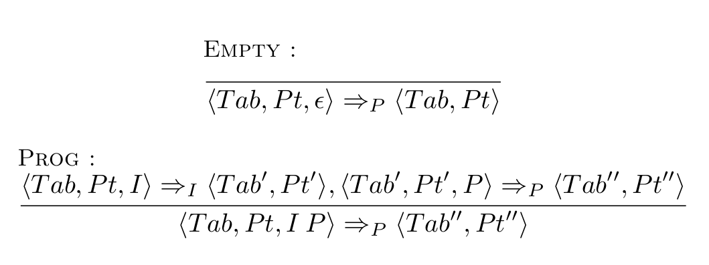

# Motivation: 
**Ce que nous voulons:**

	- Étude de langage
	- Sémantique opérationnelle
	 
**Créer un outil pour:**

	- Définir la sémantique d'un langage
	- En voir ses dérivations

----

# Outil

## langage:
	- Prolog like langage
	- Syntaxe simplifiée pour la définition de langage
	- Utilisation de PLY en tant que lexer/parser
	
## interface
	- CLI -> GUI
	- Visualisation par graphe

----

# Structure du langage

## En construction...


----

# Sémantique sur les types 

## Signature
$$ \Sigma = <S,F> $$
Depuis sigma on peut dériver l'ensemble T_{sigma} qui est l'ensemble des termes généré par Sigma.

----

# Syntaxe

## Typage
```json
    true[[empty],[bool]].
    not[[bool],[bool]].
    and[[bool,bool],[bool]].
```

## Traduction
```bash
	$ true;; => ['bool']
	$ false;; => ['bool']
	$ and(_,_);; => ['bool']
```

## Programme
```json
P= { inst1;;inst2;;...;;instn }
```

----

# Strucutre du domaine Sémantique

## Sémantique sur les valeurs de retour
	- arithmétique
	- langage plus complexe

## Etat du système
```javascript
State(e1,e2,...,en)
```

## Transition
```javascript
Transition(State(...),inst) => State(...)
```

----

# Syntaxe côté utilisateur

## State
```sql
<e1,...,en>
```

## State x inst
```sql
<e1,...,en,inst>
```

## Transition
```
<e1,...,en,inst> => <i1,...,in>
```

## Définition linéaire
```javascript
e1 => i1,...,in => in -- <e1,...,en,inst> => <i1,...,in>
```
	
----

# Définition implicite



----

# Limitations(1)

## Structure de données:
```javascript
node(leaf,node(node(leaf,leaf),leaf)) => tree
```

## Liste
```javascript
[] => list
list(a,list(b,list(c,d)) => list
[a,b,c,d] => list
```
----

# Limitations(2)

## Exercice 5
{ width=40% }

## Traduction
```javascript
modify(Tab,Pt,1) = TabP -- <Tab,Pt,+> => <TabP,Pt>
```

## Comment définir modify?
Injection python?

----


# Interface (visualisation par graphe)


----

# outils de visualisation

## Affichage
	NetworkX + matplotlib
	
## Interactivité
	NetworkX + wxPython


