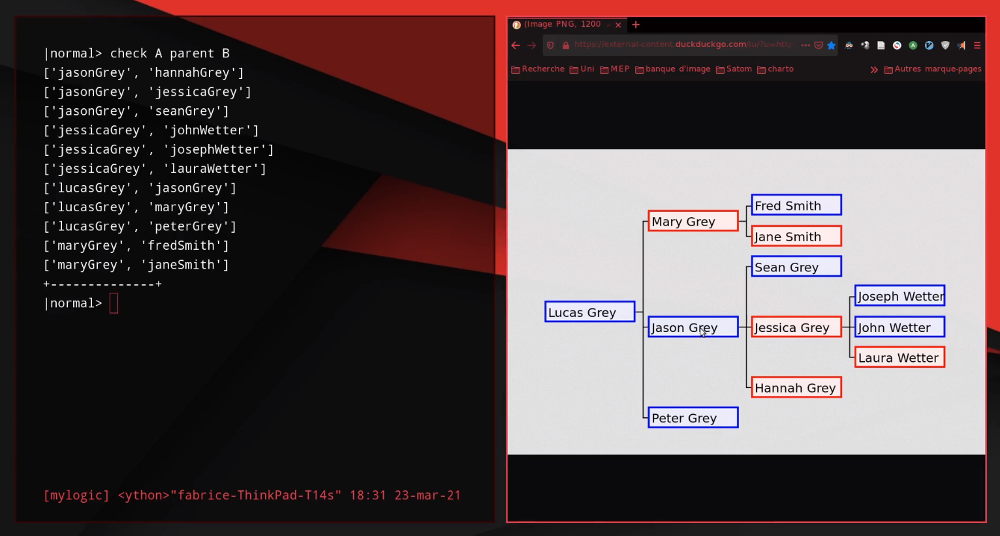
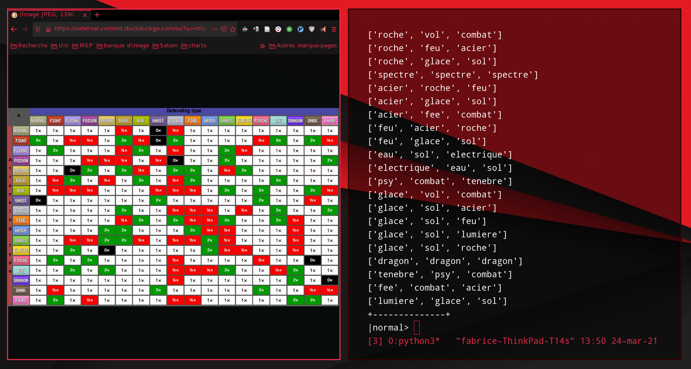

----

# Motivation: 

**Ce que nous voulons:**

	- Étude de langage
	- Sémantique opérationnelle
	 
**Créer un outil pour:**

	- Définir la sémantique d'un langage
	- En voir ses dérivations

----

# Outil

## langage:
	- Prolog like langage
	- Syntaxe simplifiée pour la définition de langage
	- Utilisation de PLY en tant que lexer/parser
	
## interface
	- CLI -> GUI
	- Visualisation par graphe

----

# Syntaxe State (du domaine sémantique)

## State
```sql
<e1,...,en>
```

## State x inst
```sql
<e1,...,en,inst>
```

## Transition
```
<e1,...,en,inst> => <i1,...,in>
```

## Définition linéaire
```javascript
e1 => i1,...,in => in -- <e1,...,en,inst> => <i1,...,in>
```

----

# Actuellement

## reconnaissance
- grammaire
- parser

## évaluation
- deuxième parser
- algorithme principal

----

# Problèmes

## évaluation de règles
	- union
	- récursivité

----

# Entraînement

## Langage plus simple
	- inspiré de la logique des prédicats
	- inspiré de prolog

## évaluation simplifiée
	- faits simples
	- règles simple

----

# Qu'est ce qu'on peut faire?

1. Créer des faits
2. Poser des questions
3. Créer des règles

----

# Syntaxe du LS faits

## prédicats à deux expressions
	[sujet] [lien] [verbe]

## exemple
Pour dire "Socrate est un homme":  
```bash
|normal> Socrate est homme
```

----

# Syntaxe du LS requête(1)

## principe
Même structure que les faits mais avec l'utilisation de variables

## variables réservées
A, B, C
Pas plus de `deux` variables par fait.

----

# Syntaxe du LS requête(2)

## Cas 1
check **A** est homme = "**Qui** est un homme?"

## Cas 2
check Socrate **A** homme = "**Quel relation** Socrate a avec 'homme'?"

## Cas 3
check Socrate est **A** = "**Qu'est-ce qu**'est Socrate?"

----

# Autres questions: 2 variables
## Cas 4
check **A B** homme = "**Qu'est-ce qui est relier à **'homme'?"

## Cas 5
check Socrate **A B** = "**Qu'est ce qu'on dit sur** Socrate?"

## Cas 6
check **A** est **B** = "**Qu'est-ce qui** 'est' **quoi?**"

----

# Syntaxe LS règles

## Syntax
add `if` [conditions] `then` [conclusions]

## exemple
Pour donner la règle "Tout les hommes sont mortels":  
```bash
	|normal> add if A est homme then A est mortel
```

----

# Actuellement(1)



----

# Actuellement(2)



----

# Interface (visualisation par graphe)


----

# outils de visualisation

## Affichage
	NetworkX + matplotlib
	
## Interactivité
	NetworkX + wxPython


