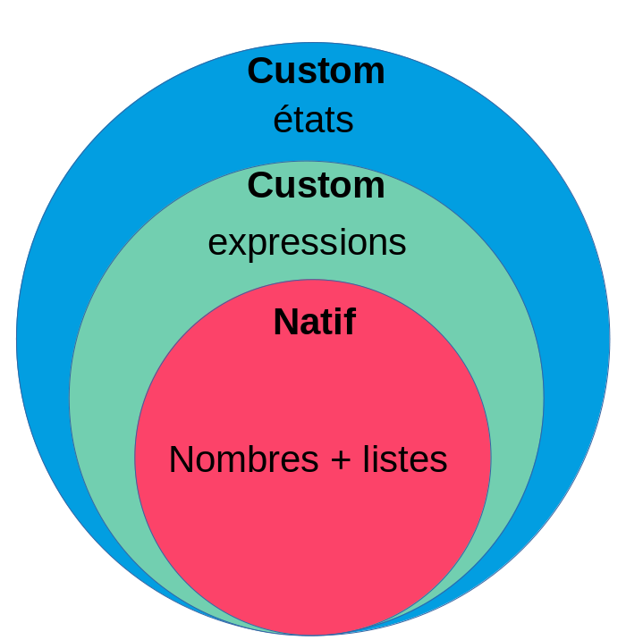
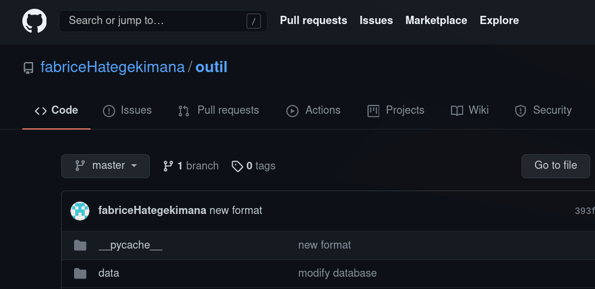
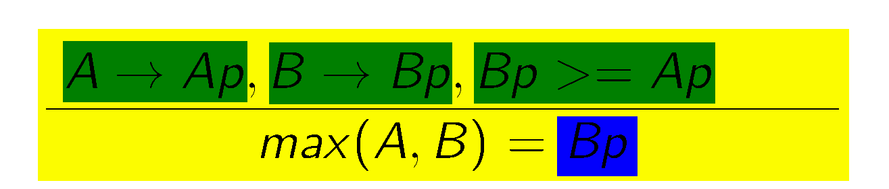

----
python -m pip freeze 

# Motivation: 

**Ce que nous voulons:**

	- Étude de langage
	- Sémantique opérationnelle
	 
**Créer un outil pour:**

	- Définir la sémantique d'un langage
	- En voir ses dérivations

----

# Outil

## langage:
	- Syntaxe simplifiée pour la définition de langage
	- Utilisation de PLY en tant que lexer/parser
	
## interface
	- CLI -> GUI
	- Outils de debbuging qui prévient l'utilisateur
	- Visualisation par graphe

----

# langage

{ width=50% }

----

# langage natif (1)
## Tree-based abstract syntaxe


----

# langage natif (2)

## Arithmétique simple
- addition **add(a,b)**   
- soustraction **sub(a,b)**  
- division **div(a,b)**  
- multiplication **mul(a,b)**  

----

# langage natif (2)

## gestion de liste
liste: [], [1,2,3], ...   

## exemple
**l1= [1,2,3]**, **l2= [4,5,6]**  
- accès **get(l1, 0)**  => 1  
- définition **set(l2, 1, 7)**  => [4,7,6]  
- insertion  **insert(l1, 0)**  => [0,1,2,3]  
- ajout  **append(l2, 7)**  => [4,5,6,7]  
- retrait  **remove(l2, 1)**  => [4,6]  
- retrait  **removeLast(l2)**  => [4,5]  
- retrait  **pop(l2)**  => 6  
- retrait  **pop(l2, 0)**  => 4  

----

# Pour le reste

{ width=40% }

## Traduction Idéale
```javascript
modify(Tab,Pt,1) -> TabP -- <Tab,Pt,+> => <TabP,Pt>
```

----

# actuellement (1)


----

# actuellement (2)

- repository github
- domaine augmenté (chaines de charactères)
- workflow écriture-exécution

----

# Github



----

# Domaine augmenté

## Types acceptés
- **nombres**
- **booléens**
- **chaines de caractères**

----

# forme plus souple

## forme simple
```javascript
-- estPair(0) -> true.
```

## forme une ligne
```javascript
estPair(N) == true, estPair(div(N,2)) -- divisibleParQuatre(N) -> True.
```

## forme multiligne
```javascript
estPair(N) == true, estPair(div(N,2))
--
divisibleParQuatre(N) -> True.
```

----

# Commentaires

## actuellement multiligne
```javascript
/*Ceci est un commentaire*/
-- ami(pierre,jean).
-- ami(jean,pierre). /*Ceci est un commentaire*/
```

----

# section du programme

## En bas de chaque fichier .fa
```javascript
Program{ 
	<val1,val2,val3>
	inst1;;inst2;;
	inst3;;
	inst4;;
}
```

----

# Debug mode

**step**: execute the next step (rule selection or rule application)  
**state**: display the actual state of the execution (still ugly and need to be improved)  
**display**: show with a graph (in your browser) the execution of the rules.  
**end**: execute the code until the end (warning, if there is an infinit loop, it won't stop util you press ctrl+c)  
**set exp**: set a new expression to be executed.  
**set state**: set a new state to be executed.  

----

# graphe



----

# Pour la suite

## 12.05.21
- écriture de la documentation (suite)
- faire tester l'outil
- réécriture du code

## 19.05.21
- écriture de la documentation (suite)
- faire tester l'outil
- gestions d'erreur

## 26.05.21
- écriture de la documentation (suite)
- faire tester l'outil
- gestions d'erreur

## 02.06.21
- écriture de la documentation (suite)
- faire tester l'outil
- gestions d'erreur

