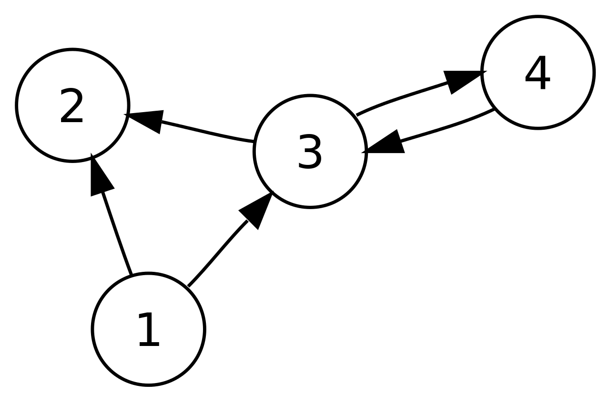

# Motivation: 
**Ce que nous voulons:**

	- Étude de langage
	- Sémantique opérationnelle
	 
**Créer un outil pour:**

	- Définir la sémantique d'un langage
	- En voir ses dérivations

----

# Outil

## langage:
	- Paradigme logique
	- Syntaxe simplifiée pour la définition de langage
	- Demande un compilateur
	
## interface
	- CLI -> GUI
	- visualisation par graphe

----

# Structure du langage

## Types
S= {...}

## Symboles/opérateurs
F= {...}

## Règles
R= {...}

## Programme
P= {...}

----

# Types, symboles et opérateurs

## Signature
$$ \Sigma = <S,F> $$
Depuis sigma on peut dériver l'ensemble T_{sigma} qui est l'ensemble des termes généré par Sigma.

----
# Syntaxe

## Signature
```json
S= {bool,nat}
F= {
    True[empty,bool],
    not[bool,bool],
    and[bool,bool,bool]
}
```

----
# Règles et progamme

## Axiom
```python
-- zero in nat
```

## Règle
```python
n in nat -- succ(n) in nat
```

## Programme
```json
P= { inst1;;inst2;;...;;instn }
```

----

# Actuellement
**Définition de l'algo de dérivation de programme:**
	 
	- GNU Bison et Flex
	- Utilisation d'une grammaire algébrique
	 
----

# Interface (visualisation par graphe)




----

# outils de visualisation

## Affichage
	NetworkX + matplotlib
	
## Interactivité
	NetworkX + wxPython


