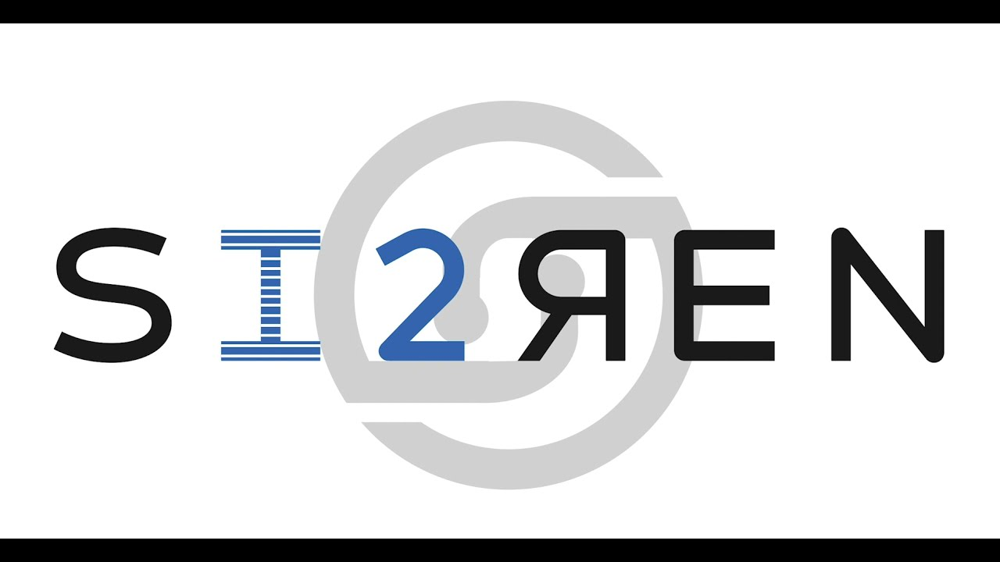
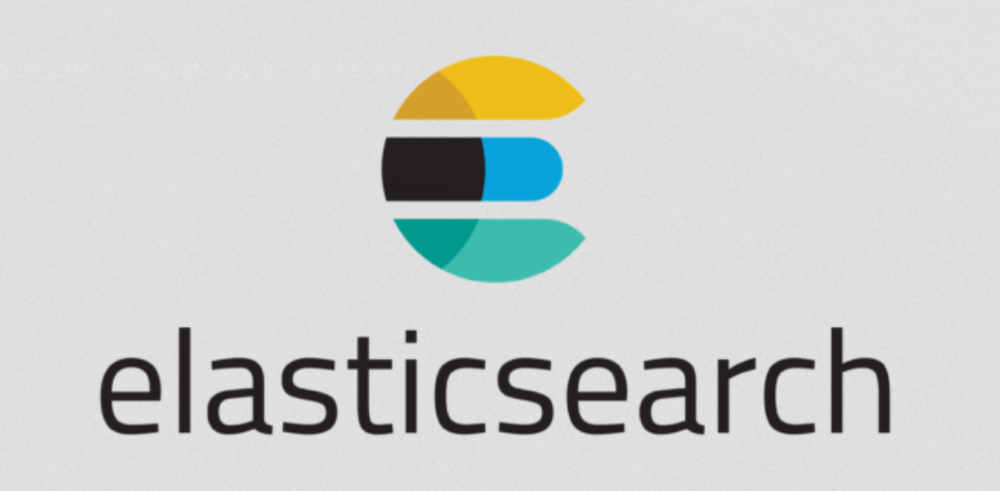
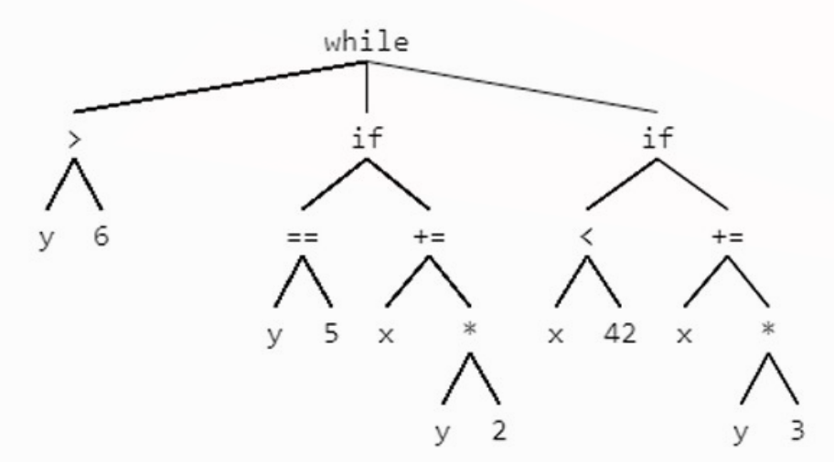
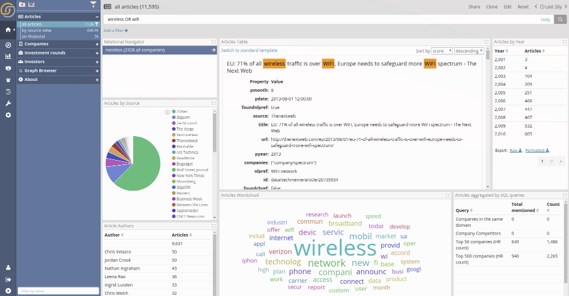

# Si2ren direct query

----

# Goal:

- Build a module that alow us to do direct queries from ANB to Siren.
- Develop a methodology and a workflow of the system (documentation, tools, expertise)

----

# Actually

## Done
- beginning of a road map with date

## Beginning of the project (starting point)
- General documentation (situation)

----

# Siren queries langage

- Extention of elastic search search API
- JSON instruction (REST API like query)
- Based on a abstract tree syntax

----

# Elastic search

----

# Query DSL

Elasticsearch provides a full Query DSL (Domain Specific Language) based on JSON to define queries. Think of the Query DSL as an AST (Abstract Syntax Tree) of queries, consisting of two types of clauses:

- Leaf query clauses 
- Compound query clauses 

----

# Abstract syntax tree

----

# Siren Dashboard

----

# Suite

## Query API
From row to client

## ANB form
Create a new endpoint, port and service

## Predicat
Develop a translator for predicat

