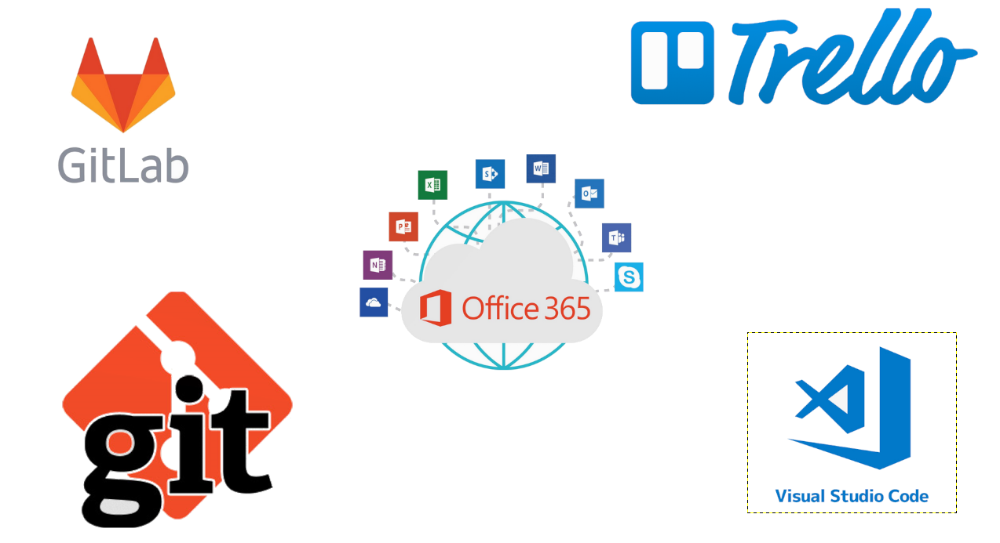

# Si2ren direct query

----

# Goal:

- Build a module that alow us to do direct queries from ANB to Siren.
- Develop a methodology and a workflow of the system (documentation, tools, expertise)

----

# Actually

## Beginning of the project (starting point)
- General documentation (situation)
- tools (for the project management)
- plan (road map)

----

# Tools:

----

# To do

## development
- Understand siren data model
- Test Siren search API
- Adapt our previous queries with the search API
- Generalise i2 data model (Flexible schema)

## demo
- Conception of a scenario
- Find the right data sources
- Give a complete documentation
