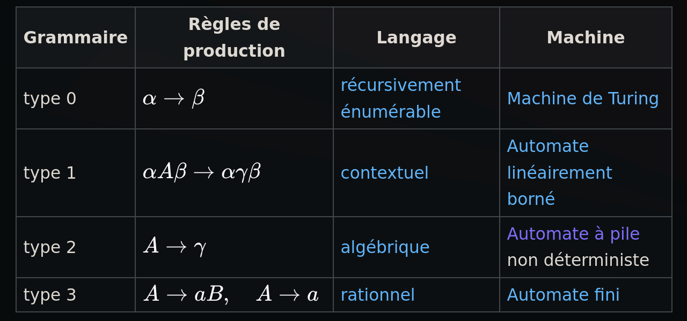

# Q3_2_Classification_des_grammaires

Hiérarchie des langages et des grammaires  
Classification de chomsky  

## Chaque type de langage est généré par un type arbitraire grammaire
régulier > algébrique > contextuel > arbitraire

## Classification de Chomsky pour les arbitraire :
régulière ⇢ algébrique ⇢ contextuelle ⇢ quelconque

Langages et grammaires algébriques

Chaque grammaire peut être classé du type 0 au type 3.
Pour chaque grammaire, on a une famille d'automate qui accepte ce type.

