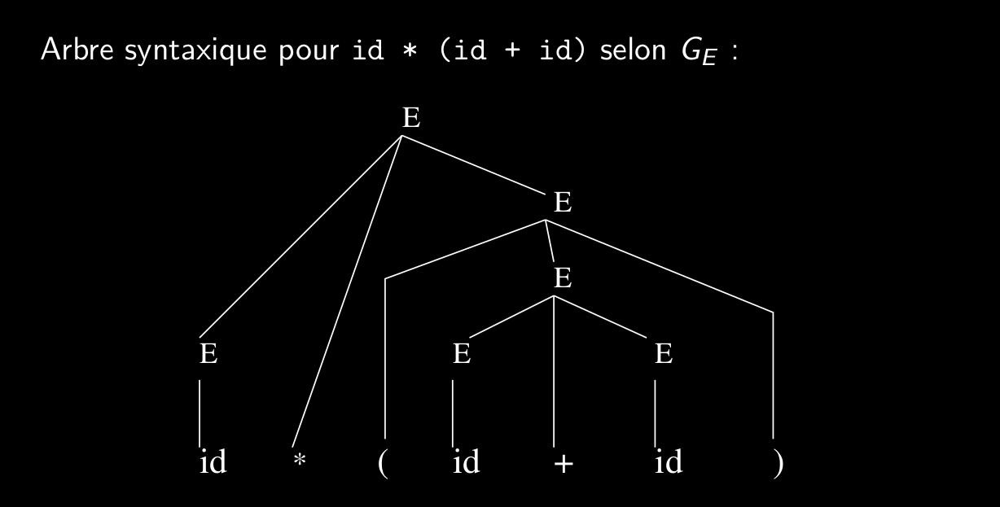
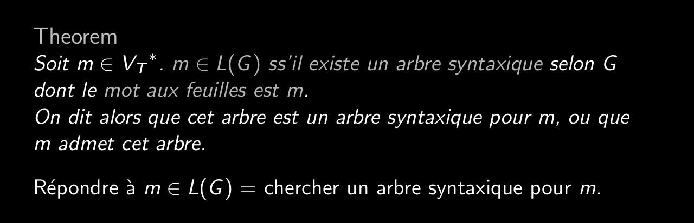
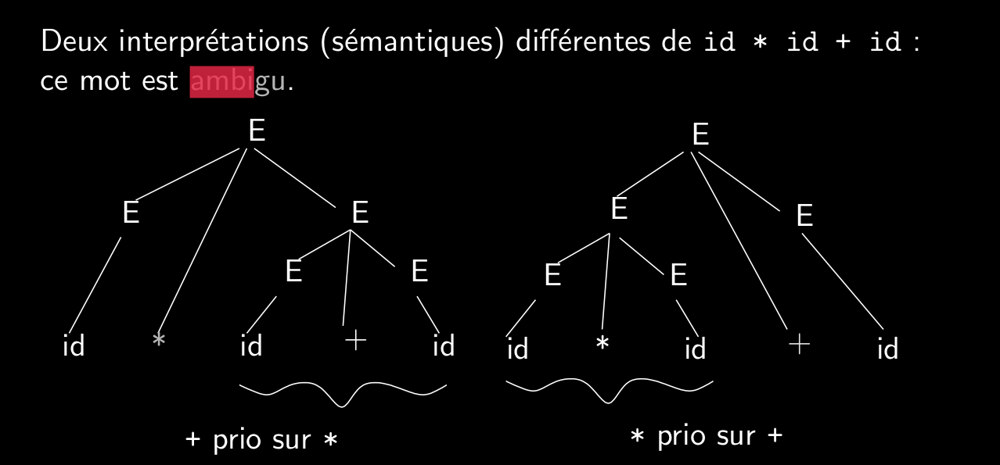

# Q3_3_Grammaires_ambigües

Propriété arbre syntaxique
Arbre résultant de l’analyse syntaxique.
Fait apparaı̂tre la structure syntaxique d’un mot.
Notion très importante, on le verra plus tard.
On parle aussi d’arbre de dérivation.

On ne construit pas un arbre syntaxique explicitement mais on utilise les dérivations (gauche ou droite)

Une grammaire ambigüe est une grammaire pathologique rejettée par le générateur.
Une grammaire ambigüe est une grammaire qui peut générer la même production par plus d'une dérivation/interprétation.

Definition (mot ambigu)
(ambiguı̈té) Un mot w est ambigu s’il admet plusieurs arbres syntaxiques.

Definition
Une grammaire est ambiguë si elle permet de dériver au moins un mot ambigu.

Mauvais pour le déterminisme d'un programme.
