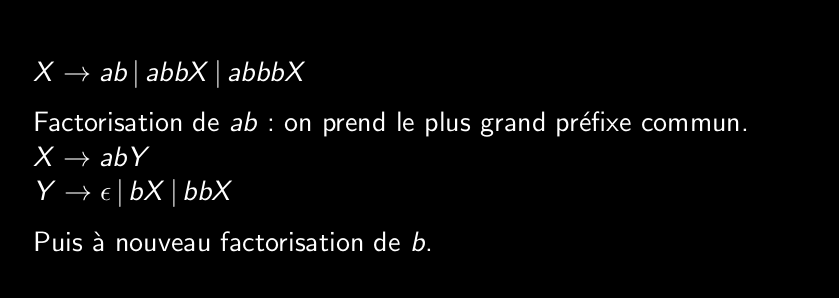
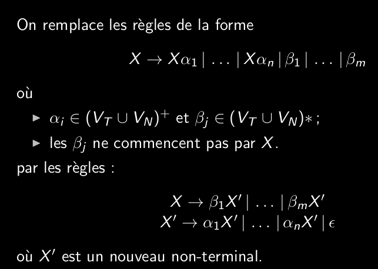

# Q5_10_rendre_une_grammaire_LL1_problèmes_et_solutions

- Généralement une grammaire:
- N'est pas ambiguë
- N'a pas de récursivité à gauche (sinon la récursion est infinie)
- A une factorisation qui se fait à gauche

Pour régler ça on peut:
- remplacer par des factorisation à gauche
- supprimer la récursivité à gauche

Ces solutions marchent parfois mais le plus efficace est d'utiliser un parser plus puissant.

Pour factoriser à gauche il faut prendre le plus grand prefix commun à gauche dans toutes les dérivations possibles du symbole.
Recommencer jusqu'à un résultat satisfaisant.

Pour éliminer la récursivité de gauche.
Il y a deux types de récursivité à gauche:
1. immédiate (on a compris)
2. et générale (il existe un chemin de dérivation menant à une forme dérivable par la gauche)

On peut supprimer la réursivité à gauche (à droite c'est possible mais on ne verra pas).

