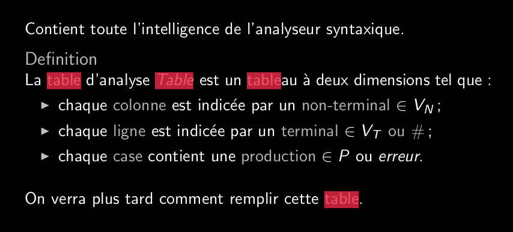
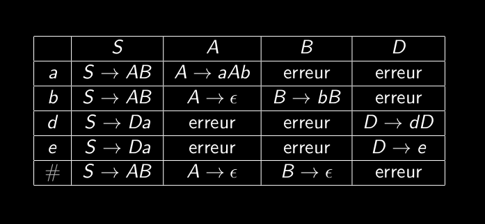

# Q5_2_Table_d_analyse
C'est le coeur et la clé de l'analyse prédictive.
Contient l'intelligence du programme, c'est grâce à elle qu'on fait nos prédictions.

La première colonne: non-terminaux
Première ligne: termiaux
Cases au centre: production

