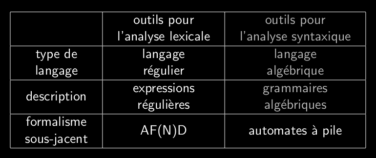

# Q5_3_Collaboration_avec_analyseur_lexical

Collaboration avec l'analyseur lexical.
L'analyseur synthaxique dispose des lexèmes du code source et les transforme en jeton (=token) que l'analyseur syntaxique devra analyser syntaxiquement pour voir si la forme des requêtes est respectée.

Le lexique d'un langage définit les mots qui le composent
De manière générique on peut avoir:
- identificateur
- chaîne de caractère
- constante numérique

Permet de faire une analyse lexical et repérer les erreurs lexicales dans le code.  

Lit le code caractère par caractère et converti les lexèmes en token (liste).  
Enlève les espaces superflux et les commentaires.  
