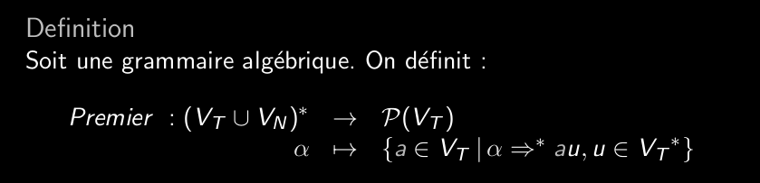
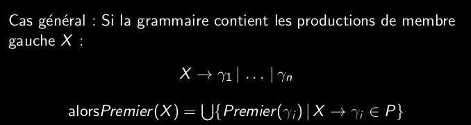
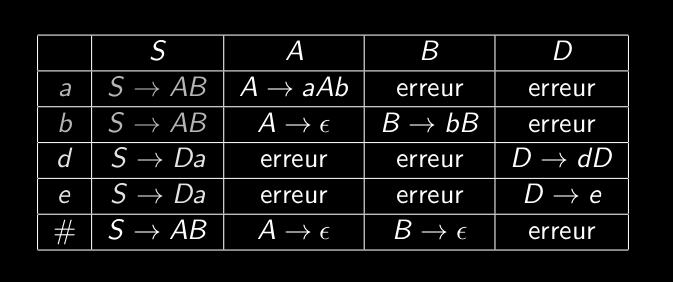

# Q5_5_construction_de_la_table_d_analyse_Premier  
  
Dans une transition d'expansion par X->X_1...X_n   
X est le "prochain" noeud à traiter dans l'arbre   
X_1 à X_n sont ajoutés de gauche à droite comme fils.  
X_1 devient le prochain noeud à traiter.  
  
  

  
Les premiers arrivent en premier (à gauche) dans les arbres syntaxiques.  
  
Si un non terminal a plusieurs transitions, alors Premier de ce symbole sera l'union de toutes ses transitions.  
  
S'il y a un chemin de dérivation menant d'un non terminal à epsilon, on dit que ce symbole est epsilon productif.  
  
On sélection les symboles terminaux et on essaie de trouver leur ensemble de premier.  
  
  
