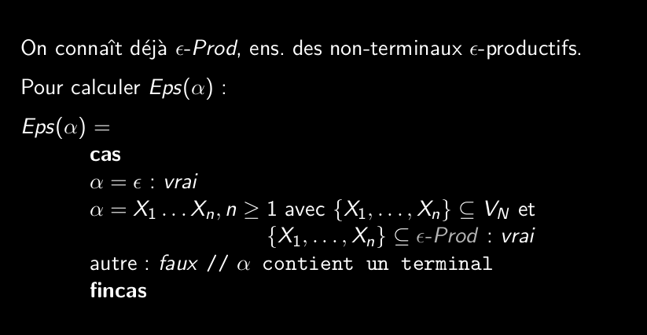

# Q5_6_construction_de_la_table_d_analyse_epsilon Prod  
  
S'il y a un chemin de dérivation menant d'un non terminal à epsilon, on dit que ce symbole est epsilon productif.  
  
Donc soit:  
X-> epsilon (relation directe)  
X -> Y_1...Y_n et chaque Y a un chemin qui mène à espilon (relation indirecte)  
  
L'ensemble des epsilon-productif et epsilon-Prod  
  
L'algorithme du calcul des epsilon-Prod est le même que pour le calcul des premiers.  
  
  
