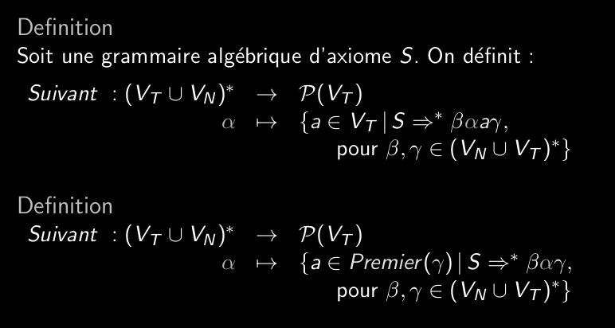
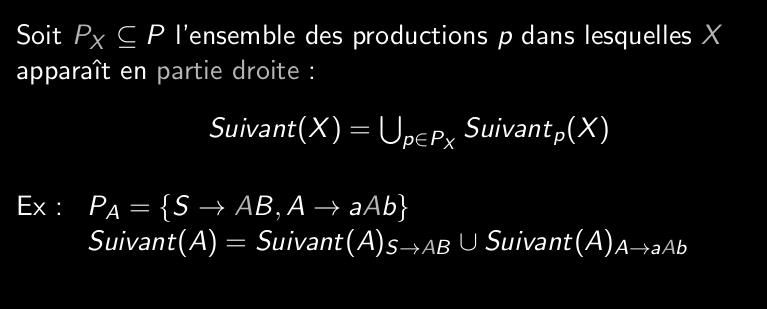
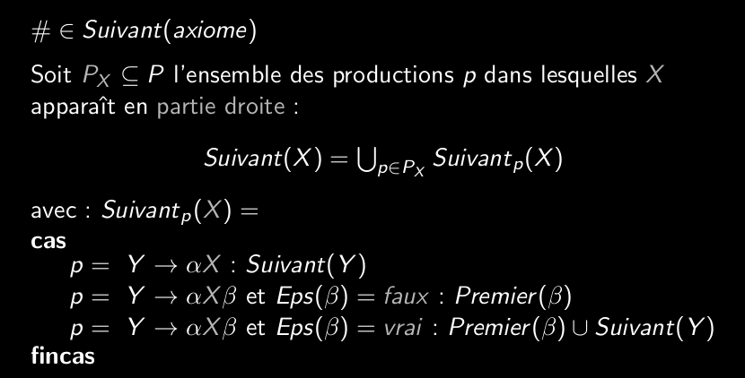

# Q5_7_construction_de_la_table_d_analyse_Suivant

L'ensemble des premier ne suffit pas toujours à trouver toutes les bonnes transitions à faire.

Pour un alpha (appartenant à l'ensemble terminaux/non), son suivant contient l'ensemble des terminaux susceptibles de suivre alpha dans le mot dérivé de l'axiome S.

Si alpha = epsilon, cet ensemble est vide.

On a deux définitions:

Pour calculer suivant on regarde les production ou le non-terminal apparaît en partie droite.

Pour l'axiome, on rajoute le marqueur de fin de mot # en union à gauche.

