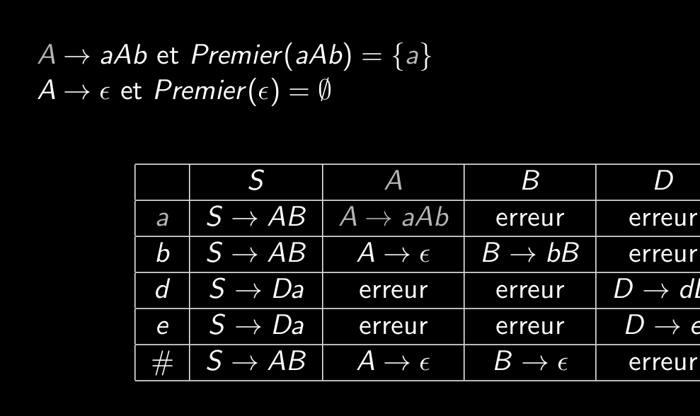

# Q5_8_construction_de_la_table_d_analyse_remplissage  
Pour construire la tables d'analyse:  
- epsilons-productifs  
- ensemble des premiers  
- ensemble des suivants  
  
Il suffit pour chaque production:  
- l'ajouter dans tout les croisement non-terminaux terminaux équivalent.  
- si la partie de droite est epsilon-productif, tout ses terminaux reçoivent la production  

