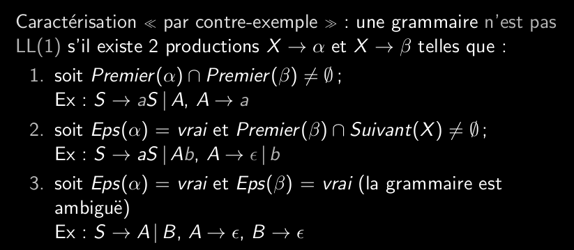

# Q5_9_caractérisation_d_une_grammaire_LL1

La grammaire LL(1) est déterministe.
n'est pas ambiguë
Il n'y a pas de récursivité à gauche (sinon la récursion est infinie)
La factorisation se fait à gauche

Une grammaire est LL(1) si la table d'analyse engendrée contient en son sain des case ayant exactement une production ou une erreur.

