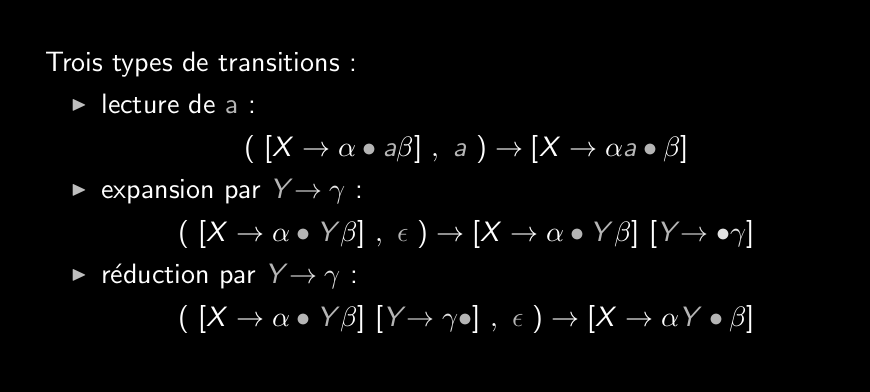

# Q6_1_Automate_des_items  
  
Effectue des lectures et des réductions  
Par du mot pour revenir à l'axiome  
Construction d'une dérivation droite  
Analyseur LR(k) (from Left to right, Right derivation)  
  
caractéristique:  
un état = un item  
Automate non déterministe (travai de détermination)  
  
On a trois transitions spécifiques:  
  
  
Lecture  
Expansion  
Réduction  
  
  
