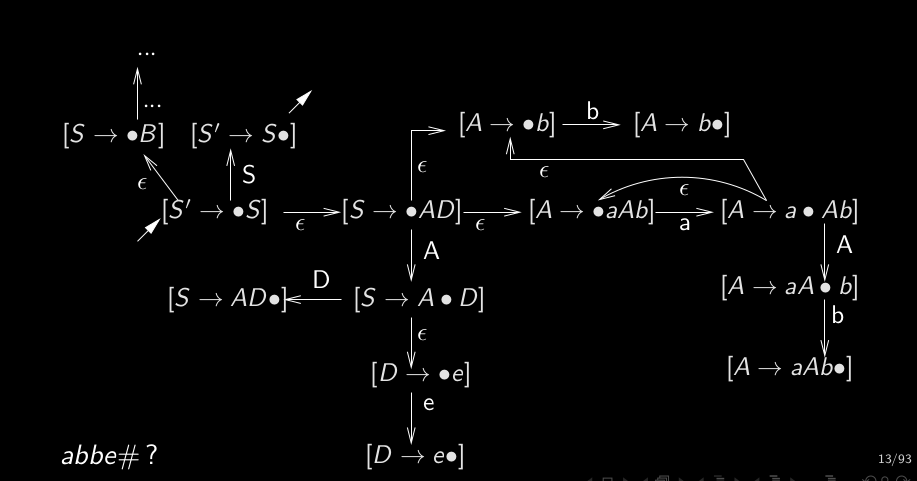

# Q6_2_Automate_charactéristique  
On utilise un automate à nombre fini d'états sous-jacent à l'automate des items.  
  
Pour chaque transition de l'automate des items, l'automate caractéristique:  
- fait une transition  
- revient en arrière depuis un état puis  
  
terminal-transition si c'est un terminal  
epsilon-transition si c'est un non-terminal  
  
réduction:  
X -> epsilon dans l'état puit  
  
automate caractéristique:  
non-déterministe (à cause des epsilon-transition, qui sont des expansions)  

