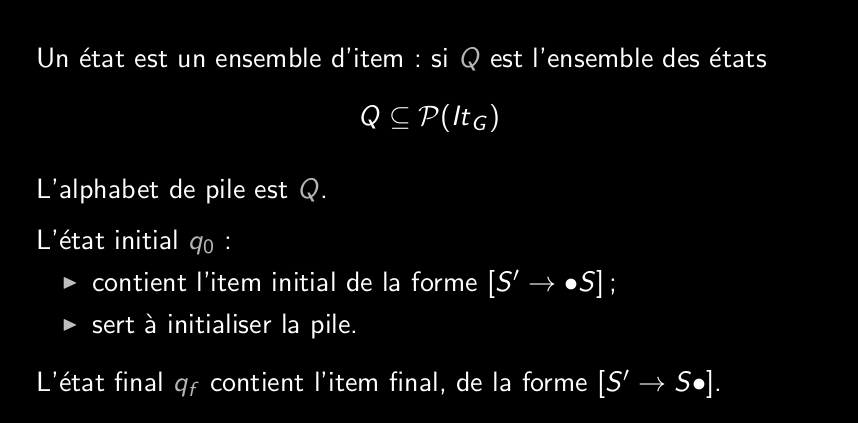
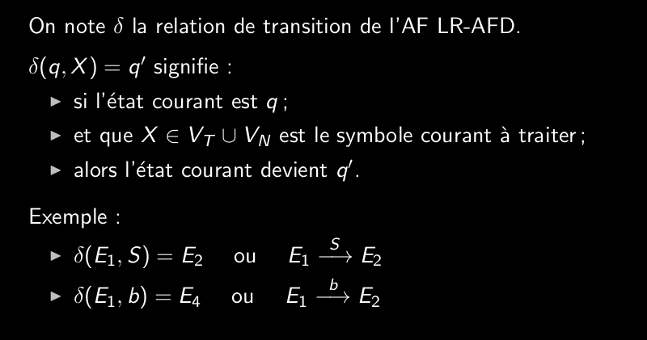
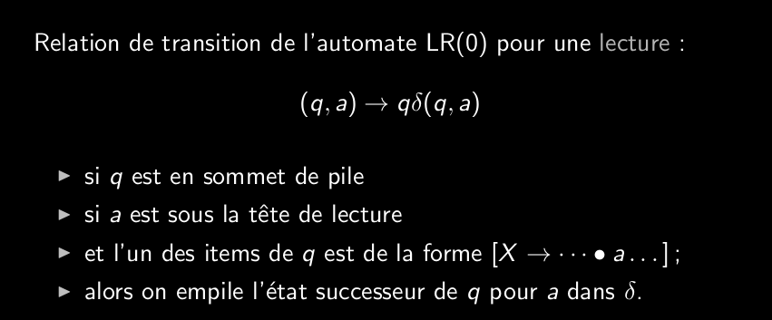
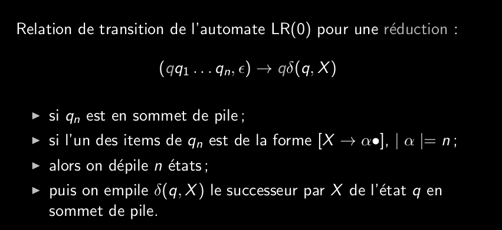
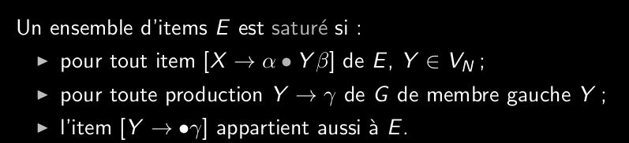

# Q6_3_Automate_LR AFD  
  
**automate LR-AFD:**  
automate caractéristique déterminé  
effectue 2 types d'actions:  
    - lecture  
    - réduction  
arbre en ordre postfixe  
dérivation droite  
  
Formulation:  
  
  
  
  
les epsilon-transitions se font implicitement à l'intérieur des états.  
  
L'automate LR-AFD peut se construire directement  
  
  
saturation(symbole, ens_item)-> ens_item contennant symbole  
  
On part de l'état E qui contient toutes les transition et pour chaque symbol non/terminal on utilise la fonction de saturation. Si on tombe sur un nouvel ensemble, on l'ajoute à l'automate.  
