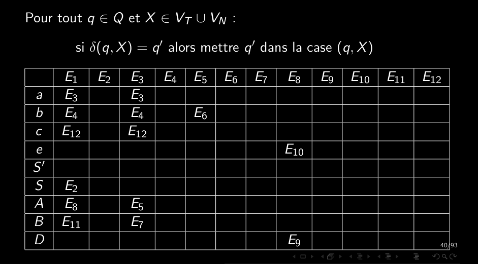

# Q6_4_Table_d_analyse_LR0_table_des_successeurs  
  
## Table d'analyse  
Deux tables:  
	- successeurs  
	- actions  
	  
	  
**Table des successeurs:**  
ligne 0: états de l'automate  
colonne 0: non/terminaux  
cases: états résultants  

