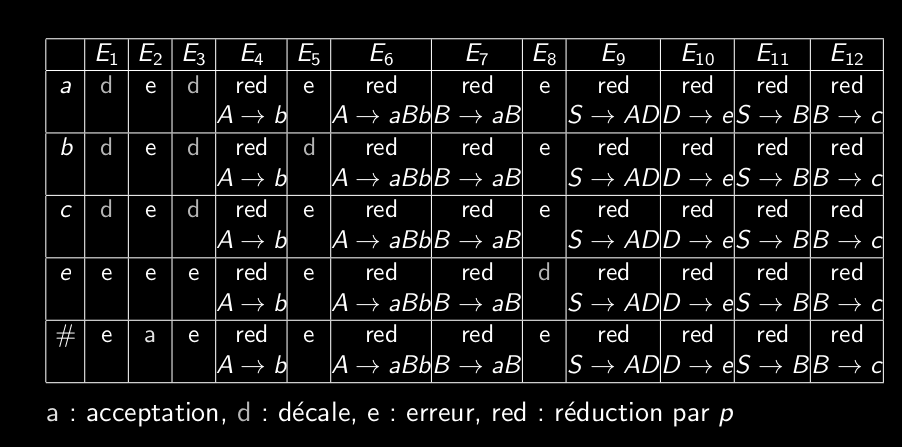

# Q6_5_Table_d_analyse_LR0_table_des_actions  
  
## Table d'analyse  
Deux tables:  
	- successeurs  
	- actions  
  
**Table des actions**  
indiques 3 actions (sinon erreur):  
	- lecture terminal (décalage)  
	- reduction production (reduction)  
	- acceptation (acceptation)  
ligne 0: états (q)  
colonne 0: terminaux (a)  
cases: actions x transitions (q,a)  
remplissage:  
- pour (q,a) si q contient item avec dot(a) -> décalage  
- si q a item terminal [X->alpha dot()] -> réduction X->alpha pour tout terminal et #  
- Mettre acceptation dans la case (qf,#)  
- Mettre erreur dans les cases vides  
qf= état final = [S'->S dot()]  

