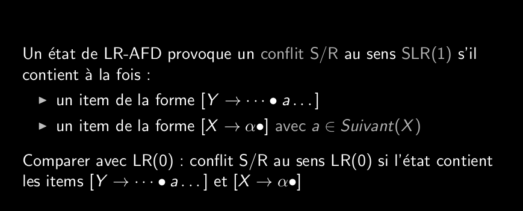
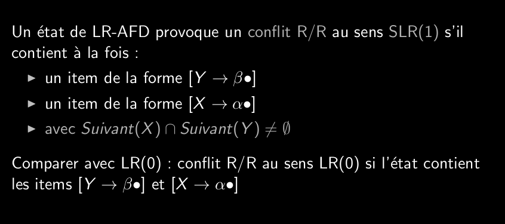

# Q_6_7_Analyseurs_SLR1_table_des_actions  
L'analyseur SLR(1) prend en compte l'élément sous la têt de lecture pour choisir une réduction.  
  
Utilise comme LR(0) l'automate LR-AFD  
Règle certains conflit du LR(0)  
  
  
  
Une grammaire est dite SLR(1) si elle ne contient pas e conflit aus sens SLR(1).  
  
inital: [S->L]  
  
pour savoir si des conflits au sens LR(0) sont des conflits aus sens SLR(1):  
Calcule des suivant  
  
Construction de la table des action SLR(1) comme LR(0)  
Différence dans la 2e étape  
  
**Table des actions**  
indiques 3 actions (sinon erreur):  
	- lecture terminal (décalage)  
	- reduction production (reduction)  
	- acceptation (acceptation)  
ligne 0: états (q)  
colonne 0: terminaux (a)  
cases: actions x transitions (q,a)  
remplissage:  
- pour (q,a) si q contient item avec dot(a) -> décalage  
- si q a item terminal [X->alpha dot()] `et` si terminal a est dans les suivant de X  -> réduction X->alpha dans (q,a)  
- Mettre acceptation dans la case (qf,#)  
- Mettre erreur dans les cases vides  
qf= état final = [S'->S dot()]  
  
La caractéristique est la même pour la table LR(0):  
dans chaque case: unique action ou erreur  
