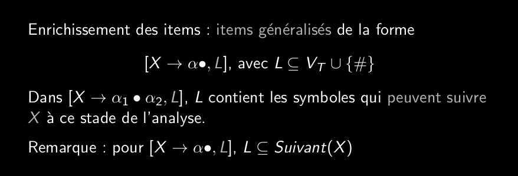
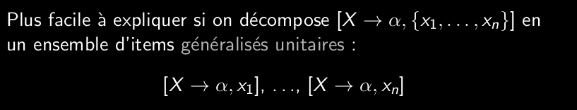

# Q_6_8_Analyseurs_LR1_items_généralisés  
  
utilise des items généralisés (enrichis):  
  
  
  
Ici L appartient aux terminaux union #, souvent aux suivants de X  
  
Ne repose pas sur l'automate LR-AFD mais sur l'automate fini (automate LR(1)) plus gros que LR-AFD et donc plus puissant.  
  
On fait comme pour l'automate LR-AFD:  
saturation d'état pas expansion et transition sur symboles.  
Mais on modifie la saturation pour calculer L, en décomposant en ensemble d'item généralisés unitaire.  
  
  
  
On utilise cette méthode  
pour un item généralisé unitaire [X->alpha dot() Y beta, a]  
pour saturer Y on cherche Premier(beta a) car a peut aussi suivre Y.  
  
En fin de saturation on reconstruit les items généralisés  
  
état initial: saturation([S'->dot(S),{#}])  
  
  
