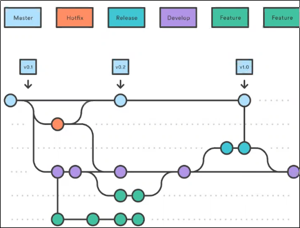
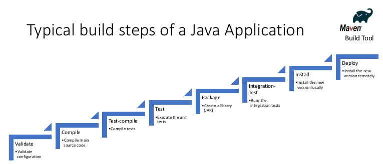

# Productivité
**Quelques règles à suivre pour rester productif**

1. don't do boring stuff => Automatiser les choses
2. don't trust your code => toujours faire des tests
3. be professional => utiliser le bon outil pour la bonne tâche
4. be lazy => ne pas réinventer un truc qui existe déjà
5. question yourself => toujours mesurer ce qu'on fait.
6. suivre un plan et s'y tenir

# Comment mesurer sa productivité?:
On utiliser des indicateurs/metrics (pas pour se comparer au autre) mais pour voir notre niveau d'avancement.

Une bonne metric est:
- Cohérente: définitions claires
- Vérifiable: Un étranger peut validé la mesure
- Disponible: Peut servir pour l'évaluation
- Répétable: différent groups d'utilisateurs von essentiellement recevoire le même chiffre 

## Storypoints (vélocité)
Mesure principale de productivité et de l'avancement d'un projet.  
Ce n'est pas une valeur absolue.  
Ça permet d'évaluer la quantité de travail.  
On peut évaluer les storypoints d'un projet grâce au scrum poker.  
On peut convertir cela en jour/homme si on veut.  

Le story point permet d'éviter des problèmes connus avec les jours/homme (mauvaise comparaison entre les personnes et les équipes).  

Quand on a trouvé les tâches et leur story point, on utilise un outils pour les répartir dans l'équipe.  
Après, haque matin, on fait un stand up:  
On regarde le Burndown Chart pour voir comment le projet avance.  

**Vélocité**:
(nombre de storypoints fait par jours) on compare la vélocité théorique (la ligne en bleu, toujours constante) et le travail vraiment fait (la ligne en vert qui peut changer).  
La vélocité théorique se crée après le premier sprint et après on ne la change plus.    
Le but c'est d'être le plus prévisible sur son travail. On veut éviter les surprises.    

Vocabulaire:
**Cycle Time metric**: temps pour régler un bug. Une feature est plus difficile à gérer.  

## Autres metrics
**Throughput** : measure the amount of work expressed in unit of works (ticket, features,
stories, ...). Helps to detect a team that is stuck. Velocity is better for software
development while throughput is better for support teams.
**Cycle Time metric**: total time between the moment a ticket is accepted by a developer
until it is delivered according to its definition of done.
**MTTR**: Mean Time To Remediation stands for how fast you can deploy fixes to the
consumers after being informed of the defect.
**Code Coverage**: the amount of code measured in Line of Code that is covered by a
unit test (and by extension all unit tests).
**Bug Rates**: the average number of bugs that are created as new items are. It can
help you estimate whether you are delivering value or just deploying some half-
baked code. Are you producing quality or just ... quantity
**Escaped Defect**: a defect that was not found by the quality assurance team.
Typically, those issues are found by end users after released version has made
available to them

# Usine logiciel 
C'est un peu une "usine" pour gérer notre projet depuis l'écriture du code jusqu'au deployement.  

Usine logiciel (software factory), 5 composants à retenir:  

- Build Tool (pour créer le code)
- Source code Repository (pour héberger le code ex.Git)
- Integration continu (CI)
- Artefact management (gère le code binaire ou le code compilé)
- Deployement infrastructure

## Build Tool
C'est pour écrire le code.  
Une IDE:
- donne des outils facile pour augmenter la productivité
- Edition de code (Synthax Highlighting, Code Completion, Refactoring)
- Compilation et Construction: compile le code source et construit des paquets déployables
- Lance, debug et fait des testes unitaires.

Important utiliser une IDE et la maîtriser.  

## Source Code Management
C'est pour héberger le code et gérer les versions du logiciel.
Permet de revenir à une version précédente.  
Gère les tags et les branches.

**Vocabulaire**:  

- Tag/label: sauvegarde du code à un moment donné.
- branch: un groupe de fichier qui ont été forqué à un momen donné
- Revision/Version: Un état propre et présentable du code source
- Checkout: faire une copie d'un dépôt à un moment donné.
- Commit: un changement fait et enregistré à un moment donné (peut aussi être un verbe: "Je commit le code"="Je fait un commit")
- Clone: copier un dépôt entièrement (même l'historique)
- Fetch/Pull: copie une version depuis un dépôt jusqu'à un autre.
- Head: pointe le commit le plus récent
- Merge: met ensemble les commit et résout les conflits
- Push: copie une verion d'un dépôt à un autre.
- Pull Request: une demande pour merge les versions.

**Branching strategy (stratégie à suivre pour être organisé)**:  

	- master (personne doit developper dessus) c'est pour les release.
	- Develop, sert à intégrer les branche
	- Feature, où chacun travail sur sa partie
	- Hotfix, où on fait des modifications courtes et rapides.

# Build and Dependency Management Tool
- Automatisation des étape de construction d'un packet de logiciel.
- Gère les dépendances (ce que le logiciel a besoin pour fonctionner)
- Le même outil et la même configuration pour construire le logiciel où on veut (ordinateur de developpement et CI Server)
- Systematique et reproductible

On retrouve souvent les étape de compilation, d'intégration, d'installation des dépendances, application des tests et déploiement du logiciel.

# Continuous Integration Tool
- Compile et lance le programme localement
- Compile et lance les nouvelles versions du code
- Évite les problème d'incompatibilité entre les machines
- La construction doit être rapide (<15 min)
- La dernière version doit être testable à tout moment

# Artefact Management Tool
- Les fichiers binaire doivent être facilement accessible par les dépendances
- Les fichiers binaires doivent être signés
- Les binaires sont uniquement identifié

# Productivity Tips
- Automatiser ce qu'on peut
- Shell (apprendre un shell, bash, zsh, powershell, etc.)
- Éviter les mails (ça fait perdre du temps)
- Trouver l'environnement de travail (pour être concentré et efficace)
- Se connaître soi-même (connaître ses force et ses limites)
- Refactorer le code (sinon on le fait jamais)
- Avoir un bon environnement de test (sinon on le fait jamais)
