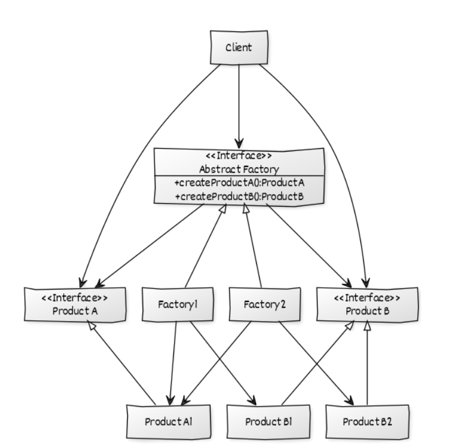

Abstract_Factory
=================

### Creational pattern.

{ width=70% }
{ width=60% }

## Définitions	
**Problème:** On aimerai que le client choisisse ses objets mais que notre code choisisse quel classe de l'objet demandé on lui donne. 
**Solution:** On crée une abstract factory qui décide quel factory appeller.

## Composition:
- AbstractFactory : Interface qui indique comment construire les objets abstraits
- ConcreteFactory : Implémente les fonctions de l'AbstractFactory
- AbstractProduct : Interface qui indique le comportement des produits
- Product : Implémente les fonction de l'interface AbstractProduct
- Client : utilise AbstractFactory et AbstractProduct

## Exemple:
On a un production de téléphone. Les clients peuvent choisir le téléphone qu'ils veulent acheter.
Problème:
Selon la localisation du client, le téléphone peut changer.
Comment faire? Utiliser une abstract factory.
Le client pourra toujours choisir son téléphone, mais la factory qui distribue sera choisie par la Factory principale.

## Définitions	
| classe       | rôle             | description                    |
|--------------|------------------|--------------------------------|
| Phone        | AbstractProduct  | l'interface pour les portables |
| AndroidPhone | Concrete Product | product                        |
| WindowsPhone | Concrete Product | product                        |
| IphonePhone  | Concrete Product | product                        |

| classe               | rôle             | description           |
|----------------------|------------------|-----------------------|
| PhoneFactory         | Main Factory     | Appelle les factories |
| AbstractPhoneFactory | Abstract Factory | Interface             |
| USAPhoneFactory      | Concrete Factory | factory               |
| DefaultPhoneFactory  | Concrete Factory | factory               |
| INDIAPhoneFactory    | Concrete Factory | factory               |

| classe         | rôle   | description |
|----------------------|------------------|-----------------------|
| AbstractDesign | Client | main class  |

## Pseudo code
```
main()   
    grâce à PhoneFactory, on construit des téléphones de trois type:  
	WINDOWS  
	ANDROID  
	IPHONE  
```
## Code
```java
class AbstractDesign 
{ 
	public static void main(String[] args) 
	{ 
		System.out.println(PhoneFactory.buildPhone(PhoneType.WINDOWS)); 
		System.out.println(PhoneFactory.buildPhone(PhoneType.ANDROID)); 
		System.out.println(PhoneFactory.buildPhone(PhoneType.IPHONE)); 
	} 
} 

enum PhoneType 
{ 
	WINDOWS, ANDROID, IPHONE 
} 

abstract class Phone 
{ 
	Phone(PhoneType model, Location location) 
	{ 
		this.model = model; 
		this.location = location; 
	} 

	abstract void construct(); 

	PhoneType model = null; 
	Location location = null; 

	PhoneType getModel() 
	{ 
		return model; 
	} 

	void setModel(PhoneType model) 
	{ 
		this.model = model; 
	} 

	Location getLocation() 
	{ 
		return location; 
	} 

	void setLocation(Location location) 
	{ 
		this.location = location; 
	} 

	@Override
	public String toString() 
	{ 
		return "PhoneModel - "+model + " located in "+location; 
	} 
} 

class IphonePhone extends Phone 
{ 
	IphonePhone(Location location) 
	{ 
		super(PhoneType.IPHONE, location); 
		construct(); 
	} 
	@Override
	protected void construct() 
	{ 
		System.out.println("Connecting to luxury phone"); 
	} 
} 

class WindowsPhone extends Phone 
{ 
	WindowsPhone(Location location) 
	{ 
		super(PhoneType.WINDOWS, location); 
		construct(); 
	} 
	@Override
	protected void construct() 
	{ 
		System.out.println("Connecting to Windows Phone "); 
	} 
} 

class AndroidPhone extends Phone 
{ 
	AndroidPhone(Location location) 
	{ 
		super(PhoneType.ANDROID,location ); 
		construct(); 
	} 
	
	@Override
	void construct() 
	{ 
		System.out.println("Connecting to Android phone"); 
	} 
} 

enum Location 
{ 
DEFAULT, USA, INDIA 
} 

class AbstractPhoneFactory(){ 
	static Phone buildPhone(PhoneType model);
}

class INDIAPhoneFactory 
{ 
	static Phone buildPhone(PhoneType model) 
	{ 
		Phone phone = null; 
		switch (model) 
		{ 
			case WINDOWS: 
				phone = new WindowsPhone(Location.INDIA); 
				break; 
			
			case ANDROID: 
				phone = new AndroidPhone(Location.INDIA); 
				break; 
				
			case IPHONE: 
				phone = new IphonePhone(Location.INDIA); 
				break; 
				
				default: 
				break; 
			
		} 
		return phone; 
	} 
} 

class DefaultPhoneFactory 
{ 
	public static Phone buildPhone(PhoneType model) 
	{ 
		Phone phone = null; 
		switch (model) 
		{ 
			case WINDOWS: 
				phone = new WindowsPhone(Location.DEFAULT); 
				break; 
			
			case ANDROID: 
				phone = new AndroidPhone(Location.DEFAULT); 
				break; 
				
			case IPHONE: 
				phone = new IphonePhone(Location.DEFAULT); 
				break; 
				
				default: 
				break; 
			
		} 
		return phone; 
	} 
} 


class USAPhoneFactory 
{ 
	public static Phone buildPhone(PhoneType model) 
	{ 
		Phone phone = null; 
		switch (model) 
		{ 
			case WINDOWS: 
				phone = new WindowsPhone(Location.USA); 
				break; 
			
			case ANDROID: 
				phone = new AndroidPhone(Location.USA); 
				break; 
				
			case IPHONE: 
				phone = new IphonePhone(Location.USA); 
				break; 
				
				default: 
				break; 
			
		} 
		return phone; 
	} 
} 


class PhoneFactory 
{ 
	private PhoneFactory() 
	{ 
		
	} 
	public static Phone buildPhone(PhoneType type) 
	{ 
		Phone phone = null; 
		// We can add any GPS Function here which 
		// read location property somewhere from configuration 
		// and use location specific phone factory 
		// Currently I'm just using INDIA as Location 
		Location location = Location.INDIA; 
		
		switch(location) 
		{ 
			case USA: 
				phone = USAPhoneFactory.buildPhone(type); 
				break; 
				
			case INDIA: 
				phone = INDIAPhoneFactory.buildPhone(type); 
				break; 
					
			default: 
				phone = DefaultPhoneFactory.buildPhone(type); 

		} 
		
		return phone; 

	} 
} 

```
