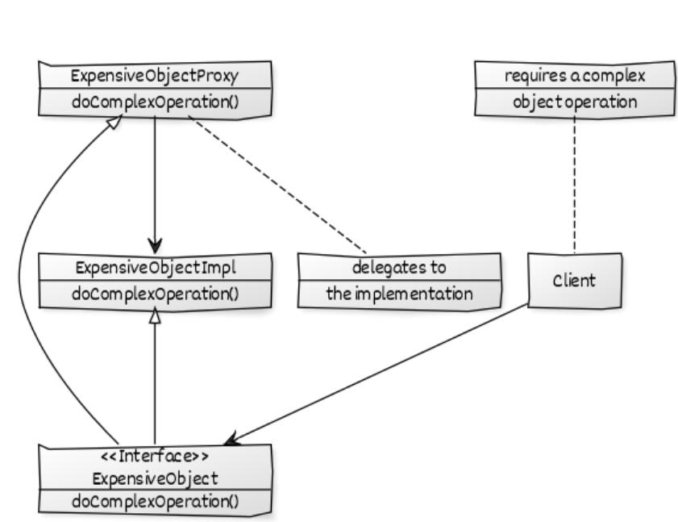

Proxy
======

### Creational pattern.

{ width=72% }
{ width=72% }

## Définition
**Problème:** On a une classe qui a des comportements spéciaux qu'on veut cacher au client.  
**Solution:** Créer un proxy qui va se faire passer pour la vrai classe.
Permet de cacher des comportement complexes au client. Le client ne connais que l'interface.
On peut rajouter des comportements sans que le client le sache.
Les objet ou le contenu complexe et l'objet sont créés de façon invisible au client.

Permet aussi de répondre à des non-functionnals requirements.

## Composition:
Proxy: agit comme intérmédiaire avec une ressource
ConcreteObjet: ressource
Objet: Interface utilisé par le client pour manipuler le proxy
Client: Manipule l'interface

## Exemple:
Pour des raison de sécurité, on aimerait faire un proxy qui nous empêche de nous connecter à des sites dangereux.

## Définitions	
| classe        | rôle           | description                     |
|---------------|----------------|---------------------------------|
| ProxyInternet | Proxy          | intermédiaire avec internet     |
| RealInternet  | Concrete Objet | True complicated class          |
| Internet      | Objet          | Define connexion rules          |
| Client        | Client         | Demande une connexion à un site |

## Pseudo code
```
main () 
    On crée un nouveau ProxyInternet
    On essaie de se connecter sur deux sites
```

## Code
```java
public class Client 
{ 
	public static void main (String[] args) 
	{ 
		Internet internet = new ProxyInternet(); 
		try
		{ 
			internet.connectTo("geeksforgeeks.org"); 
			internet.connectTo("abc.com"); 
		} 
		catch (Exception e) 
		{ 
			System.out.println(e.getMessage()); 
		} 
	} 
} 

public interface Internet 
{ 
	public void connectTo(String serverhost) throws Exception; 
} 

public class RealInternet implements Internet 
{ 
	@Override
	public void connectTo(String serverhost) 
	{ 
		System.out.println("Connecting to "+ serverhost); 
	} 
} 

import java.util.ArrayList; 
import java.util.List; 


public class ProxyInternet implements Internet 
{ 
	private Internet internet = new RealInternet(); 
	private static List<String> bannedSites; 
	
	static
	{ 
		bannedSites = new ArrayList<String>(); 
		bannedSites.add("abc.com"); 
		bannedSites.add("def.com"); 
		bannedSites.add("ijk.com"); 
		bannedSites.add("lnm.com"); 
	} 
	
	@Override
	public void connectTo(String serverhost) throws Exception 
	{ 
		if(bannedSites.contains(serverhost.toLowerCase())) 
		{ 
			throw new Exception("Access Denied"); 
		} 
		
		internet.connectTo(serverhost); 
	} 

} 

```
