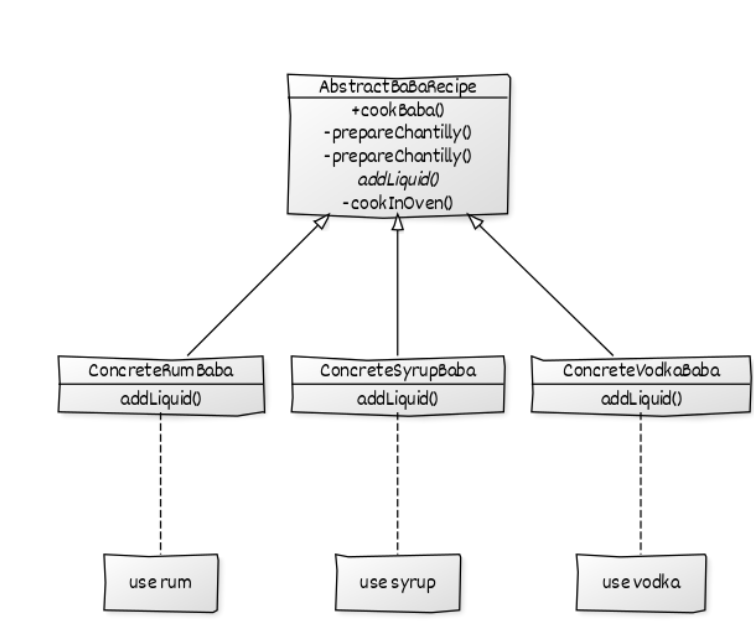
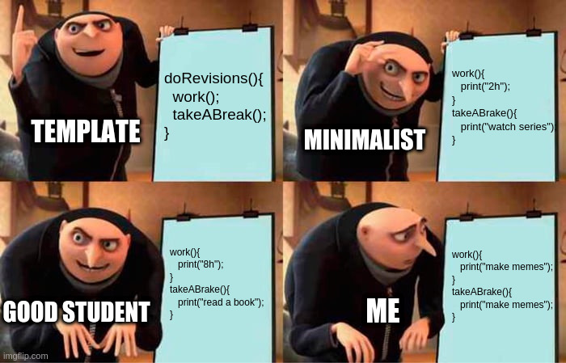

# Template

### Behavioral Pattern


{ width=110%}

## Définition
**Problème:** On a un groupe d'objet qui suivent le même algorithme mais avec quelques différences à certains endroits.   
**Solution:** On crée une abstract class ou interface Template qui définit l'algorithme que doit suivre les classes qui l'impléments (chaque classe pourra mettre les modifications qu'elle veut).
Crée une "une recette", un algorithme que vont suivre toute les classes qui l'implémente.

## Composition:
- Objet: Ont un comportement similaire
- Template: Contient l'algorithme que les Objets vont implémenter
- Client: Appelle les objets de la même façon, mais chacun fait son truc

## Exemple:
On a deux objets qui s'occupent de faire les commandes, un pour le magasin (=store), un pour le réseaux (=net). Il ont des comportement similaires. C'est pourquoi on peut définir un template qui contiendra l'algorithme pour gérer une commande (sélectionner, payer, emballer, livrer). Chaque objet pourra utiliser l'algorithme et changer les parties dont il a besoin.

## Définitions	
| classe                      | rôle     | description             |
|-----------------------------|----------|-------------------------|
| TemplateMethodPatternClient | Client   | classe principale       |
| OrderProcessTemplate        | Template | Définit l'algorithme    |
| StoreOrder                  | Objet    | Implémente l'algorithme |
| NetOrder                    | Objet    | Implémente l'algorithme |

## Pseudo code
```
main() 
    On crée un NetOrder et on applique la méthode processOrder()
    On crée un StoreOrder et on applique la méthode processOrder()
```

## Code
```java
class TemplateMethodPatternClient 
{ 
	public static void main(String[] args) 
	{ 
		OrderProcessTemplate netOrder = new NetOrder(); 
		netOrder.processOrder(true); 
		System.out.println(); 
		OrderProcessTemplate storeOrder = new StoreOrder(); 
		storeOrder.processOrder(true); 
	} 
} 

abstract class OrderProcessTemplate 
{ 
	public boolean isGift; 

	public abstract void doSelect(); 

	public abstract void doPayment(); 

	public final void giftWrap() 
	{ 
		try
		{ 
			System.out.println("Gift wrap successful"); 
		} 
		catch (Exception e) 
		{ 
			System.out.println("Gift wrap unsuccessful"); 
		} 
	} 

	public abstract void doDelivery(); 

	public final void processOrder(boolean isGift) 
	{ 
		doSelect(); 
		doPayment(); 
		if (isGift) { 
			giftWrap(); 
		} 
		doDelivery(); 
	} 
} 


class NetOrder extends OrderProcessTemplate 
{ 
	@Override
	public void doSelect() 
	{ 
		System.out.println("Item added to online shopping cart"); 
		System.out.println("Get gift wrap preference"); 
		System.out.println("Get delivery address."); 
	} 

	@Override
	public void doPayment() 
	{ 
		System.out.println 
				("Online Payment through Netbanking, card or Paytm"); 
	} 

	@Override
	public void doDelivery() 
	{ 
		System.out.println 
					("Ship the item through post to delivery address"); 
	} 

} 

class StoreOrder extends OrderProcessTemplate 
{ 

	@Override
	public void doSelect() 
	{ 
		System.out.println("Customer chooses the item from shelf."); 
	} 

	@Override
	public void doPayment() 
	{ 
		System.out.println("Pays at counter through cash/POS"); 
	} 

	@Override
	public void doDelivery() 
	{ 
		System.out.println("Item delivered to in delivery counter."); 
	} 

} 

class TemplateMethodPatternClient 
{ 
	public static void main(String[] args) 
	{ 
		OrderProcessTemplate netOrder = new NetOrder(); 
		netOrder.processOrder(true); 
		System.out.println(); 
		OrderProcessTemplate storeOrder = new StoreOrder(); 
		storeOrder.processOrder(true); 
	} 
} 
```
