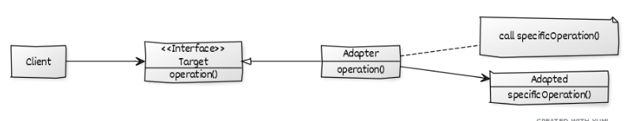
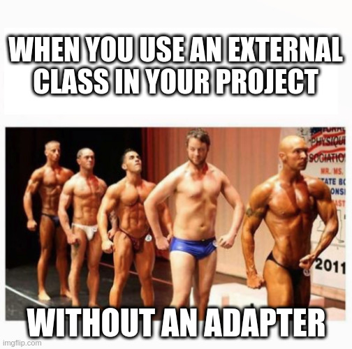

Wrapper (Adapter)
=================

### Behavioral Pattern




## Définition
**Problème:** On a un ou plusieurs objets qui suivent la "logique" de notre code et on veut ajouter une classe étrangère (par exemple fait par quelqu'un d'autre qui voit les choses autrement) qui suit une autre "logique".  
**Solution:** On peut faire un Adapter (Wrapper) qui va prendre la classe différente et "traduire" le comportement qu'on veut dans son comportement.
Change un contract dans un autre contract. On enveloppe en fait une classe [nom] dans une wrapper qu'on appelle souvent [nom]Wrapper.

## Composition:
- Adapted: respecte un certain protocole (des méthodes)
- ConcreteTarget: respecte un certain protocole (des méthodes) définit par une interface 
- Target: Définit un contrat
- Adapter: Convertit les appels pour les faire à l'objet contenu
- Client: Fait des requête à l'Adapter
 
## Exemple:
On a une classe PlasticToyDuck qui a ses propres méthodes et on aimerai ajouter une classe Sparrow qui ne respecte pas le même contrat (=qui n'a pas les même méthodes). On va donc lui créer un Adapter BirdAdapter pour qu'il ait les même méthodes que PlasticToyDuck.

## Définitions	
| Classe         | rôle            | description       |
|----------------|-----------------|-------------------|
| Sparrow        | Adapted         | Classe étrangère  |
| BirdAdapter    | Adapter         | Adapte Sparrow    |
| ToyDuck        | Target          | Classe étrangère  |
| PlasticToyDuck | Concrete Target | Classe            |
| Main           | Client          | Classe principale |

## Pseudo code
```
main() 
    On crée un Sparrow et un PlasticToyDuck
    on encapsule le Sparrow dans un bird adapter
    Sparrow a toujours ses propres fonctions
    Mais le BirdAdapter a le même comportement que le PlasticToyDuck
```

## Code
```java
// Java implementation of Adapter pattern 
class Main 
{ 
	public static void main(String args[]) 
	{ 
		Sparrow sparrow = new Sparrow(); 
		ToyDuck toyDuck = new PlasticToyDuck(); 

		// Wrap a bird in a birdAdapter so that it 
		// behaves like toy duck 
		ToyDuck birdAdapter = new BirdAdapter(sparrow); 

		System.out.println("Sparrow..."); 
		sparrow.fly(); 
		sparrow.makeSound(); 

		System.out.println("ToyDuck..."); 
		toyDuck.squeak(); 

		// toy duck behaving like a bird 
		System.out.println("BirdAdapter..."); 
		birdAdapter.squeak(); 
	} 
} 
interface Bird 
{ 
	// birds implement Bird interface that allows 
	// them to fly and make sounds adaptee interface 
	public void fly(); 
	public void makeSound(); 
} 

class Sparrow implements Bird 
{ 
	// a concrete implementation of bird 
	public void fly() 
	{ 
		System.out.println("Flying"); 
	} 
	public void makeSound() 
	{ 
		System.out.println("Chirp Chirp"); 
	} 
} 

interface ToyDuck 
{ 
	// target interface 
	// toyducks dont fly they just make 
	// squeaking sound 
	public void squeak(); 
} 

class PlasticToyDuck implements ToyDuck 
{ 
	public void squeak() 
	{ 
		System.out.println("Squeak"); 
	} 
} 

class BirdAdapter implements ToyDuck 
{ 
	// You need to implement the interface your 
	// client expects to use. 
	Bird bird; 
	public BirdAdapter(Bird bird) 
	{ 
		// we need reference to the object we 
		// are adapting 
		this.bird = bird; 
	} 

	public void squeak() 
	{ 
		// translate the methods appropriately 
		bird.makeSound(); 
	} 
} 

```
