# Chapitre 5-6:
### Design Patterns

## Design Pattern
**Types (4):**

1. Creational pattern  
2. Structural pattern
3. behavioral pattern
4. concurrency

La plupart des patterns sont composables.  

**Avant propos:**  
Ces design pattern ont des niveaux de compréhention différents. La meilleur pratique est de s'imaginer une situation de base avec un problème et de voir comment ces design patterns en sont une solution.
# Singleton

### Creational Pattern

## Définition
**Problème:** On a une classe et on aimerai que l'utilisateur manipule toujours la même instance (pas avoir plusieurs instances ayant des "sauvegardes" différentes).
**Solution:** Il suffit juste de transformer l'objet en Singleton.


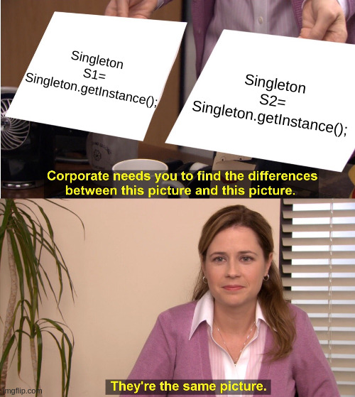

## Composition:
- Singleton: La classe qui ne renvoie qu'une seule instance d'elle même.

## Exemple:
On peut tester le singleton pour voir s'il renvoit toujours la même instance.

## Définitions	
| classe    | rôle      | description                  |
|-----------|-----------|------------------------------|
| Singleton | Composite | répartie la companie en bloc |

## Pseudo code
```
main ()   
	On appelle le singleton 2 fois  
``` 

## Code
```java
public class TestSingleton{
	public static void main(args[]){ 
		Singleton S1= Singleton.getInstance();
		Singleton S2= Singleton.getInstance();
		//S1 and S2 are the same
	}
}

public final class Singleton {

    private static final Singleton INSTANCE = new Singleton();

    private Singleton() {}

    public static Singleton getInstance() {
        return INSTANCE;
    }
}
```
Abstract_Factory
=================

### Creational pattern.

{ width=70% }
{ width=60% }

## Définitions	
**Problème:** On aimerai que le client choisisse ses objets mais que notre code choisisse quel classe de l'objet demandé on lui donne. 
**Solution:** On crée une abstract factory qui décide quel factory appeller.

## Composition:
- AbstractFactory : Interface qui indique comment construire les objets abstraits
- ConcreteFactory : Implémente les fonctions de l'AbstractFactory
- AbstractProduct : Interface qui indique le comportement des produits
- Product : Implémente les fonction de l'interface AbstractProduct
- Client : utilise AbstractFactory et AbstractProduct

## Exemple:
On a un production de téléphone. Les clients peuvent choisir le téléphone qu'ils veulent acheter.
Problème:
Selon la localisation du client, le téléphone peut changer.
Comment faire? Utiliser une abstract factory.
Le client pourra toujours choisir son téléphone, mais la factory qui distribue sera choisie par la Factory principale.

## Définitions	
| classe       | rôle             | description                    |
|--------------|------------------|--------------------------------|
| Phone        | AbstractProduct  | l'interface pour les portables |
| AndroidPhone | Concrete Product | product                        |
| WindowsPhone | Concrete Product | product                        |
| IphonePhone  | Concrete Product | product                        |

| classe               | rôle             | description           |
|----------------------|------------------|-----------------------|
| PhoneFactory         | Main Factory     | Appelle les factories |
| AbstractPhoneFactory | Abstract Factory | Interface             |
| USAPhoneFactory      | Concrete Factory | factory               |
| DefaultPhoneFactory  | Concrete Factory | factory               |
| INDIAPhoneFactory    | Concrete Factory | factory               |

| classe         | rôle   | description |
|----------------------|------------------|-----------------------|
| AbstractDesign | Client | main class  |

## Pseudo code
```
main()   
    grâce à PhoneFactory, on construit des téléphones de trois type:  
	WINDOWS  
	ANDROID  
	IPHONE  
```
## Code
```java
class AbstractDesign 
{ 
	public static void main(String[] args) 
	{ 
		System.out.println(PhoneFactory.buildPhone(PhoneType.WINDOWS)); 
		System.out.println(PhoneFactory.buildPhone(PhoneType.ANDROID)); 
		System.out.println(PhoneFactory.buildPhone(PhoneType.IPHONE)); 
	} 
} 

enum PhoneType 
{ 
	WINDOWS, ANDROID, IPHONE 
} 

abstract class Phone 
{ 
	Phone(PhoneType model, Location location) 
	{ 
		this.model = model; 
		this.location = location; 
	} 

	abstract void construct(); 

	PhoneType model = null; 
	Location location = null; 

	PhoneType getModel() 
	{ 
		return model; 
	} 

	void setModel(PhoneType model) 
	{ 
		this.model = model; 
	} 

	Location getLocation() 
	{ 
		return location; 
	} 

	void setLocation(Location location) 
	{ 
		this.location = location; 
	} 

	@Override
	public String toString() 
	{ 
		return "PhoneModel - "+model + " located in "+location; 
	} 
} 

class IphonePhone extends Phone 
{ 
	IphonePhone(Location location) 
	{ 
		super(PhoneType.IPHONE, location); 
		construct(); 
	} 
	@Override
	protected void construct() 
	{ 
		System.out.println("Connecting to luxury phone"); 
	} 
} 

class WindowsPhone extends Phone 
{ 
	WindowsPhone(Location location) 
	{ 
		super(PhoneType.WINDOWS, location); 
		construct(); 
	} 
	@Override
	protected void construct() 
	{ 
		System.out.println("Connecting to Windows Phone "); 
	} 
} 

class AndroidPhone extends Phone 
{ 
	AndroidPhone(Location location) 
	{ 
		super(PhoneType.ANDROID,location ); 
		construct(); 
	} 
	
	@Override
	void construct() 
	{ 
		System.out.println("Connecting to Android phone"); 
	} 
} 

enum Location 
{ 
DEFAULT, USA, INDIA 
} 

class AbstractPhoneFactory(){ 
	static Phone buildPhone(PhoneType model);
}

class INDIAPhoneFactory 
{ 
	static Phone buildPhone(PhoneType model) 
	{ 
		Phone phone = null; 
		switch (model) 
		{ 
			case WINDOWS: 
				phone = new WindowsPhone(Location.INDIA); 
				break; 
			
			case ANDROID: 
				phone = new AndroidPhone(Location.INDIA); 
				break; 
				
			case IPHONE: 
				phone = new IphonePhone(Location.INDIA); 
				break; 
				
				default: 
				break; 
			
		} 
		return phone; 
	} 
} 

class DefaultPhoneFactory 
{ 
	public static Phone buildPhone(PhoneType model) 
	{ 
		Phone phone = null; 
		switch (model) 
		{ 
			case WINDOWS: 
				phone = new WindowsPhone(Location.DEFAULT); 
				break; 
			
			case ANDROID: 
				phone = new AndroidPhone(Location.DEFAULT); 
				break; 
				
			case IPHONE: 
				phone = new IphonePhone(Location.DEFAULT); 
				break; 
				
				default: 
				break; 
			
		} 
		return phone; 
	} 
} 


class USAPhoneFactory 
{ 
	public static Phone buildPhone(PhoneType model) 
	{ 
		Phone phone = null; 
		switch (model) 
		{ 
			case WINDOWS: 
				phone = new WindowsPhone(Location.USA); 
				break; 
			
			case ANDROID: 
				phone = new AndroidPhone(Location.USA); 
				break; 
				
			case IPHONE: 
				phone = new IphonePhone(Location.USA); 
				break; 
				
				default: 
				break; 
			
		} 
		return phone; 
	} 
} 


class PhoneFactory 
{ 
	private PhoneFactory() 
	{ 
		
	} 
	public static Phone buildPhone(PhoneType type) 
	{ 
		Phone phone = null; 
		// We can add any GPS Function here which 
		// read location property somewhere from configuration 
		// and use location specific phone factory 
		// Currently I'm just using INDIA as Location 
		Location location = Location.INDIA; 
		
		switch(location) 
		{ 
			case USA: 
				phone = USAPhoneFactory.buildPhone(type); 
				break; 
				
			case INDIA: 
				phone = INDIAPhoneFactory.buildPhone(type); 
				break; 
					
			default: 
				phone = DefaultPhoneFactory.buildPhone(type); 

		} 
		
		return phone; 

	} 
} 

```
# Prototype

### Creational pattern


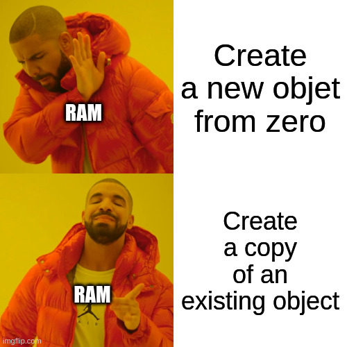

## Définition
**Problème:** Comment comment éviter de ralentir le code en créan depuis zéro des objets très lourd.  
**Solution:** En créant des prototypes qui seront des copie des éléments déjà existant.
Le but est de créer un objet par défaut et de le cloner lorsqu'on demande une nouvelle instance. Le clone peut modifier des élément de l'objet original car il pointe au même endroit (attention: ça peut provoquer des effets de bord)

## Composition:
- Product : L'objet en question
- Prototype: registre pour avoir accès à tout les propotypes.
- Client : Utilisera le registre pour gérer les prototype.

## Exemple:
On a mit deux couleurs dans ColorStore par défaut (bleu et noir)


## Définitions	
| classe     | rôle           | description                    |
|------------|----------------|--------------------------------|
| Prototype  | Prototype      | retourne les instances         |
| Color      | AbstractObject | Clonable                       |
| blackColor | Product        | géré par l'interface Prototype |
| blueColor  | Product        | géré par l'interface Prototype |
| ColorStore | Client         | Demande différentes couleurs   |


## Pseudocode
```
main() 
    On ajoute successivement les couleurs bleu et noir du ColorStore
```

## Code
```java

// A Java program to demonstrate working of 
// Prototype Design Pattern with example 
// of a ColorStore class to store existing objects. 

// Driver class 
class Prototype 
{ 
	public static void main (String[] args) 
	{ 
		ColorStore.getColor("blue").addColor(); 
		ColorStore.getColor("black").addColor(); 
		ColorStore.getColor("black").addColor(); 
		ColorStore.getColor("blue").addColor(); 
	} 
} 

import java.util.HashMap; 
import java.util.Map; 


abstract class Color implements Cloneable 
{ 
	
	protected String colorName; 
	
	abstract void addColor(); 
	
	public Object clone() 
	{ 
		Object clone = null; 
		try
		{ 
			clone = super.clone(); 
		} 
		catch (CloneNotSupportedException e) 
		{ 
			e.printStackTrace(); 
		} 
		return clone; 
	} 
} 

class blueColor extends Color 
{ 
	public blueColor() 
	{ 
		this.colorName = "blue"; 
	} 

	@Override
	void addColor() 
	{ 
		System.out.println("Blue color added"); 
	} 
	
} 

class blackColor extends Color{ 

	public blackColor() 
	{ 
		this.colorName = "black"; 
	} 

	@Override
	void addColor() 
	{ 
		System.out.println("Black color added"); 
	} 
} 

class ColorStore { 

	private static Map<String, Color> colorMap = new HashMap<String, Color>(); 
	
	static
	{ 
		colorMap.put("blue", new blueColor()); 
		colorMap.put("black", new blackColor()); 
	} 
	
	public static Color getColor(String colorName) 
	{ 
		return (Color) colorMap.get(colorName).clone(); 
	} 
} 
```
Wrapper (Adapter)
=================

### Behavioral Pattern


## Définition
**Problème:** On a un ou plusieurs objets qui suivent la "logique" de notre code et on veut ajouter une classe étrangère (par exemple fait par quelqu'un d'autre qui voit les choses autrement) qui suit une autre "logique".  
**Solution:** On peut faire un Adapter (Wrapper) qui va prendre la classe différente et "traduire" le comportement qu'on veut dans son comportement.
Change un contract dans un autre contract. On enveloppe en fait une classe [nom] dans une wrapper qu'on appelle souvent [nom]Wrapper.

## Composition:
- Adapted: respecte un certain protocole (des méthodes)
- ConcreteTarget: respecte un certain protocole (des méthodes) définit par une interface 
- Target: Définit un contrat
- Adapter: Convertit les appels pour les faire à l'objet contenu
- Client: Fait des requête à l'Adapter
 
## Exemple:
On a une classe PlasticToyDuck qui a ses propres méthodes et on aimerai ajouter une classe Sparrow qui ne respecte pas le même contrat (=qui n'a pas les même méthodes). On va donc lui créer un Adapter BirdAdapter pour qu'il ait les même méthodes que PlasticToyDuck.

## Définitions	
| Classe         | rôle            | description       |
|----------------|-----------------|-------------------|
| Sparrow        | Adapted         | Classe étrangère  |
| BirdAdapter    | Adapter         | Adapte Sparrow    |
| ToyDuck        | Target          | Classe étrangère  |
| PlasticToyDuck | Concrete Target | Classe            |
| Main           | Client          | Classe principale |

## Pseudo code
```
main() 
    On crée un Sparrow et un PlasticToyDuck
    on encapsule le Sparrow dans un bird adapter
    Sparrow a toujours ses propres fonctions
    Mais le BirdAdapter a le même comportement que le PlasticToyDuck
```

## Code
```java
// Java implementation of Adapter pattern 
class Main 
{ 
	public static void main(String args[]) 
	{ 
		Sparrow sparrow = new Sparrow(); 
		ToyDuck toyDuck = new PlasticToyDuck(); 

		// Wrap a bird in a birdAdapter so that it 
		// behaves like toy duck 
		ToyDuck birdAdapter = new BirdAdapter(sparrow); 

		System.out.println("Sparrow..."); 
		sparrow.fly(); 
		sparrow.makeSound(); 

		System.out.println("ToyDuck..."); 
		toyDuck.squeak(); 

		// toy duck behaving like a bird 
		System.out.println("BirdAdapter..."); 
		birdAdapter.squeak(); 
	} 
} 
interface Bird 
{ 
	// birds implement Bird interface that allows 
	// them to fly and make sounds adaptee interface 
	public void fly(); 
	public void makeSound(); 
} 

class Sparrow implements Bird 
{ 
	// a concrete implementation of bird 
	public void fly() 
	{ 
		System.out.println("Flying"); 
	} 
	public void makeSound() 
	{ 
		System.out.println("Chirp Chirp"); 
	} 
} 

interface ToyDuck 
{ 
	// target interface 
	// toyducks dont fly they just make 
	// squeaking sound 
	public void squeak(); 
} 

class PlasticToyDuck implements ToyDuck 
{ 
	public void squeak() 
	{ 
		System.out.println("Squeak"); 
	} 
} 

class BirdAdapter implements ToyDuck 
{ 
	// You need to implement the interface your 
	// client expects to use. 
	Bird bird; 
	public BirdAdapter(Bird bird) 
	{ 
		// we need reference to the object we 
		// are adapting 
		this.bird = bird; 
	} 

	public void squeak() 
	{ 
		// translate the methods appropriately 
		bird.makeSound(); 
	} 
} 

```
Proxy
======

### Creational pattern.

{ width=72% }
{ width=72% }

## Définition
**Problème:** On a une classe qui a des comportements spéciaux qu'on veut cacher au client.  
**Solution:** Créer un proxy qui va se faire passer pour la vrai classe.
Permet de cacher des comportement complexes au client. Le client ne connais que l'interface.
On peut rajouter des comportements sans que le client le sache.
Les objet ou le contenu complexe et l'objet sont créés de façon invisible au client.

Permet aussi de répondre à des non-functionnals requirements.

## Composition:
Proxy: agit comme intérmédiaire avec une ressource
ConcreteObjet: ressource
Objet: Interface utilisé par le client pour manipuler le proxy
Client: Manipule l'interface

## Exemple:
Pour des raison de sécurité, on aimerait faire un proxy qui nous empêche de nous connecter à des sites dangereux.

## Définitions	
| classe        | rôle           | description                     |
|---------------|----------------|---------------------------------|
| ProxyInternet | Proxy          | intermédiaire avec internet     |
| RealInternet  | Concrete Objet | True complicated class          |
| Internet      | Objet          | Define connexion rules          |
| Client        | Client         | Demande une connexion à un site |

## Pseudo code
```
main () 
    On crée un nouveau ProxyInternet
    On essaie de se connecter sur deux sites
```

## Code
```java
public class Client 
{ 
	public static void main (String[] args) 
	{ 
		Internet internet = new ProxyInternet(); 
		try
		{ 
			internet.connectTo("geeksforgeeks.org"); 
			internet.connectTo("abc.com"); 
		} 
		catch (Exception e) 
		{ 
			System.out.println(e.getMessage()); 
		} 
	} 
} 

public interface Internet 
{ 
	public void connectTo(String serverhost) throws Exception; 
} 

public class RealInternet implements Internet 
{ 
	@Override
	public void connectTo(String serverhost) 
	{ 
		System.out.println("Connecting to "+ serverhost); 
	} 
} 

import java.util.ArrayList; 
import java.util.List; 


public class ProxyInternet implements Internet 
{ 
	private Internet internet = new RealInternet(); 
	private static List<String> bannedSites; 
	
	static
	{ 
		bannedSites = new ArrayList<String>(); 
		bannedSites.add("abc.com"); 
		bannedSites.add("def.com"); 
		bannedSites.add("ijk.com"); 
		bannedSites.add("lnm.com"); 
	} 
	
	@Override
	public void connectTo(String serverhost) throws Exception 
	{ 
		if(bannedSites.contains(serverhost.toLowerCase())) 
		{ 
			throw new Exception("Access Denied"); 
		} 
		
		internet.connectTo(serverhost); 
	} 

} 

```
Decorator
==========

### Structural pattern

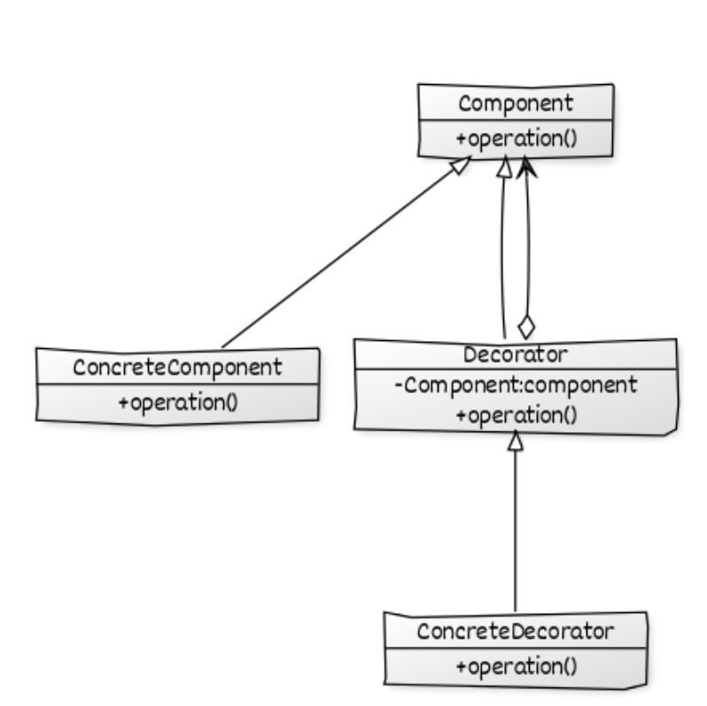{ width=70% }
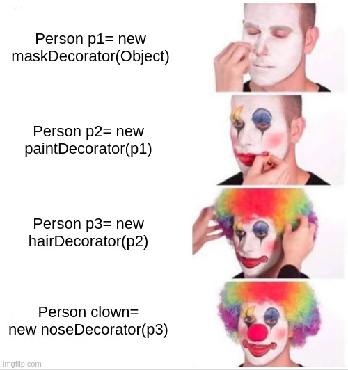

## Définition
**Problème:** On aimerai ajouter une nouvelle fonctionnalité à une super classe ou un interface sans avoir à changer le comportement des classes qui l'implémentent.  
**Solution:** On crée un Décorator qui ajoutera "à la volée" les éléments en plus.
Les décorateurs ajoutent du nouveau contenu sans altéré la structure de l'objet qu'on modifie. Ils font une surcharge.
On peut ainsi wrapper la classe tout en gardant la signature de celle-ci.
Le decorator doit être une abstract class qui implémente l'interface en question.

## Composition:
Component: Interface ou class abstraite qui définit un comportement
ConcreteComponent: Implémente le Component
Decorator: Ajoute des décorations au Component
ConcreteDecorator: Implément le Decorator

## Exemple:
On crée une classe concrète qui étant le décorateur. Cela permet de pouvoir ajouter des fonctionnalité à un groupe d'interface sans en modifier l'interface principale.

## Définitions	
| classe               | rôle              | description    |
|----------------------|-------------------|----------------|
| Shape                | Component         | interface      |
| Circle               | ConcreteComponent | interface      |
| Rectangle            | ConcreteComponent | interface      |
| ShapeDecorator       | Decorator         | abstract class |
| RedShapeDecorator    | ConcreteDecorator | concrete class |
| DecoratorPatternDemo | Client            | interface      |

## Pseudo code
```
main() 
      On crée un Shape Circle
      On crée un Shape redCircle avec RedShapeDecorator et le Circle
      On crée un Shape Rectangle
      On crée un Shape redRectangle avec RedShapeDecorator et le Rectangle
      On déssine les formes et leur version rouge avec la méthode draw
```

## Code
```java
public class DecoratorPatternDemo {
   public static void main(String[] args) {

      Shape circle = new Circle();

      Shape redCircle = new RedShapeDecorator(new Circle());

      Shape redRectangle = new RedShapeDecorator(new Rectangle());
      System.out.println("Circle with normal border");
      circle.draw();

      System.out.println("\nCircle of red border");
      redCircle.draw();

      System.out.println("\nRectangle of red border");
      redRectangle.draw();
   }
}

public interface Shape { 
   void draw();
   }

public class Rectangle implements Shape {

   @Override
   public void draw() {
      System.out.println("Shape: Rectangle");
   }
}

public class Circle implements Shape {

   @Override
   public void draw() {
      System.out.println("Shape: Circle");
   }
}


public abstract class ShapeDecorator implements Shape {
   protected Shape decoratedShape;

   public ShapeDecorator(Shape decoratedShape){
      this.decoratedShape = decoratedShape;
   }

   public void draw(){
      decoratedShape.draw();
   }	
}

public class RedShapeDecorator extends ShapeDecorator {

   public RedShapeDecorator(Shape decoratedShape) {
      super(decoratedShape);		
   }

   @Override
   public void draw() {
      decoratedShape.draw();	       
      setRedBorder(decoratedShape);
   }

   private void setRedBorder(Shape decoratedShape){
      System.out.println("Border Color: Red");
   }
}
```
# Template

### Behavioral Pattern


{ width=110%}

## Définition
**Problème:** On a un groupe d'objet qui suivent le même algorithme mais avec quelques différences à certains endroits.   
**Solution:** On crée une abstract class ou interface Template qui définit l'algorithme que doit suivre les classes qui l'impléments (chaque classe pourra mettre les modifications qu'elle veut).
Crée une "une recette", un algorithme que vont suivre toute les classes qui l'implémente.

## Composition:
- Objet: Ont un comportement similaire
- Template: Contient l'algorithme que les Objets vont implémenter
- Client: Appelle les objets de la même façon, mais chacun fait son truc

## Exemple:
On a deux objets qui s'occupent de faire les commandes, un pour le magasin (=store), un pour le réseaux (=net). Il ont des comportement similaires. C'est pourquoi on peut définir un template qui contiendra l'algorithme pour gérer une commande (sélectionner, payer, emballer, livrer). Chaque objet pourra utiliser l'algorithme et changer les parties dont il a besoin.

## Définitions	
| classe                      | rôle     | description             |
|-----------------------------|----------|-------------------------|
| TemplateMethodPatternClient | Client   | classe principale       |
| OrderProcessTemplate        | Template | Définit l'algorithme    |
| StoreOrder                  | Objet    | Implémente l'algorithme |
| NetOrder                    | Objet    | Implémente l'algorithme |

## Pseudo code
```
main() 
    On crée un NetOrder et on applique la méthode processOrder()
    On crée un StoreOrder et on applique la méthode processOrder()
```

## Code
```java
class TemplateMethodPatternClient 
{ 
	public static void main(String[] args) 
	{ 
		OrderProcessTemplate netOrder = new NetOrder(); 
		netOrder.processOrder(true); 
		System.out.println(); 
		OrderProcessTemplate storeOrder = new StoreOrder(); 
		storeOrder.processOrder(true); 
	} 
} 

abstract class OrderProcessTemplate 
{ 
	public boolean isGift; 

	public abstract void doSelect(); 

	public abstract void doPayment(); 

	public final void giftWrap() 
	{ 
		try
		{ 
			System.out.println("Gift wrap successful"); 
		} 
		catch (Exception e) 
		{ 
			System.out.println("Gift wrap unsuccessful"); 
		} 
	} 

	public abstract void doDelivery(); 

	public final void processOrder(boolean isGift) 
	{ 
		doSelect(); 
		doPayment(); 
		if (isGift) { 
			giftWrap(); 
		} 
		doDelivery(); 
	} 
} 


class NetOrder extends OrderProcessTemplate 
{ 
	@Override
	public void doSelect() 
	{ 
		System.out.println("Item added to online shopping cart"); 
		System.out.println("Get gift wrap preference"); 
		System.out.println("Get delivery address."); 
	} 

	@Override
	public void doPayment() 
	{ 
		System.out.println 
				("Online Payment through Netbanking, card or Paytm"); 
	} 

	@Override
	public void doDelivery() 
	{ 
		System.out.println 
					("Ship the item through post to delivery address"); 
	} 

} 

class StoreOrder extends OrderProcessTemplate 
{ 

	@Override
	public void doSelect() 
	{ 
		System.out.println("Customer chooses the item from shelf."); 
	} 

	@Override
	public void doPayment() 
	{ 
		System.out.println("Pays at counter through cash/POS"); 
	} 

	@Override
	public void doDelivery() 
	{ 
		System.out.println("Item delivered to in delivery counter."); 
	} 

} 

class TemplateMethodPatternClient 
{ 
	public static void main(String[] args) 
	{ 
		OrderProcessTemplate netOrder = new NetOrder(); 
		netOrder.processOrder(true); 
		System.out.println(); 
		OrderProcessTemplate storeOrder = new StoreOrder(); 
		storeOrder.processOrder(true); 
	} 
} 
```
Flyweight
==========

Structural design pattern

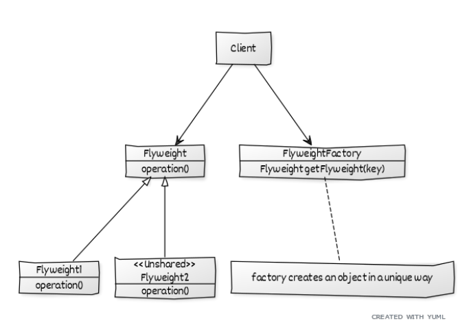


## Définition
**Problème:** On a une structure complexe qui devient facilement lourd à force d'ajouter des éléments.  
**Solution:** On peut alors transformer cette structure en Flyweight qui va supprimé les éléments qui se répètent.

Permet de s'implifier les structures complexes. Quand on a besoin de gérer une grande quantité d'objet similaire.
Réduire la mémoire occupée en joignant les objets similaire.
Va utiliser un hashCode pour trouver les similarités.
Si un enfant existe déjà, on le recrée pas, mais on crée un nouveau lien dans la structure.
Utilisation d'un map qui répertorie tout les objets. Cela se fait à l'aide d'une factorie exécuté du côté client.

## Composition:
Client: Appelle la FlyweightFactory et gére les Flyweight
FlyweightFactory: distribue les Flyweight en évitant les répétitions.

## Exemple
on veut créer un jeu avec deux type de personnage (Terrorist et CounterTerrorist). On va générer àléatoirement des personnages. La FlyweightFactory s'occupera de mapper ou de réutiliser les classes déjà existantes.

## Définitions	
| classe           | rôle             | description            |
|------------------|------------------|------------------------|
| PlayerFactory    | FlyweightFactory | Gère la mémoire        |
| CounterStrike    | Conteneur        | contient weapon/player |
| Player           | Type             | Interface Player       |
| CounterTerrorist | Flyweight        | Player                 |
| Terrorist        | Flyweight        | Player                 |

## Pseudo code
```
main() 
    Pour 10 joueurs
	On crée un Player (avec un type aléatoire)
	On lui attribut une arme aléatoire
	On lance le Player en mission
```


## Code
```java
// A Java program to demonstrate working of 
// FlyWeight Pattern with example of Counter 
	// Driver code 
	public static void main(String args[]) 
	{ 
		/* Assume that we have a total of 10 players 
		in the game. */
		for (int i = 0; i < 10; i++) 
		{ 
			/* getPlayer() is called simply using the class 
			name since the method is a static one */
			Player p = PlayerFactory.getPlayer(getRandPlayerType()); 

			/* Assign a weapon chosen randomly uniformly 
			from the weapon array */
			p.assignWeapon(getRandWeapon()); 

			// Send this player on a mission 
			p.mission(); 
		} 
	} 

	// Utility methods to get a random player type and 
	// weapon 
	public static String getRandPlayerType() 
	{ 
		Random r = new Random(); 

		// Will return an integer between [0,2) 
		int randInt = r.nextInt(playerType.length); 

		// return the player stored at index 'randInt' 
		return playerType[randInt]; 
	} 
	public static String getRandWeapon() 
	{ 
		Random r = new Random(); 

		// Will return an integer between [0,5) 
		int randInt = r.nextInt(weapons.length); 

		// Return the weapon stored at index 'randInt' 
		return weapons[randInt]; 
	} 
} 

// Strike Game 
import java.util.Random; 
import java.util.HashMap; 

// A common interface for all players 
interface Player 
{ 
	public void assignWeapon(String weapon); 
	public void mission(); 
} 

// Terrorist must have weapon and mission 
class Terrorist implements Player 
{ 
	// Intrinsic Attribute 
	private final String TASK; 

	// Extrinsic Attribute 
	private String weapon; 

	public Terrorist() 
	{ 
		TASK = "PLANT A BOMB"; 
	} 
	public void assignWeapon(String weapon) 
	{ 
		// Assign a weapon 
		this.weapon = weapon; 
	} 
	public void mission() 
	{ 
		//Work on the Mission 
		System.out.println("Terrorist with weapon "
						+ weapon + "|" + " Task is " + TASK); 
	} 
} 

// CounterTerrorist must have weapon and mission 
class CounterTerrorist implements Player 
{ 
	// Intrinsic Attribute 
	private final String TASK; 

	// Extrinsic Attribute 
	private String weapon; 

	public CounterTerrorist() 
	{ 
		TASK = "DIFFUSE BOMB"; 
	} 
	public void assignWeapon(String weapon) 
	{ 
		this.weapon = weapon; 
	} 
	public void mission() 
	{ 
		System.out.println("Counter Terrorist with weapon " + weapon + "|" + " Task is " + TASK); 
	} 
} 

// Class used to get a player using HashMap (Returns 
// an existing player if a player of given type exists. 
// Else creates a new player and returns it. 
class PlayerFactory 
{ 
	/* HashMap stores the reference to the object 
	of Terrorist(TS) or CounterTerrorist(CT). */
	private static HashMap <String, Player> hm = new HashMap<String, Player>(); 

	// Method to get a player 
	public static Player getPlayer(String type) 
	{ 
		Player p = null; 

		/* If an object for TS or CT has already been 
		created simply return its reference */
		if (hm.containsKey(type)) 
				p = hm.get(type); 
		else
		{ 
			/* create an object of TS/CT */
			switch(type) 
			{ 
			case "Terrorist": 
				System.out.println("Terrorist Created"); 
				p = new Terrorist(); 
				break; 
			case "CounterTerrorist": 
				System.out.println("Counter Terrorist Created"); 
				p = new CounterTerrorist(); 
				break; 
			default : 
				System.out.println("Unreachable code!"); 
			} 

			// Once created insert it into the HashMap 
			hm.put(type, p); 
		} 
		return p; 
	} 
} 

// Driver class 
public class CounterStrike 
{ 
	// All player types and weapon (used by getRandPlayerType() 
	// and getRandWeapon() 
	private static String[] playerType = 
					{"Terrorist", "CounterTerrorist"}; 
	private static String[] weapons = 
	{"AK-47", "Maverick", "Gut Knife", "Desert Eagle"}; 

}
```
Command
========

### Behavioral pattern

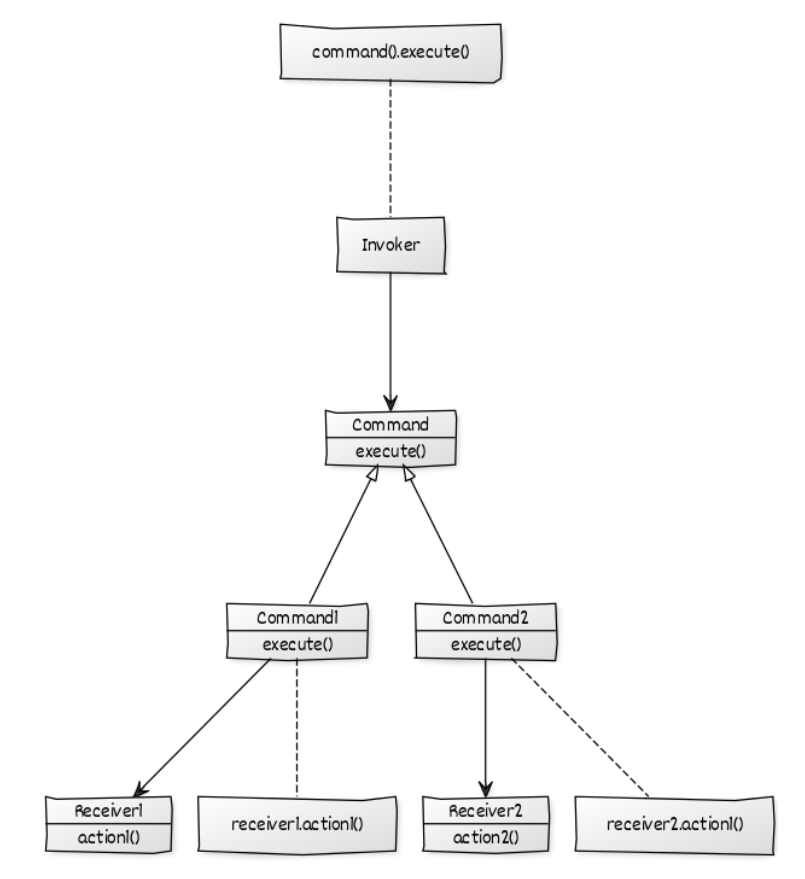{ width=75% }
{ width=120% }

## Définition
**Problème:** On veut pouvoir géré une liste de commandes/actions sur des objets. On pourra lancer/annuler les commandes quand on veut.
**Solution:** On crée une interface Command. Pour chaque objet, on créer des ConcreteCommands. On utilise un Invoker qui les liste et les exécute.
Permet de créer une liste de commande listable ou annulable.

## Composition:
- Client: Crée des commande pour des reciever 
- Invoker: Stock est exécute les commandes
- Command: Interface qui défini comment manipuler les commandes
- ConcreteCommande: Implémente Command et seront exécuté par l'Invoker
- Reciever: Sont les objets contrôlés par les commandes.

## Exemple:
On a un Broker (=Courtier, une personne qui gère les transactions financières) qui doit gérer des stocks.
Pour ce faire on a des commandes (orders) pour l'achat et la vente de stock. Le broker peut prendre les commandes et les exécuter à tout moment.

## Définitions	
| classe             | rôle             | description           |
|--------------------|------------------|-----------------------|
| Broker             | Invoker          | execute les commandes |
| SellStock          | Concrete Command | vente pour les stocks |
| BuyStock           | Concrete Command | achat pour les stocks |
| Stock              | Reciever         | Stocks à vendre       |
| CommandPatternDemo | main             | classe Principale     |
| OrderReciever      | Command          | Interface             |

## Pseudocode
main()
  Création d'un nouveau stock
  Création d'une commande d'achat et une commande de vente pour le store
  Création d'un Broker
  Le Broker prend les commandes
  Le Broker exécute les commandes

## Code
```java
public class CommandPatternDemo {
   public static void main(String[] args) {
      Stock abcStock = new Stock();

      BuyStock buyStockOrder = new BuyStock(abcStock);
      SellStock sellStockOrder = new SellStock(abcStock);

      Broker broker = new Broker();
      broker.takeOrder(buyStockOrder);
      broker.takeOrder(sellStockOrder);

      broker.placeOrders();
   }
}
public interface Order {
   void execute();
}

public class Stock {
	
   private String name = "ABC";
   private int quantity = 10;

   public void buy(){
      System.out.println("Stock [ Name: "+name+", Quantity: " + quantity +" ] bought");
   }
   public void sell(){
      System.out.println("Stock [ Name: "+name+", Quantity: " + quantity +" ] sold");
   }
}

public class BuyStock implements Order {
   private Stock abcStock;

   public BuyStock(Stock abcStock){
      this.abcStock = abcStock;
   }

   public void execute() {
      abcStock.buy();
   }
}


public class SellStock implements Order {
   private Stock abcStock;

   public SellStock(Stock abcStock){
      this.abcStock = abcStock;
   }

   public void execute() {
      abcStock.sell();
   }
}

import java.util.ArrayList;
import java.util.List;

   public class Broker {
   private List<Order> orderList = new ArrayList<Order>(); 

   public void takeOrder(Order order){
      orderList.add(order);		
   }

   public void placeOrders(){
   
      for (Order order : orderList) {
         order.execute();
      }
      orderList.clear();
   }
}

```
# Compose Pattern

### Structural pattern

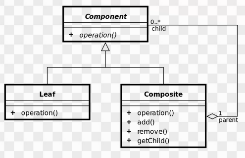


## Définition
**Problème:** On a une structure et chaque objet a des comportement similaire. On aimerai que le client manipule la structure de la même façon qu'elle manipule un seul de ses objets.  
**Solution:** On crée alors une Interface Component qui sera implémenté par des Composite (noeud de la structure) les objets deviennent des Leaf (feuille).

Crée un arbre et fait exécuter des éléments dans les nodes.
C'est comm si on manipule une un groupe d'objet avec une seule instance seulement.

## Composition:
- Component: L'interface qui défini le protocole de comunication
- Leaf: définit le comportement des enfants (les plus bas)
- Composite: Contient les enfants et fait des actions en rapport avec eux.
- Client: manipule les objet de la composition par le biais de l'interface

## Exemple:

On peut donc définir une action sur le parent et l'action va être reproduite par les enfants.


## Définitions	
| classe           | rôle      | description                  |
|------------------|-----------|------------------------------|
| CompanyDirectory | Composite | répartie la companie en bloc |
| Manager          | Leaf      | type d'employé               |
| Developer        | Leaf      | type d'employé               |
| Employee         | Component | interface                    |
| Company          | Client    | interface                    |
 
## Pseudo code
```
main () 
    On crée deux Developpers
    on crée une CompanyDirectory
    on ajoute les deux Developpers dans la CompanyDirectory
    
    On crée deux Manager
    on crée une autre CompanyDirectory:
    on ajoute les deux Manager dans la CompanyDirectory
    
    on crée une troisième CompanyDirectory
    on y ajoute les deux précédentes CompanyDirectory
    On fait un showEmployeeDetails
    (=toutes les CompanyDirectory vont appeller les Employee et tout les Employee vont se présenter)
```

## Code
```java
public class Company 
{ 
	public static void main (String[] args) 
	{ 
		Developer dev1 = new Developer(100, "Lokesh Sharma", "Pro Developer"); 
		Developer dev2 = new Developer(101, "Vinay Sharma", "Developer"); 
		CompanyDirectory engDirectory = new CompanyDirectory(); 
		engDirectory.addEmployee(dev1); 
		engDirectory.addEmployee(dev2); 
		
		Manager man1 = new Manager(200, "Kushagra Garg", "SEO Manager"); 
		Manager man2 = new Manager(201, "Vikram Sharma ", "Kushagra's Manager"); 
		
		CompanyDirectory accDirectory = new CompanyDirectory(); 
		accDirectory.addEmployee(man1); 
		accDirectory.addEmployee(man2); 
	
		CompanyDirectory directory = new CompanyDirectory(); 
		directory.addEmployee(engDirectory); 
		directory.addEmployee(accDirectory); 
		directory.showEmployeeDetails(); 
	} 
} 

public interface Employee 
{ 
	public void showEmployeeDetails(); 
} 
public class Developer implements Employee 
{ 
	private String name; 
	private long empId; 
	private String position; 

	public Developer(long empId, String name, String position) 
	{ 
		this.empId = empId; 
		this.name = name; 
				this.position = position; 
	} 
	
	@Override
	public void showEmployeeDetails() 
	{ 
		System.out.println(empId+" " +name+); 
	} 
} 

public class Manager implements Employee 
{ 
	private String name; 
	private long empId; 
		private String position; 

	public Manager(long empId, String name, String position) 
	{ 
		this.empId = empId; 
		this.name = name; 
				this.position = position; 
	} 
	
	@Override
	public void showEmployeeDetails() 
	{ 
		System.out.println(empId+" " +name); 
	} 
} 

import java.util.ArrayList; 
import java.util.List; 

public class CompanyDirectory implements Employee 
{ 
	private List<Employee> employeeList = new ArrayList<Employee>(); 
	
	@Override
	public void showEmployeeDetails() 
	{ 
		for(Employee emp:employeeList) 
		{ 
			emp.showEmployeeDetails(); 
		} 
	} 
	
	public void addEmployee(Employee emp) 
	{ 
		employeeList.add(emp); 
	} 
	
	public void removeEmployee(Employee emp) 
	{ 
		employeeList.remove(emp); 
	} 
} 

```
Builder
========

### Creationnal pattern

## Définition
**Problème:** On a des objets qui héritent d'une super classe (ou interface), mais ils sont très compliqué à construire pour le client. On aimerait facilité la construction.  
**Solution:** On crée une interface Builder (soeur jumelle de la super classe) qui définit comment construire les objets. Les Concretes Builders seront les soeurs des objets et on crée un director qui "constuira" les objets grâce aux ConcreteBuilders. 
Le client aura seulement à utiliser les Builders et le directors pour avoirs ses objets sans rentrer des paramètres super compliqués.

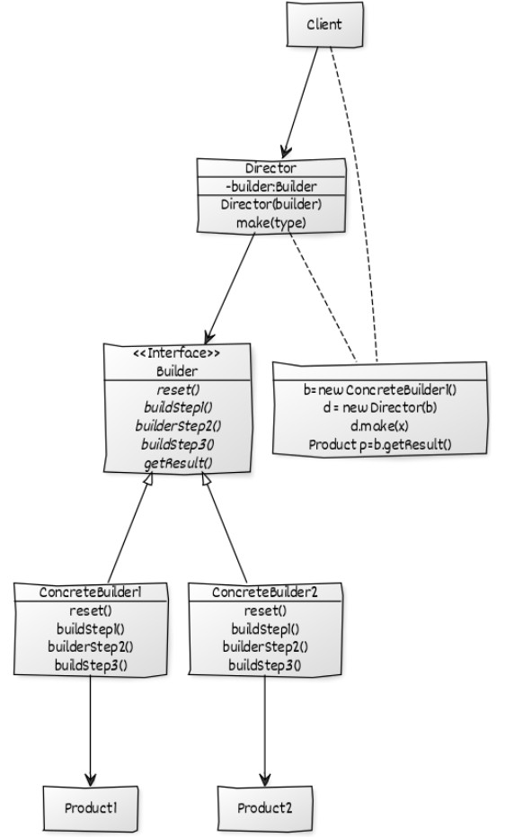


## Composition:
- Product: Définit le type de l'objet complexe
- Builder: (abstract class ou interface) définit toute les étape de création et la méthode pour retourner le produit.
- ConcreteBuilder: Hérite de Builder et est utilisé pour créer des porduits complexes.
- Director: Contrôle l'algorithme qui va généré le produit final. Choisi le concrète builder. Manipule le builder.

## Exemple:
Pour une interface donnée, il faudra aussi mettre en place son interface jumelle Builder
Pour un objet, on aura plusieur Builder différents.

## Use case:
On a un ingénieur qui doit construire une maison.
Nous utilison les buidler pour rendre invisible le détail de construction des maisons.

## Définitions	
| classe            | rôle             | description           |
|-------------------|------------------|-----------------------|
| HousePlan         | type             | interface             |
| House             | objet complexe   | définit les maisons   |
| HouseBuilder      | Builder          | interface             |
| IglooHouseBuilder | Concrete Builder | type de maison        |
| TipiHouseBuilder  | Concrete Builder | type de maison        |
| CivilEngineer     | Director         | Construit les maisons |
	 
## Pseudo code
```
main() 
On construit un Builder igloo
On construit un ingénieur qui se charge de l'igloo

On demande à l'ingénieur de construire l'igloo
On demande à l'ingénieur de donner la maison
```

## Code
```java
class Builder 
{ 
	public static void main(String[] args) 
	{ 
		HouseBuilder iglooBuilder = new IglooHouseBuilder(); 
		CivilEngineer engineer = new CivilEngineer(iglooBuilder); 

		engineer.constructHouse(); 

		House house = engineer.getHouse(); 

		System.out.println("Builder constructed: "+ house); 
	} 
} 
//Builder
interface HousePlan 
{ 
	public void setBasement(String basement); 

	public void setStructure(String structure); 

	public void setRoof(String roof); 

	public void setInterior(String interior); 
} 

// Product
class House implements HousePlan 
{ 

	private String basement; 
	private String structure; 
	private String roof; 
	private String interior; 

	public void setBasement(String basement) 
	{ 
		this.basement = basement; 
	} 

	public void setStructure(String structure) 
	{ 
		this.structure = structure; 
	} 

	public void setRoof(String roof) 
	{ 
		this.roof = roof; 
	} 

	public void setInterior(String interior) 
	{ 
		this.interior = interior; 
	} 

} 

//Buidler
interface HouseBuilder 
{ 

	public void buildBasement(); 

	public void buildStructure(); 

	public void bulidRoof(); 

	public void buildInterior(); 

	public House getHouse(); 
} 

//concreteBuilder
class IglooHouseBuilder implements HouseBuilder 
{ 
	private House house; 

	public IglooHouseBuilder() 
	{ 
		this.house = new House(); 
	} 

	public void buildBasement() 
	{ 
		house.setBasement("Ice Bars"); 
	} 

	public void buildStructure() 
	{ 
		house.setStructure("Ice Blocks"); 
	} 

	public void buildInterior() 
	{ 
		house.setInterior("Ice Carvings"); 
	} 

	public void bulidRoof() 
	{ 
		house.setRoof("Ice Dome"); 
	} 

	public House getHouse() 
	{ 
		return this.house; 
	} 
} 

//concreteBuilder
class TipiHouseBuilder implements HouseBuilder 
{ 
	private House house; 

	public TipiHouseBuilder() 
	{ 
		this.house = new House(); 
	} 

	public void buildBasement() 
	{ 
		house.setBasement("Wooden Poles"); 
	} 

	public void buildStructure() 
	{ 
		house.setStructure("Wood and Ice"); 
	} 

	public void buildInterior() 
	{ 
		house.setInterior("Fire Wood"); 
	} 

	public void bulidRoof() 
	{ 
		house.setRoof("Wood, caribou and seal skins"); 
	} 

	public House getHouse() 
	{ 
		return this.house; 
	} 

} 

//director
class CivilEngineer 
{ 

	private HouseBuilder houseBuilder; 

	public CivilEngineer(HouseBuilder houseBuilder) 
	{ 
		this.houseBuilder = houseBuilder; 
	} 

	public House getHouse() 
	{ 
		return this.houseBuilder.getHouse(); 
	} 

	public void constructHouse() 
	{ 
		this.houseBuilder.buildBasement(); 
		this.houseBuilder.buildStructure(); 
		this.houseBuilder.bulidRoof(); 
		this.houseBuilder.buildInterior(); 
	} 
} 

```
Facade
=======

### Structural Pattern

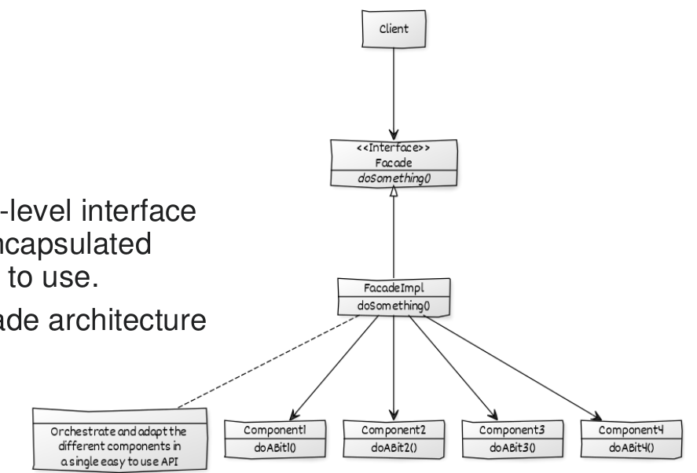


## Définition
**Problème:** On a un système (ou une structure) super complexe et on aimerait que le Client puisse intéragir facilement avec.  
**Solution:** On crée une facade qui va prendre les instructions du clients et manipuler le système.
"On cache la complexité d'un système et son interaction"
Crée une interface de haut niveau pour rendre l'utilisation d'un système complexe plus facile. Ici on a plusieurs formes et on cherche un moyen de les créer simplement. C'est comme la face avant d'une construction. 

## Composition:
- Facade: Interface qui recevra les demandes du client et executera les Component nécessaire
- ConcreteFacade: exécutera concrètement les commandes.
- Component: Objets divers qui seront appellé par la ConcreteFacade
  
## Exemple:
Ici, on utilisera pas d'interface mais une classe ConcreteFacade facade (=ShapeMaker) qui va manipuler les différentes formes selon les orderes qu'on lui donnera.

## Définitions	
| classe            | rôle           | description                       |
|-------------------|----------------|-----------------------------------|
| ShapeMaker        | ConcreteFacade | Facilite l'utilisation des formes |
| Shape             | type           | interface                         |
| Rectangle         | Component      | type de Shape                     |
| Circle            | Component      | type de Shape                     |
| Square            | Component      | type de Shape                     |
| FacadePatternDemo | Client         | classe principale                 |

## Pseudo code
```
main()
  Créer un ShapeMaker
  Créer des formes (cercle, rectangle, carré) avec le ShapeMaker
```

## Code
```java

//Use the facade to draw various types of shapes.
//FacadePatternDemo.java
public class FacadePatternDemo {
   public static void main(String[] args) {
      ShapeMaker shapeMaker = new ShapeMaker();

      shapeMaker.drawCircle();
      shapeMaker.drawRectangle();
      shapeMaker.drawSquare();		
   }
}

//Create an interface.
//Shape.java
public interface Shape {
   void draw();
}

//Create concrete classes implementing the same interface.
//Rectangle.java
public class Rectangle implements Shape {

   @Override
   public void draw() {
      System.out.println("Rectangle::draw()");
   }
}

//Square.java
public class Square implements Shape {

   @Override
   public void draw() {
      System.out.println("Square::draw()");
   }
}

//Circle.java
public class Circle implements Shape {

   @Override
   public void draw() {
      System.out.println("Circle::draw()");
   }
}

//Create a facade class.
//ShapeMaker.java
public class ShapeMaker {
   private Shape circle;
   private Shape rectangle;
   private Shape square;

   public ShapeMaker() {
      circle = new Circle();
      rectangle = new Rectangle();
      square = new Square();
   }

   public void drawCircle(){
      circle.draw();
   }
   public void drawRectangle(){
      rectangle.draw();
   }
   public void drawSquare(){
      square.draw();
   }
}

```
Observer
=========

Behavioral pattern

## Définition
**Problème:** On a des objets qui ont beaucoup de comportements différent qu'ils peuvent changer et on aimerai ajouter de nouveau comportement sans faire beaucoup de "if else"  
**Solution:** On transformes ses objets en observer. On définit des états (appellé Subject) qui vont modifier le comportement des objets. Si on veut ajouter un nouveau comportement, on crée un nouveau Subject.
l'Observer pattern est utilisé quand il y a beaucoup de dépendance entre les objet (si un objet change, tout les autres doivent changer). Les classes dépenantes vont devenir les observers et une classe (ici Subject) sera chargée de mettre à jour les autres.

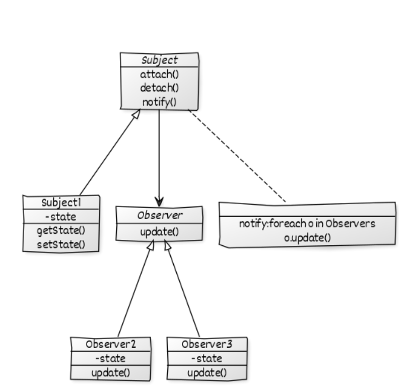

## Composition:
Subject: Interface qui définira un ensemble d'état.
ConcreteSubject: Implémente Subject et on un "state" (variable d'état)
Observer: Définit le changement de comportement d'un objet 
ConcreteObserver: Classes qui vont changer leur comportement selon le ConcreteSubject qu'on leur donne

## Point clé:
Chaque classe observer va prendre le sujet dans son constructeur et va ajouter son addresse dans la liste des observer du sujet. L'observer et le Subject se pointent l'un et l'autre


## Exemple:
## Définitions	
| classe              | rôle     | description                     |
|---------------------|----------|---------------------------------|
| HexaObserver        | Observer | Calcule selon l'état du système |
| OctalObserver       | Observer | Calcule selon l'état du système |
| BinaryObserver      | Observer | Calcule selon l'état du système |
| Observer            | type     | Définit le type des observers   |
| Subject             | State    | Définit l'état du système       |
| ObserverPatternDemo | Client   | classe principale               |

## Pseudo code
```
main()
  On crée un nouveau sujet.
  On crée successivement des observateur Hexa, Octa et Binaire (Ils dépendent tous du sujet)

  On change l'état du sujet (on lui ajoute 15)
  On change l'état du sujet (on lui ajoute 10)
```

## Code
```java
//Use Subject and concrete observer objects.
public class ObserverPatternDemo {
   public static void main(String[] args) {
      Subject subject = new Subject();

      new HexaObserver(subject);
      new OctalObserver(subject);
      new BinaryObserver(subject);

      System.out.println("First state change: 15");	
      subject.setState(15);
      System.out.println("Second state change: 10");	
      subject.setState(10);
   }
}

//Create Subject class.
public class Subject {
	
   private List<Observer> observers = new ArrayList<Observer>();
   private int state;

   public int getState() {
      return state;
   }

   public void setState(int state) {
      this.state = state;
      notifyAllObservers();
   }

   public void attach(Observer observer){
      observers.add(observer);		
   }

   public void notifyAllObservers(){
      for (Observer observer : observers) {
         observer.update();
      }
   } 	
}


//Create Observer class.
public abstract class Observer {
   protected Subject subject;
   public abstract void update();
}


//Create concrete observer classes
public class BinaryObserver extends Observer{

   public BinaryObserver(Subject subject){
      this.subject = subject;
      this.subject.attach(this);
   }

   @Override
   public void update() {
      System.out.println( "Binary String: " + Integer.toBinaryString( subject.getState() ) ); 
   }
}


public class OctalObserver extends Observer{

   public OctalObserver(Subject subject){
      this.subject = subject;
      this.subject.attach(this);
   }

   @Override
   public void update() {
     System.out.println( "Octal String: " + Integer.toOctalString( subject.getState() ) ); 
   }
}

public class HexaObserver extends Observer{

   public HexaObserver(Subject subject){
      this.subject = subject;
      this.subject.attach(this);
   }

   @Override
   public void update() {
      System.out.println( "Hex String: " + Integer.toHexString( subject.getState() ).toUpperCase() ); 
   }
}
```
State
======

### Behavioral pattern.


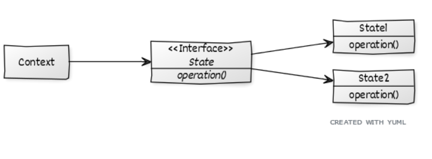{ width=110% }
{ width=75% }

## Définition
**Problème:** On voudrait donner un état interne à un objet pour modifier son comportement.  
**Solution:** On transforme l'objet désiré en contexte, on crée une interface State qui va être implémenté par toutes les classes qui vont représenté un comportement différent de l'objet. Ça éviter de faire de faire beaucoup de is-else pour un objet.

## Composition:
- Context: Définit le contexte du comportement de l'objet
- State: Défini le comportement selon un état
- ConcreteState: Définit des objets qui agiront différemment selon le contexte

## Exemple:
Exemple avec un AlertStateContext. On peut imaginer un téléphone qui lance des alert, on peut le mettre en mode vibreur, silencieux ou avec du son. 
Ici, chacun de ces mode d'alert représente une implémentation d'une interface State qu'on crée. Comme ça si, on veut changer le comportement du télépohone on change juste sa classe interne avec Silence, Vibreur, etc.


## Définitions	
| classe            | rôle          | description                      |
|-------------------|---------------|----------------------------------|
| Silent            | ConcreteState | met le télépnone en silencieux   |
| Vibration         | ConcreteState | met le téléphone en mode vibreur |
| AlertStateContext | Context       | définit le téléphone             |
| MobileAlertState  | State         | Définit le type d'état           |
| StatePattern      | Client        | utilise le téléphone             |

## Pseudo code
```
main() 
    création d'un AlertStateContext
    On lui fait lancer deux alerts
    On change son état interne grâce à un objet Silence
    On lui fait lancer trois alerts
```

## Code
```java
// Java program to demonstrate working of 
// State Design Pattern 

class StatePattern 
{ 
	public static void main(String[] args) 
	{ 
		AlertStateContext stateContext = new AlertStateContext(); 
		stateContext.alert(); 
		stateContext.alert(); 
		stateContext.setState(new Silent()); 
		stateContext.alert(); 
		stateContext.alert(); 
		stateContext.alert();		 
	} 
} 

interface MobileAlertState 
{ 
	public void alert(AlertStateContext ctx); 
} 

class AlertStateContext 
{ 
	private MobileAlertState currentState; 

	public AlertStateContext() 
	{ 
		currentState = new Vibration(); 
	} 

	public void setState(MobileAlertState state) 
	{ 
		currentState = state; 
	} 

	public void alert() 
	{ 
		currentState.alert(this); 
	} 
} 

class Vibration implements MobileAlertState 
{ 
	@Override
	public void alert(AlertStateContext ctx) 
	{ 
		System.out.println("vibration..."); 
	} 

} 

class Silent implements MobileAlertState 
{ 
	@Override
	public void alert(AlertStateContext ctx) 
	{ 
		System.out.println("silent..."); 
	} 

} 

```
