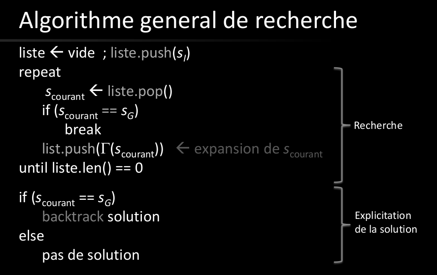

# Map
Recherche:

Formaliser:
- le problème
- Le fait de cherher une solution
- difficulté du problème
- Solution elle-même
- le fait qu'il y ait (ou pas) de solution

Definition:
Un état s (state) est une configuration d'un système.
Un état est un ensemble de valeur des paramètre d'un système (on peut parler de vecteur d'état)

Definition:
L'espace d'états (state space) S d'un système est l'ensemble de tous les états possibles du système.
La taille de l'espace peut être une mesure de la complexité du problème

Les états (initial ou final) peuvent être défini de façon explicite (exacte) ou implicite (règle).

On doit aussi définir les actions possible pour passer d'un état à un autre

On finit par un graphe d'états à partir de la fonction de transition

successeur(vj, vi) ssi eI= (vi, vj)
NG+(vi)= successeur de vi
NG-(vi)= prédécesseurs de vi
gamma= donne l'ensemble des successeur (son inverse donne les prédécesseurs)

Définition:
application multivoque donne plusieurs résultats pour une seule entrée

Définition:
Problème:
	- espace des états S
	- fonction de transition gamma
	- état initial Si
	- état final Sg
	
	

• Categorie A: Noeuds deja visités
    – sortis de la liste
• Catégorie B: Noeuds pas encore visités avec
    voisins visités (en A)
    – Noeuds dans la liste
• Catégorie C: noeuds pas encore visités (ni en B)
    - Noeuds jamais passés dans la liste

# Algorithme de recherche (propriétés):
Compltude: complet si trouve une solution
optimal: si trouve la meilleure solution

Complexité:
- nb état
- degré moyen du graphe
- distribution des solutions
- espace mémoire / état
- Temps d'exécution de la fonction gamma

# Rechercher aveugle
## recherche en largeur:
complet et optimal
complexité: temps = espace = O(b^d) (avec b le nombre de noeud?)
On peut augmenter la vitesse de recherche en faisant un BFS à partir du point de départ et du point d'arrivé.
À leur intersection, on joint le chemin qui mène de Si à Sg

## recherche en profondeur
complet si l'arbre est fini
Non optimal en général
complexité: temps= O(b^m), espace O(b*m)
On peut améliorer l'algorithme si on fait un approfondissement itératif (IDS). Cela rend l'algorithme optimal:

# Chapitres:
[01 intro](01.intro)
[02 preuveTaquin](02.preuveTaquin)
02.recherche
03.rechercheAveugle
04.rechercheHeuristique
05.satisfactionContraintes
06.rechercheAdverse
07.planification
08.apprentissage
08.graphicalModels
08.incertitude
09.decisionTrees
10.NaiveBayes-RegressionLogistique
10.reseauxBayesiens
11.reseaux de Neurones - Graphes Computationnels
12.markovDecisionProcess-reinforcementLearning
13.fairness
