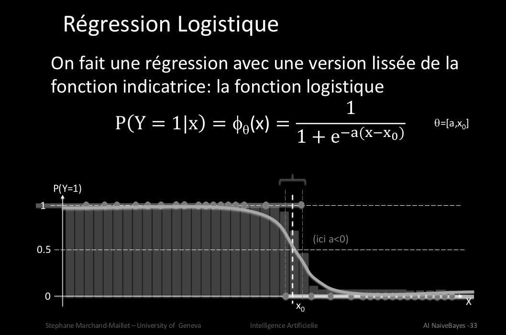

# Q11 Régression logistique :
  
## Rappelez le principe de l’apprentissage supervisé. Quel est le protocole de gestion des données dans ce contexte ?  
  
## Rappelez la relation entre classification et régression ?
Faire une classification suivant une courbe  
Des éléments suivnent une loi de Bernoulli  
  
## Qu’est-ce que l’algorithme de régression logistique ?
On cherche à ajuster une courbe de régression logistique sur une répartition donnée  
  
  
  
## Quelles sont les hypothèses sous-jacentes ?
Des éléments suivent une loi de Bernoulli et on des propriétés observables.  
amène un recouvrermemnt sur un seuil pour amortir la marge d'erreur quand les valeurs de deux classes se sépare.  
  
## Quels sont les paramètres ?
Cette fonction à deux paramètres:  
x0= l'ordonnée à l'origine  
a= la pente  
  
on peut se ramener à un cas linéaire  
odd ration= la poportion relative que ce soit vrai ou faux, évite un seuil absolue (sans unité)  
  
## Quel est sont les propriétés de la fonction logistique ?
  
  
## Qu’est-ce que le sur-apprentissage ?
Quand on cherche à séparer strictement chaque classe.  
  
Discutez sa relation avec la régression logistique.  
  
