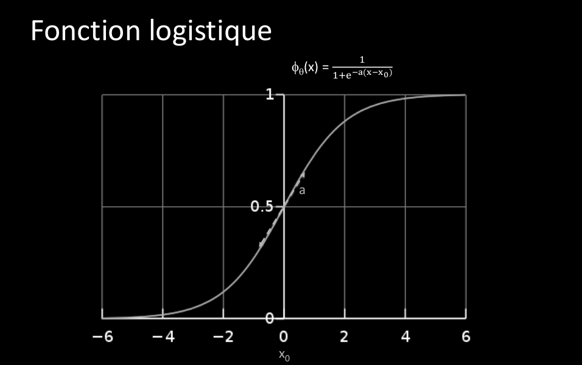

# Q13 Réseaux de neurones :
  
## Rappelez le principe d’un neurone artificiel. Comment combine-t-on les neurones en réseaux ?
En combinant les neurones, on aura une classification non-linéaire. On les combine en couches.  
Données->couche(s) cachés->sortie  
  
## Comment entraine-t-on un réseau de neurones ?
On a seulement accès aux données de sortie (pas aux hidden layers)  
On aimerai quand même cacluler l'erreur du loss pour mettre à jour les poids  
On va tented la backpropagation de la couche de sortie jusqu'à l'entrée par une fonction récursive  
On peut calculer tout les gradients du réseau. Implémenté par un graphe computationnel.  
  
## Qu’est-ce que la fonction logistique ?
  
  
## Comment est-elle utilisée dans un neurone artificiel ?
Elle est utilisé comme fonction d'activation.  
  
## Quelles sont ses propriétés ?
Cette fonction à deux paramètres:  
x0= l'ordonnée à l'origine  
a= la pente  
  
Vous pourrez parler des principes des graphes computationnels et de la différentiation automatique.  
  
