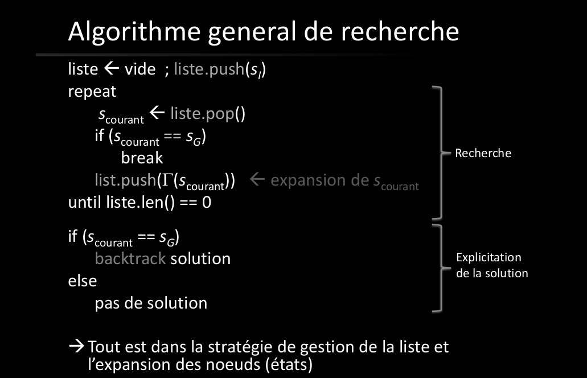
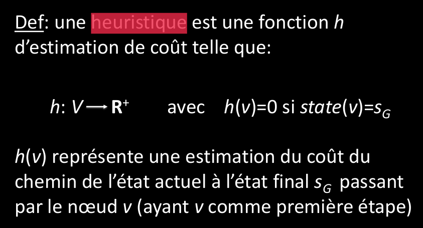
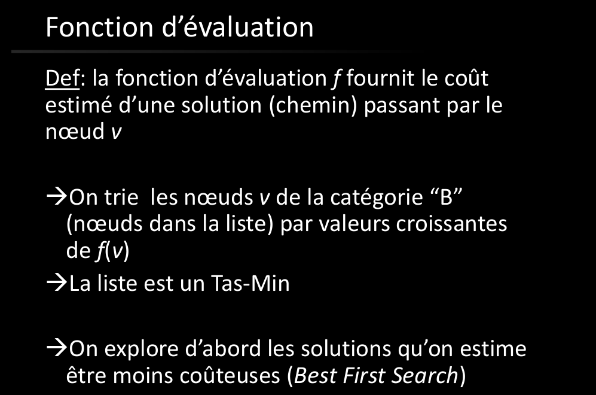
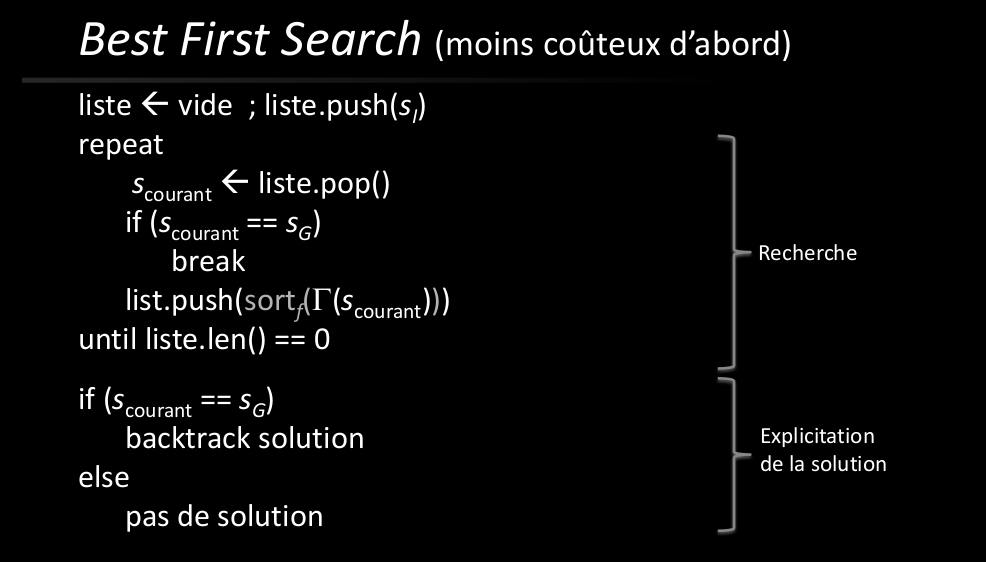
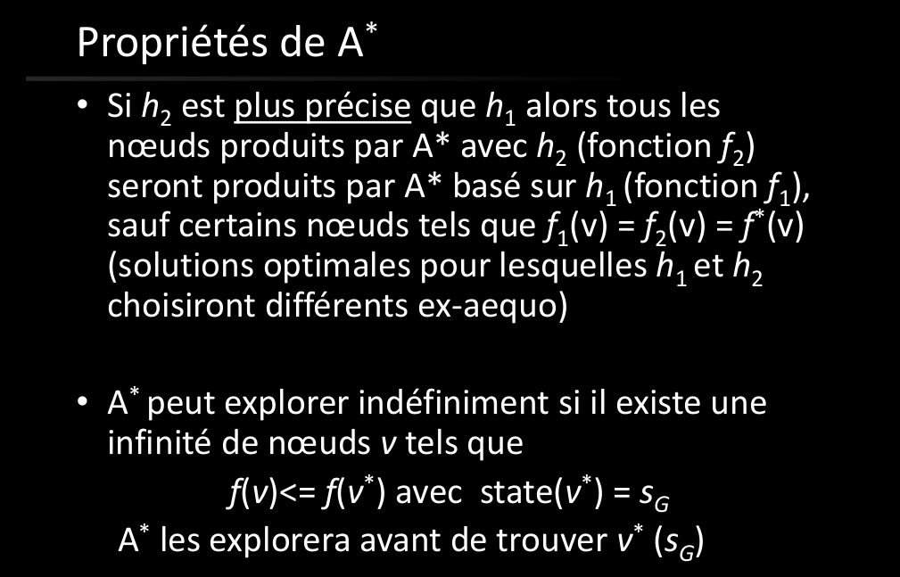

# Q2 Méthodes de Recherche: rappelez le principe des méthodes de recherche. 
  
Dans les méthode de recherche nous cherchons à explorer un graphe d'état pour trouver le chemin idéal depuis un état initial jusqu'à un état final souhaité.  
  
**Type de recherche:**  
- recherche aveugle  
- recherche heuristique  
  
**Le graphe nous donne un formalisation pour la résolution du problème:**    
S: ensemble des état du système  
Gamma: la fonction de transition qui fait passer d'un état valide à un autre (fonction multivoque de voisinage)  
S_I: état initial (par où on commence)  
S_G: état final (par où on veut finir)  
  
  
  
• Categorie A: Noeuds deja visités sortis de la liste  
• Catégorie B: Noeuds pas encore visités avec voisins visités (en A) Noeuds dans la liste  
• Catégorie C: noeuds pas encore visités (ni en B)  
  
un noeud fera le passage C-B-A  
  
## Qu’est-ce que la profondeur limitée et en quoi est-ce utile ?
La profondeur limité est une restriction utilisée pour les algorithmes de recherche en profondeur.  
Cela permet de régler l'optimalité de l'algorithme de recherche. Elle permet aussi de réduir son coût sur la mémoire.  
  
Par défaut, l'algorithme de recherche en profondeur pur peut être complet mais pas optimal dans la recherche de la solution. En effet, elle fonction selon un méchanisme de backtracking.  
On explore chaque stratgies jusqu'au bout.  
  
## Comment est définie une heuristique et quelles sont ses propriétés ?
Une heuristique est une méthode de valuation qui permet d'ordonner les noeud à explorer selon une connaissance qu'on a à priorie du problème. C'est une méthode de convergence rapide.  
  
  
  
## A quoi sert une heuristique ?
Cela permet de donner un ordre et une plus grande importance aux choix jugés plus "efficaces".  
Elle donne donc une meilleur optimalité au problème.  
  
  
  
  
  
l'algorithme A* est l'algorithme best-first search avec une fonction d'évaluation   
f(v)= g(v)+h(v)  
complet et optimal  
  
  
  
Expliquez en particulier l’algorithme A* et ses propriétés. Citez des exemples d’application.  
