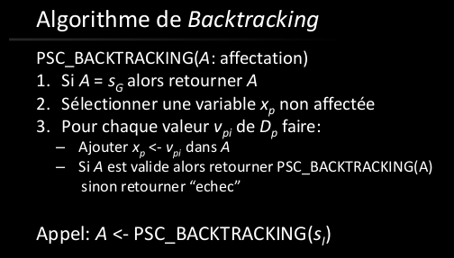
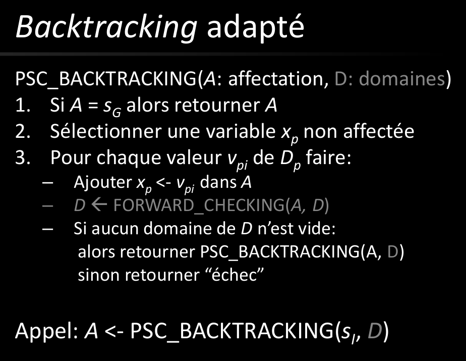
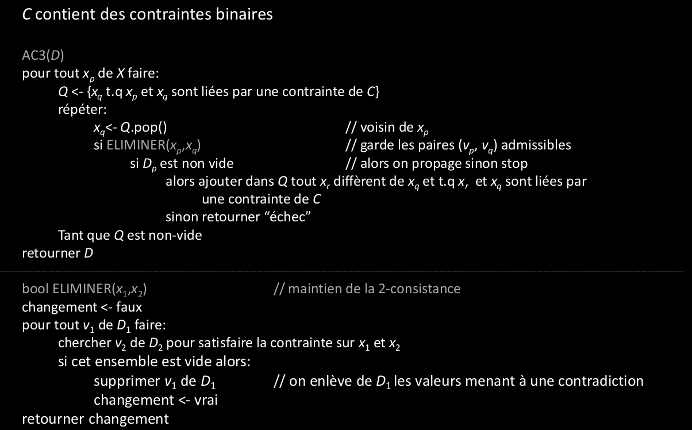

# Q3 Satisfaction de contraintes :

## Qu’est-ce qu’un PSC ?
Problem satisfaction contrainte, c'est un problème où on ne sait pas d'avance à quoi ressemble le modèle final.
Cependant, on sait quel règles (=contraintes) il est suposé satisfaires.

Représenté par:
Un ensembe de variables X= x_1, x_2, x_3,...,x_N)
Un ensembe de contraintes C= c_1, c_2, c_3,...,c_M)

chaque x a un domaine de valeur admissible
chaque c est une proposition logique

On cherche X* tel que ses composantes soient dans leur domaine respectif et que toutes les contraintes sont respectés.

## Quel est son modèle ?
C'est toujours un graphe, on connait pas son état final.

On doit essayer de trouver:
- les variables
- les domaines
- les contraintes

tuple(S, Gamma, S_i, S_G)

S: ensemble des états du système
Gamma: fonction de succession
S_i: Etat initial
S_f: Etat final

## Comment le résout-on ?
On le résout en faisant des choix et en utilisant le principe de propagation de contraintes pour éliminer les choix qui ne permettraient pas de respecter la contrainte.

On va utiliser la propagation de contrainte pou résuire l'espace de recherche et déduire les états non-valides du probléme
On utilisera aussi des heuristiques pour guider notre recherche.

Algorithme:

On peut utiliser une heuristique pour la sélection de variables: le forward checking
C'est pour éviter l'affectation à des valeurs qui rendraient le graphe invalide, cela est fait à priori (d'où le forward checking)

On utilise aussi des heuristiques pour supprimer la sélection aléatoire.
- la variable la plus contrainte (variable ayant le plus petit domaine)
- la variable la plus contraignante (variable apparaissant dans le plus de contrainte)
- la valeur la moins contraignante (valeur qui retire le moins de valeur aux autres)

C'est un algorithme de propagation de contraintes binaires avec une anticipation de niveau 3. est utilisé à la deuxième étape du backtracking pour défiinir le nouveau domaine selon l'ancien domaine qu'on lui donne.

## En quoi consiste le graphe mis en jeu ?

Graphe de contrainte
G(V,E)= (variables, contraintes)
Les composant connexes représentent les variables liées
On utilise ce graphe pour suivre la propagation des contraintes.

Espace d'etat: espace des affectations valides
Transition: affectation d'une nouvelle variable
Etat initial: affectation vide
Etat final: une solution

Affectation valide: affectation de ceraines variable
solution: affectation de toutes les variables

Décrivez les algorithmes et heuristiques associées.
