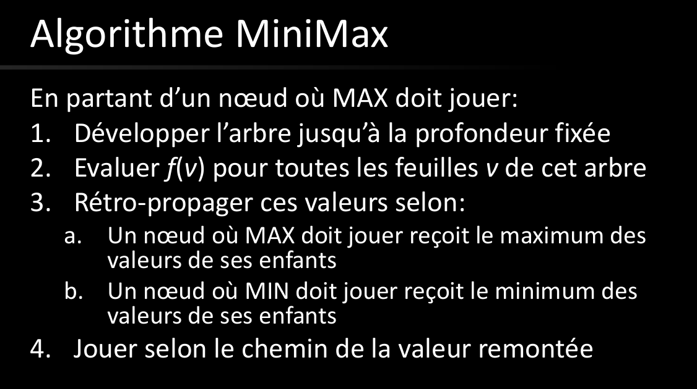

# Q4 Recherche Adverse :
  
## En quoi consiste la recherche adverse et en quoi diffère-t-elle de la recherche classique ?
La recherche advairse tient en compte l'existence d'un autre adversaire rendant le déterminisme plus compliqué.  
Comparer à la recherche classique, on est obligé de faire attention à ce que l'autre joueur ferra.  
  
## Quel est son modèle ?
Son modèle est le même que celui de la recherche en général.  
  
Etats: Configuration de jeu  
Transition: choix d'une nouvelle configuration  
Etat initial: Configuration de départ et joueur initial  
Etat final: égalité ou victoire d'un des deux joueurs  
  
## Qu’est-ce qu’une fonction d’évaluation ?
C'est une fonction qui nous permet de guider notre stratégie de coup à jouer.  
  
f(v): V->R  
  
Estimation numérique du potentiel d'une configuration à mener à la victoire.  
  
On cherche à maximiser f et l'adversaire cherche à minimiser f  
  
Horizon: profondeur max de la recherche avant notre coup.  
On calcule la fonction d'évaluation des feuille et on propage vers le haut.  
  
# Décrivez l’algorithme MINIMAX et ses variantes.
  
Max cherche à maximiser la fonction d'évaluation  
Min cherche à minimiser la fonction d'évaluation  
  
  
  
Si f est une bpnne estimation alors on maximise notre chance de victoire.  
  
Complet et opttimal (si l'adversaire est optimal)  
  
Complexité en temps O(b^M)   
Complexité en espace O(b.M)  
  
b branchement moyen et M profondeur maximale  
  
  
Il y a aussi:  
NegaMax: pas d'alternance des fonctions min et max. Simplement une fonction évaluée à un niveau dont on prend son opposé au suivant.  
ExpectMiniMax: permet de modéliser les jeux dans lesquels un facteur aléatoire est présent.  
On utilise aussi le Reinforcement Learning (alphaGo)  
  
  
## Autre
élagage alpha-beta  
On évite de développer les branches qui servent à rien  
  
on affecte:  
alpha à Max  
beta à Min  
  
On maintient:  
alpha la valeur du meilleurs successeur jusqu'ici  
beta la valeur du plus faible successeur jusqu'ici  
  
alpha ne fera que de croitre et beta que de décroitre  
  
alpha commence à moins l'infini et beta à plus l'infini  
  
On peut arrêter lorsqu'il n'y a plus de croissance ou décroissance respectivement.  
  
Complexité en temps O(b^(3M/4)) et un facteur de branchement sqrt(b)  
  
  
  
  
  
