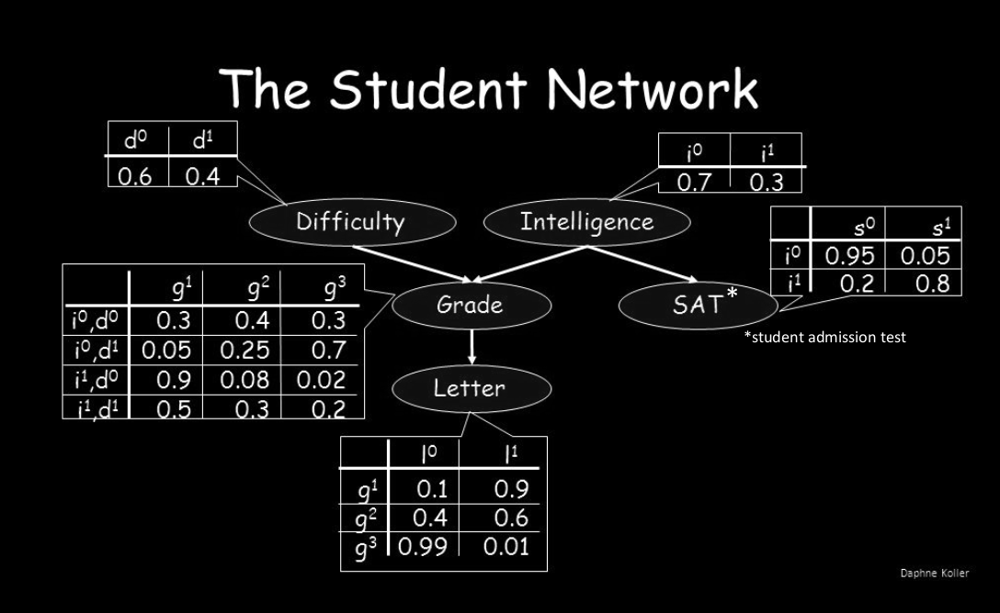
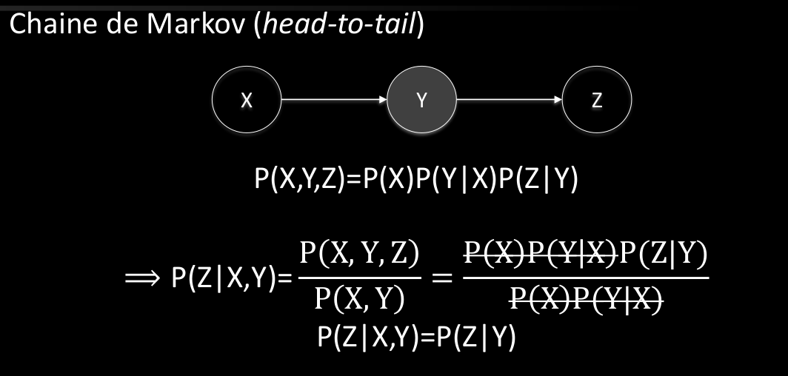
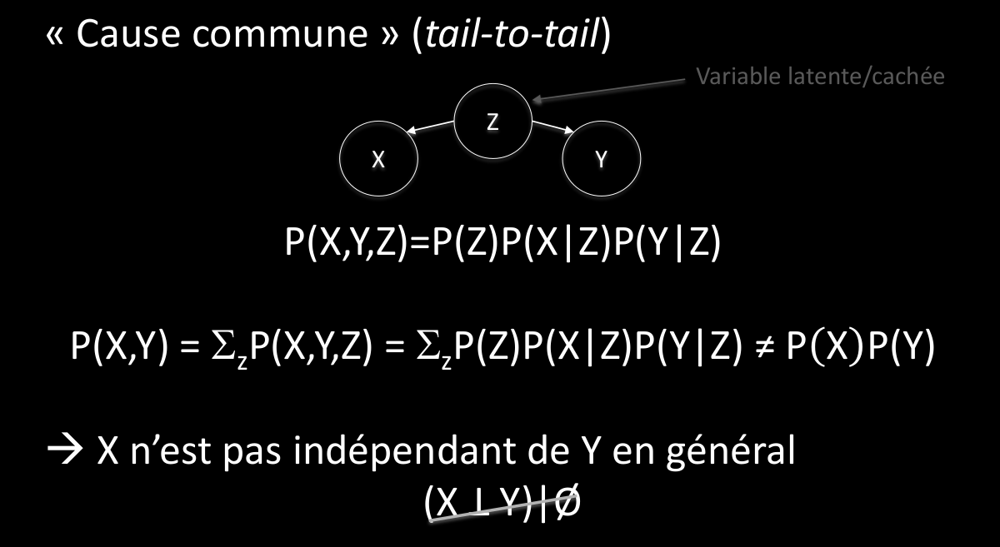
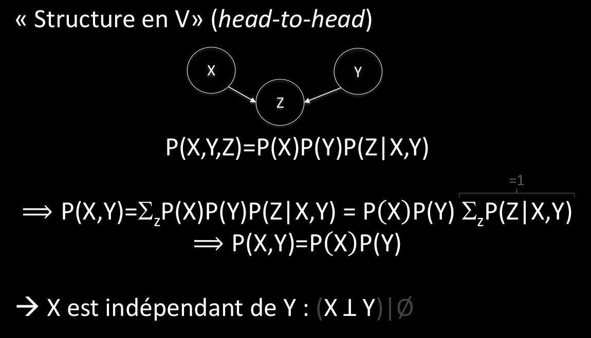
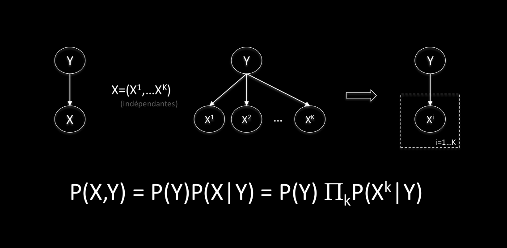

# Q6 Modèle de graphes probabilistes :
  
## Donnez la définition d’un PGM en relation avec les notions de probabilités. Quelle est l’utilité d’utiliser un PGM ?
Probability graphe model. C'est un graphe basés sur les probabilités conditionnelles.  
Le PGM nous permet à partir d'une base de donnée (ou une connaissance antérieur) de faire des pronostiques sur ce qui va se produire.  
  
On utilise les graphes pour organiser les relations  
  
On modélise les relation de dépendances probabiliste entre variables aléatoires.  
  
P(X,Y)=P(Y)P(X|Y)  
  
G(V,Gamma)  
V: ensemble des variables aléatoires  
gamma: fonction de transition produisant les enfants (successeurs)  
  
L'abscence de relation donne l'indépendance  
L'indépendance conditionnelle n'est pas l'indépendance en général.  
L'indépendance conditionnelle est garantie pour tou noeud hors de la couverture Markovienne d'un autre noeud (par définition)  
  
  
  
Les indépendances réduisent le degré maximal du graphe et les coûps de calcule.  
  
Permet de saisir la sémantique dans la modélisation et un meilleurs compréhention de celle-ci.  
  
  
  
On peut utiliser les chaînes de Markov (head-to-tail) pour la configuration ce qui simplifie beaucoup le modèle.  
  
  
  
On a aussi le phénomène de "cause commune" (tail-to-tail).  
  
  
  
Structure en V (head-to-head)  
  
  
  
## Donnez un exemple d’utilisation. Quel est l’impact de l’indépendance conditionnelle dans les PGM ?
On pourra faire le lien avec les outils Bayésiens type Naïve Bayes ou Réseaux Bayésiens.  
  
Application de Naive Bayes  
  
  
