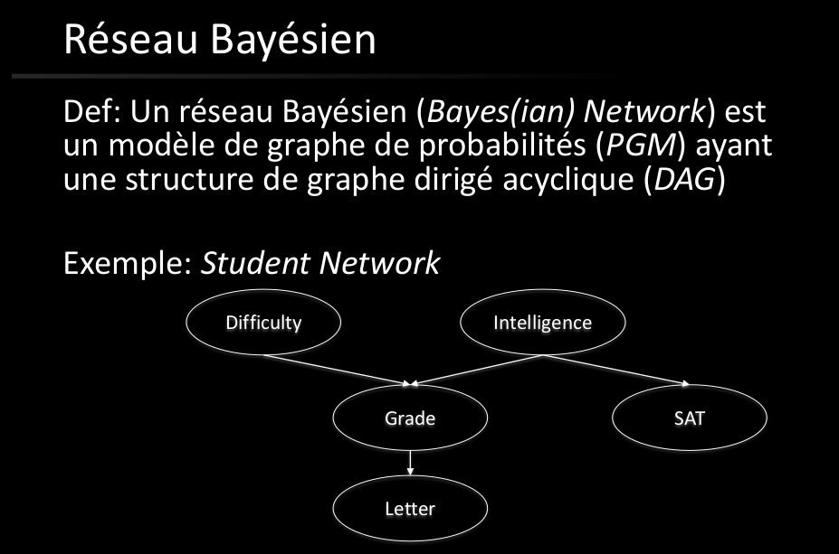
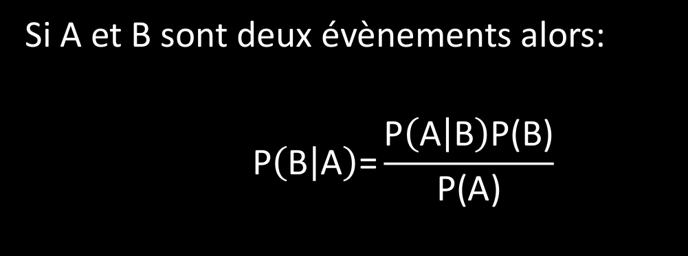
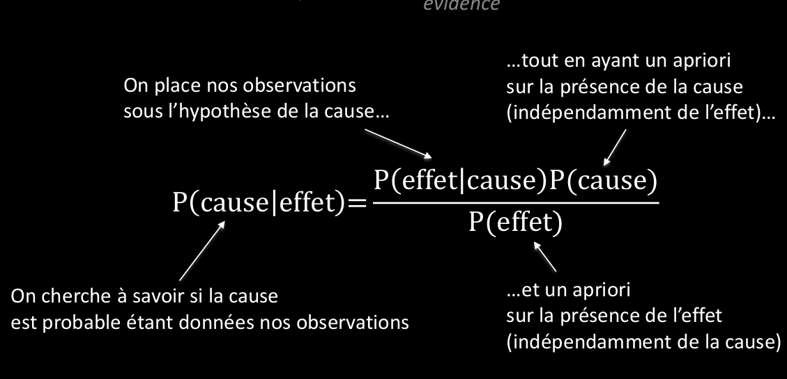
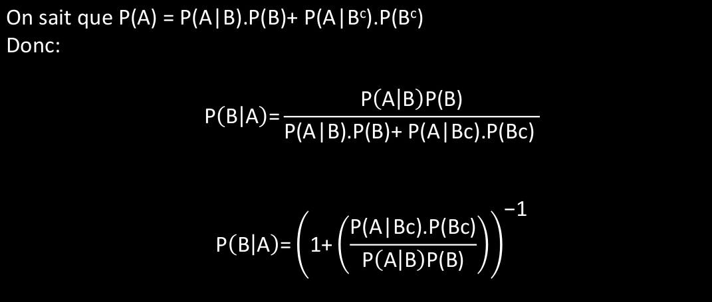
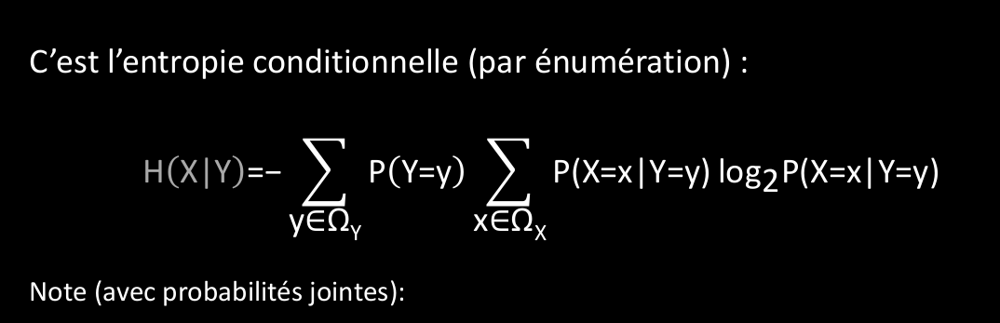
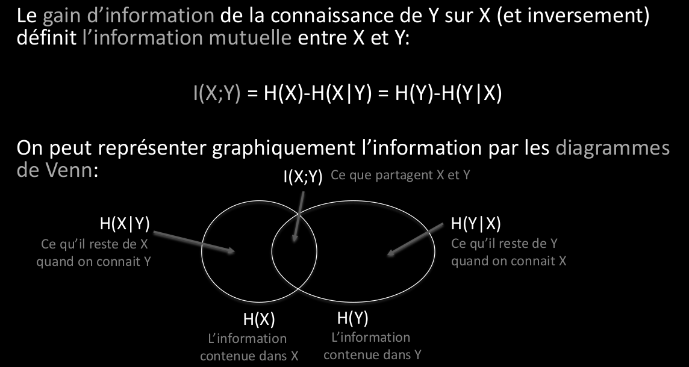

# Q7 Réseaux Bayésiens :
  
Les réseaux Bayessiens se repose sur la loi de Bayes:  
  
## Que représentent les réseaux Bayésiens ?
  
  
  
On peut représenter une connaissance à l'aide du réseau Bayésien pour ensuite faire des inférences en l'interrogeant.  
  
## Quel est leur principe ?
Ils permettent de répondre à des requêtes par inférence.  
  
## Quel est leur particularité en tant que Modèles de Graphes Probabilistes ?
Ce sont des PGM dirigés acycliques.  
  
## Comment les utilise-t-on pour modéliser un phénomène ?
- On considère la probabilité jointe de toutes les variables  
- On développe selon le réseau (factorisatoin PGM)  
- On utilise la règle de la somme (marginalisation) pour éliminer les variables qui ne nous intéressent pas.  
  
## Comment les utilise-t-on pour faire de l’inférence ?
  
  
  
La probabilité conditionnelle introduit une temporalité pour l'étude des effets d'une cause.  
  
A= l'effet  
B= la cause  
  
Je peux estimer la présence de la cause sachant que j'ai observé l'effet:  
c'est P(B|) que je peux calculer par le théorème de Bayes  
  
  
  
  
  
On utilise la notion d'entropie pour mesure l'incertitude et la quantité d'information pour l'optimisation de l'inférence.  
  
  
  
L'entropie conditionnelle permet de connaître l'entropie de X sachant Y  
  
  
  
Le gain d'information vient Grâce à la probabilité conditionnelle  
  
  
  
  
  
