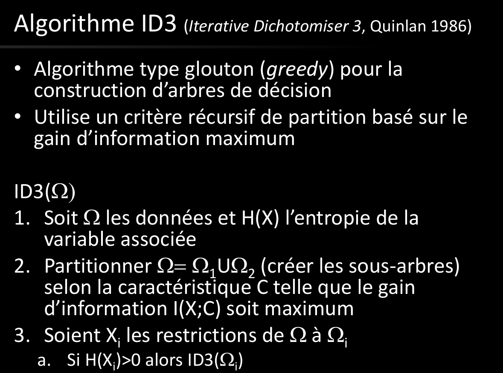

# Q8 Arbres de Décision :

Context supervisé

On se sert de l'entropie conditionnelle

But:
Créer des frontière de decisions

Partition: morceaux dont l'union donne l'univers
Partition: représenté par un arbre de décision

On coupe chaque groupe par un hyperplan (droite en 2D). Récursion tant que c'est hétérogène (on continue à diviser)
Pour que toutes les feuilles soient homogène.

On peut représenter cela en une expression logique qui représente l'arbre

On veut faire la partition avec le moins de trait possible.

Pour mesurer l'homogénéité, on peut utiliser l'entropie.

On a des caractéristique et une décision induite
Quantification des données (labelisation pour simplifier des groupes)

Les séparations sont parallèles aux axes (pour simplifier)

Algorithme ID3 (algorithme parallèle)

algorithme greedy (local), va essayer de baisser l'entropie, récursif
On va séparer par caractéristique

évaluation: quantification de la qualité de l'apprentissage

Sur-apprentissage: poussser l'algorithme à trop découper le plan pour des données bruits (des données qui ne sont pas nécessaire)

Pour empâcher le sur-apprentissage: pruning avec tolérance pour élager l'arbre, on réduit la profondeur de l'arbre

## Quel est le principe des arbres de décision ?
## On pourra rappeler le principe
## de l’apprentissage supervisé. Comment est mesuré le gain d’information ?
## Pourquoi peut-on utiliser l’entropie ?
## Comment fonctionne l’algorithme ID3 ?
## Qu’est-ce que le sur-apprentissage ?

## Comment le mesurer/détecter ?
## Comment l’éviter ou le contrer ?
## On pourra mentionner l’évaluation des méthodes d’apprentissage.

