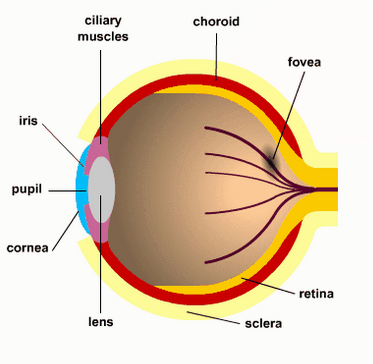
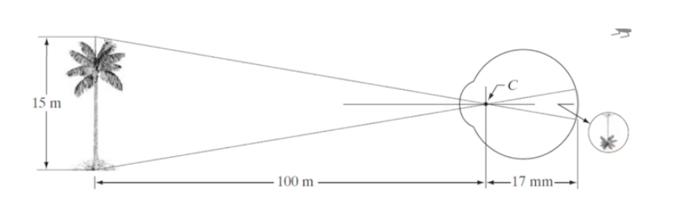

# Q1 explain the image formation in the eye. What are the differences in focusing between the ordinary cameras and the human eyes?

The image formation in the eye :
La rétine contient 2 types de photorecepteurs:
    -  batonnet (100 millions) distribué dans la rétine (intensité de lumière)
    -  cône (6.5 millions) distribué dans la fovéa (couleur)

Le système visuel humain fonctionne de cette façon:
    1. L'énergie lumineuse est concentrée dans la lentille à l'intérieur du capteur et de la rétine
    2. Le capteur de l'oeil répond à la lumière par une réaction électrochimique qui envoie un signal électrique au cerveau(à travers le nerf optique)
    3. Le cerveau utilise les signaux pour créer des schéma neurologique que nous percevons en tant qu'image.

**Example**
    On regarde un arbre de 15 m à une distance de 100 m, H est la hauteur de l'objet dans la rétine.
    

**What are the differences in focusing between the ordinary cameras and the human eyes?**
1. La première différence se trouve dans la tentille. Dans le système visuel humain, la lentille est flexible alors que pour la plus part des caméras, la lentille est fixe (cela existe pour les caméras les plus chères mais pas autant que pour l'oeil humain)
2. La deuxième différence se trouve au niveau des élément photo sensibles. Dans l'oeil, il n'y a pas de répartition uniforme mais dans les appareils si (c'est dans une petit zone de fovea pas plus grande que 0.15 mm)
3. La troisèime différence se trouve dans la façon de percevoir la lumière. Le champ d'intensité lumineus de l'oeil peut s'adapter (dans un ordre de 1010). L'intensité perçue par l'oeil (brillance subjective) est un logarithm de l'intensité de la lumière incidente dans l'oeil.
