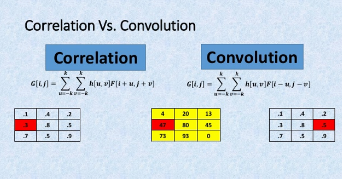
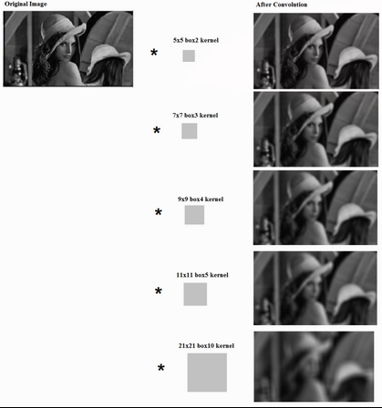

# Q14. Explain the difference between the convolution and correlation. Give examples and explain the practical usage of both.

**Give examples**

Important: si le filtre est symmetrique, le résultat de la convolution et de la correlation sera la même chose.

