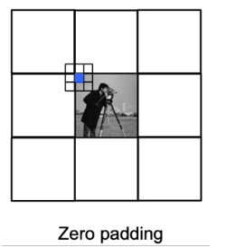
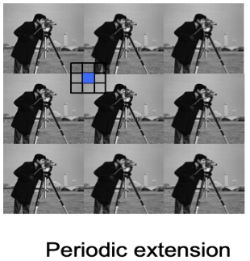
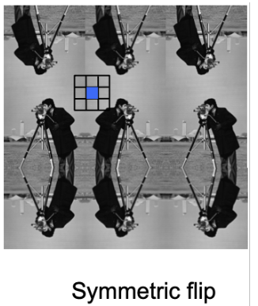

# Q15.Explain the border effects during the computation of 2D convolution. Define the

Pour nos opérations, on ne connais pas les valeurs qu'il y a au bord de notre image discrète.
Alors on rajoute un "padding" tout autour.

Il y a différents types de padding.
    1. Zero padding
    2. Periodic extension
    3. Symmetrically flip

