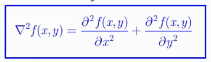
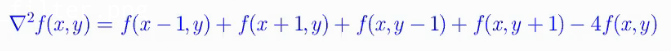

# Q19.Explain the high-pass filtering. Provide the examples of sharpening filters.
Derivatives.

La relation avec le low pass filter
Si on sait appliquer le lowpass filter, on peut le convertir en highpass filter grâce à la relation
HPF= 1-LPF

On peut aussi faire la transition avec les dérivations du premier et du second degré.

**premier degré (one tap filter)**:
df(x)/dx= f(x+1)-f(x)

**deuxième degré (two tap filter)**:
d²f(x)/d²x= f(x-1)-2f(x)+f(x+1)

Sert à la détection des bords mais aussi au sharpening.

Le sharpening est juste une addition entre l'image de base et un highpass filter.
